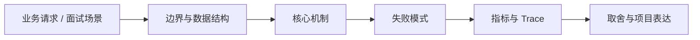

# 自生长知识库与企业 Wiki

## 面试定位

自生长知识库与企业 Wiki 属于 AI 工程趋势与实战方案 / RAG 数据基础设施。面试里它不是背概念题，而是用来判断你是否能把知识落到架构、数据流、指标和取舍上。
一句话定位：自生长知识库把文档解析、RAG 问答、Agent 推理和 Wiki 结构化维护结合起来，让知识资产持续更新。

**必须讲清楚**
- 自生长知识库把文档解析、RAG 问答、Agent 推理和 Wiki 结构化维护结合起来，让知识资产持续更新。
- 自动生长必须可追溯
- Wiki 结构不能只靠生成
- 更新要有审核和版本

**常见追问方向**
- 自生长知识库和普通 RAG 的区别。
- 如何防止错误知识被自动固化。
- 企业 Wiki 如何处理权限、过期内容和知识冲突。
- 如果这个点落到 Paper Agent：论文研读与可追溯综述，架构如何设计？
- 线上失败时看哪些 trace、日志、指标，怎么回滚或补偿？

## 架构与运行机制

### 核心机制

- WeKnora 代表了文档到 RAG、reasoning agent、自维护 Wiki 的趋势。
- 企业场景要处理权限、版本、过期内容和知识冲突。

### 通用数据流

可以按用户目标、模型、上下文、状态、工具、执行循环、评测、安全和可观测性来讲。数据流是用户任务进入编排层，Context Builder 汇总系统指令、用户约束、RAG 证据、短期状态和工具结果，模型输出结构化动作，宿主程序执行工具并把 observation 写回 State 和 Trace。

### 工程落点

- 把文档解析为 source_docs、claims、citations、topics 和 ownership。
- 每条知识保存版本、来源、置信度、更新时间、review_status 和适用范围。
- 自动更新先进入 proposed 状态，经过 verifier 或 human review 后发布。
- 回答时暴露 citation 和 staleness，冲突证据触发澄清或人工复核。
- 知识条目保存 source_docs、claims、citations、owner、version、staleness、review_status。
- 自动更新需要 human review 或 policy gate。
- 把每个关键步骤都映射到可观测指标，避免只描述功能。
- 回答时主动说明哪些信息是强一致状态，哪些只是上下文或缓存视图。

## 可画图

图 1：自生长知识库与企业 Wiki 的回答要从业务入口进入，先讲边界和数据结构，再讲机制、失败模式、指标和取舍。

## 系统设计案例

### 自生长知识库与企业 Wiki 的面试级设计题

典型设计题是企业内部 Agent、Coding Agent、Paper Agent 或 Web Agent：外层 deterministic workflow 管理权限、预算、审批和最终提交，内层 Agent loop 处理开放探索，Eval Gate 根据 golden case、轨迹评分、工具结果和人工反馈决定是否继续。

**可画架构**
- 入口层校验用户请求、权限、租户、参数和幂等键。
- 业务服务层决定同步处理、异步处理、缓存读写、数据库回源或降级返回。
- 状态层保存业务状态、缓存版本、事件状态和恢复点。
- 执行层处理存储访问、下游调用、异步任务和补偿动作，并把结构化结果写入 trace。
- 观测层用指标、日志和链路追踪证明系统可运行、可排障、可复盘。

**数据流**
- 请求进入入口层后生成 request_id/run_id。
- 业务服务读取缓存、数据库或异步事件状态，选择执行路径。
- 执行结果写回状态存储，并向监控系统上报延迟、错误和业务结果。
- 保护策略根据成功标准、失败次数、SLA 和风险等级决定继续、降级、补偿或停止。

## 真实问题与排障

真实线上问题一般从任务成功率、工具调用成功率、invalid args、上下文漂移、幻觉率、引用准确率、token 成本、延迟、guardrail block rate 和 human handoff rate 看起。回答时要把模型问题、检索问题、工具问题、状态问题和权限问题分开归因。

**排查顺序**
- 先确认用户可感知问题：错误率、延迟、成功率、数据一致性或结果质量是否异常。
- 再沿数据流定位是哪一段出了问题：入口、状态、缓存、数据库、异步事件、外部依赖或消费端。
- 对比最近发布、配置变更、流量变化、数据倾斜和下游限流。
- 先止血：限流、降级、回滚、暂停消费、隔离高风险工具或切换只读模式。
- 最后把失败样例进入 regression/eval，避免同类问题复发。

**重点指标**
- knowledge_freshness
- claim_support_rate
- review_pass_rate
- stale_answer_rate
- rollback_count

**常见误区**
- 让 Agent 自动改知识库但无审核
- 无法解释某条知识从哪来
- 旧文档污染新答案

## 业界方案与技术取舍

AI Agent 的取舍是开放任务能力换来了不确定性、成本、延迟和治理复杂度。面试追问通常会围绕 workflow 与 agent 边界、memory 与 RAG 区别、function calling 是否等于 agent、eval 怎么证明不是 demo、如何做安全边界展开。

**方案对比**
- 自生长知识库不是让模型随便改 Wiki，而是让文档、证据、claim 和审核形成闭环。
- RAG 回答、Reasoning Agent 和 Wiki 维护需要共同的来源追踪和版本治理。
- 自动生长越强，越需要 review_status、owner、staleness 和回滚能力。

**复习时要能讲出的细节**
- 这个知识点解决什么问题，不解决什么问题。
- 关键数据结构、状态变化、失败边界和可观测指标是什么。
- 面试官继续追问时，能从架构图、数据流、线上排障和项目证据四个角度展开。
- 能说明为什么这个取舍适合当前业务，而不是只背业界名词。

## 深入技术细节

自生长知识库把文档解析、RAG 问答、Agent 推理和 Wiki 结构化维护结合起来，让知识资产持续更新。

面试深挖时要把对象、状态、协议、执行顺序和失败分支讲出来。不要只说“可以用 Redis/数据库/MQ 解决”，而要说明 key、字段、版本、超时、重试、幂等、降级和观测指标如何共同工作。

## 关键数据结构与协议

| 字段 | 所属对象 | 作用 | 排障价值 |
| :--- | :--- | :--- | :--- |
| `request_id` | 请求 | 串联入口、缓存、DB 和下游调用 | 定位单次异常 |
| `key_schema` | Redis/存储 | 固定业务域、实体和版本 | 排查误删、串租户和旧版本 |
| `source_version` | value/event | 标识事实源版本 | 防止旧值覆盖新值 |
| `ttl_policy` | 缓存策略 | 控制过期、抖动和刷新 | 排查击穿、雪崩和旧值窗口 |
| `trace_id` | 观测链路 | 串联服务、存储和异步任务 | 复盘慢请求和失败分支 |

## 深问准备

被追问边界时，先说这个方案适合什么、不适合什么，再给反例。被追问线上故障时，按影响面、止血、根因、修复、回归五段回答。被追问项目时，把回答落到你做过的接口、缓存、队列、数据库、监控或 Agent 工程链路。

- 反例要明确，例如强事务事实源不能交给缓存或搜索读模型。
- 指标要可执行，例如 p95、error_rate、retry_rate、lag、miss_rate、stale_rate。
- 回归要可复现，例如固定输入、故障注入、压测脚本或 golden case。

## 趋势落地补充

自生长知识库最容易被误解成“让 Agent 自动写 Wiki”。更稳的工程表达是：文档解析产生 source docs，抽取器产生候选 claim，verifier 检查 claim 是否被 citation 支撑，review gate 决定是否发布，Wiki 只是最终可读视图。任何自动写入都要能回答“这句话来自哪份文档、哪个版本、谁审核过、什么时候应该过期”。

动手实验可以选一组内部文档或公开 README，生成 topics、claims、citations 和 proposed wiki pages。评估时看 claim_support_rate、review_pass_rate、stale_answer_rate 和 rollback_count。这样能把 WeKnora 类趋势落到可追溯知识资产，而不是停留在“文档自动变知识库”的口号。

## 生产验收清单

- 知识条目要保存 `claim`、`source_doc`、`citation_span`、`owner`、`version`、`confidence`、`review_status` 和 `expires_at`。
- 自动更新只能先进入 proposed 状态，发布前经过 citation verifier、冲突检测和人工或策略审核。
- 检索回答要暴露来源和过期状态；当证据冲突或来源权限不足时，应返回澄清或 unsupported，而不是生成新事实。
- 回滚要能按 claim、topic、文档版本和发布时间撤回，不能只回滚整站 Wiki。
- 核心指标包括 claim_support_rate、conflict_rate、review_pass_rate、stale_answer_rate 和 rollback_count。
- 知识生长还要处理“删除”和“过期”：当源文档被撤回、权限改变或业务规则失效时，相关 claim 要进入 expired/review 状态，而不是继续被检索命中。
- 面试里可以用一次错误知识回滚案例说明治理闭环：发现旧答案、定位 citation、撤回 claim、重建索引、补 regression question。

## 来源与延伸阅读

- [Tencent WeKnora](https://github.com/Tencent/WeKnora)：用于确认官方语义边界、命令行为和工程约束。
- [OpenAI: A practical guide to building agents](https://cdn.openai.com/business-guides-and-resources/a-practical-guide-to-building-agents.pdf)：用于确认官方语义边界、命令行为和工程约束。
