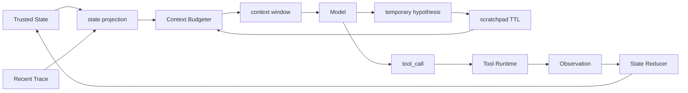

# 短期记忆与工作记忆

## 面试定位

短期记忆是 Agent 在一次任务内保持连续性的工作区。面试官通常会用它追问“多步任务怎么记住已经做过什么”“上下文窗口不够怎么办”“短期记忆和长期记忆、State、RAG 的边界是什么”。回答时要把 working memory、scratchpad、state projection 和 context window 说成工程模块，而不是说“把历史对话都传给模型”。

## 一句话定义

短期记忆保存当前 run 仍然有用的任务上下文，包括目标、约束、当前计划、最近 observation、未解决风险、临时假设和下一步候选。它通常绑定 step scope、TTL、state version 和 context window，只服务当前任务，不应自动变成长期 Memory。

## 为什么需要它

Agent 每一步都要在有限上下文里做决策。没有短期记忆，模型不知道前面查过什么、哪些工具失败过、哪些假设还没验证。短期记忆太多也有问题，旧 observation 会污染新决策，过期假设会被当成事实，token 成本会吞掉真正重要的证据。工程目标不是“记住更多”，而是“当前步骤看到正确的最小上下文”。

## 核心架构

图 1：短期记忆与工作记忆架构，展示可信 State、近期 trace、scratchpad、上下文预算器和工具 observation 如何共同决定下一轮模型输入。

图中的边界很重要：scratchpad 是临时区，State 是可信区。临时假设只有被工具 observation、测试、用户确认或 citation 支持后，才能提升为可信 State。

## 架构与运行机制

短期记忆的数据流可以按“投影、预算、执行、验证、过期”五步讲。Projector 从可信 State 和 recent trace 中抽取当前 step 需要的内容。Context Budgeter 为 goal、constraints、recent observations、open risks 分配 token。模型基于这些内容输出 action 或临时假设。工具 observation 回写 State。Scratchpad 根据 TTL、证据状态和当前 step 被保留、降权或清理。

Working memory 不应由模型自由维护。宿主程序应使用 schema 管理，例如 `goal`、`constraints`、`plan_summary`、`current_step`、`recent_observations`、`open_risks`、`next_actions`。模型可以建议更新，但最终写入由 reducer 或 orchestrator 完成。

## 运行机制

短期记忆常见形态有三类。第一是 recent window，保留最近几轮消息，适合短客服。第二是 structured working memory，用 JSON 状态保存计划、当前步骤和 observation 摘要。第三是 scratchpad with TTL，保存临时假设、尝试路径和待验证问题。

Context window 中要固定保留 goal 和 hard constraints，否则最近工具结果会把任务目标挤掉。对于长工具输出，只放摘要、evidence id、source、风险和 next_action_hint，原始内容放 artifact store。

## 关键设计取舍

| 方案 | 适用场景 | 优点 | 风险 | 面试表达 |
| --- | --- | --- | --- | --- |
| 最近 N 轮消息 | 短对话 | 简单、低延迟 | 噪声大，难恢复 | baseline，可用于低风险任务 |
| Structured working memory | 多步工具任务 | 可测试、可恢复 | 需要 schema 和 reducer | 推荐用于生产 Agent |
| Scratchpad with TTL | 探索型任务 | 记录临时路径 | 易把假设当事实 | 必须有来源、confidence 和过期 |
| State projection | 长任务恢复 | 可信、可裁剪 | Projector 设计成本高 | 和 State Store 配套使用 |

## 生产落地细节

每个 scratchpad item 至少包含 content、source_step、evidence_status、confidence、expires_at 和 promoted_to_state。每次模型输入应保存 context manifest，记录哪些 working memory item 被放入上下文、为什么放入、哪些被裁剪。这样线上出错时可以判断是记忆缺失、记忆过期还是上下文污染。

关键指标包括 `working_memory_tokens`、`scratchpad_stale_rate`、`lost_constraint_rate`、`state_projection_precision`、`context_window_usage` 和 `resume_success_rate`。如果 stale rate 高，说明 TTL 或 evidence_status 没有发挥作用。如果 lost constraint 高，要给 goal 与 constraints 设固定预算。

## 系统设计案例

Debug Agent 分析线上错误时，短期记忆可以保存：当前错误签名、已查日志、已排除假设、下一个排查方向和风险。比如已经确认“不是数据库连接池耗尽”，这个结论可以留在 scratchpad，但要附带证据来源。如果新日志推翻它，scratchpad 要更新或过期。

Web Agent 操作页面时，working memory 保存当前 URL、页面目标、已点击元素、最新 DOM 摘要和等待条件。页面刷新后不能依赖旧截图，必须让 observation 更新 State，再由 state projection 投给模型。

## 真实问题与排障

短期记忆常见故障是旧信息影响新决策。例如页面已经跳转，但模型继续按旧 DOM 点击按钮。排查时看 observation timestamp、state version 和 context manifest。另一类故障是压缩时丢约束，例如用户要求“不要发邮件”，但该约束没有进入工作记忆。修复方式是把 hard constraints 放入固定预算区，并对 context builder 写 component eval。

## 常见误区与排障

- 把短期记忆和长期 Memory 混在一起。
- scratchpad 没有 TTL，旧假设一直留在上下文。
- 完整工具输出直接塞入 context window。
- 模型说“我记得”就当成事实，没有 observation 支持。

## 面试追问

1. 短期记忆和 State 的区别是什么？重点看可信写入和投影关系。
2. 多轮任务窗口不够怎么办？重点看摘要、artifact 引用和固定预算。
3. scratchpad 里的内容什么时候能进 State？重点看证据、测试和用户确认。
4. 旧记忆污染怎么办？重点看 TTL、confidence、context manifest 和 eval。

## 项目化表达

在 Coding Agent 里可以说：我用 structured working memory 保存当前修复目标、已读文件、测试失败摘要和下一步动作。大日志只保存 artifact 引用。临时假设写入 scratchpad，并带 TTL 与证据状态。这样模型每轮看到的是当前最有用信息，而不是一整段聊天历史。

## 深入技术细节

短期记忆要服务当前 run，而不是跨任务个性化。Working memory 由宿主维护，字段包括 `goal`、`hard_constraints`、`current_step`、`recent_observations`、`open_risks`、`scratchpad_items`、`artifact_refs` 和 `next_actions`。模型可以建议更新，但最终写入必须经过 State Reducer。

Scratchpad 的每条假设都要带 evidence_status。未验证假设只能影响探索，不能提升为可信 State；被工具 observation、测试、citation 或用户确认支持后，才可以 promotion。过期或被推翻的假设要降权或删除。

工程上要避免把“压缩摘要”误当成短期记忆本身。摘要只是投影结果，真实工作记忆仍应保存在结构化状态里，并带版本、来源和过期策略。否则模型在恢复任务时只能看到一段自然语言总结，无法判断哪些事实来自工具、哪些只是上一轮推测，也无法在测试失败或页面跳转后自动淘汰旧信息。

## 关键数据结构与协议

| 字段 | 作用 | 风险 |
| :--- | :--- | :--- |
| `current_step` | 当前执行点 | 重复旧动作 |
| `recent_observations` | 新事实 | 旧页面/旧日志污染 |
| `scratchpad_items` | 临时假设 | 假设当事实 |
| `evidence_status` | 验证状态 | 错误提升 |
| `expires_at` | TTL | 旧信息常驻 |
| `promoted_to_state` | 升级记录 | 无法审计 |

协议上 context manifest 要记录哪些短期记忆被放入模型输入、哪些被裁剪。答错后才能判断是记忆缺失、过期、还是预算分配错误。

## 深问准备

被问“短期记忆和长期记忆区别”时，回答：短期记忆围绕当前 run 的状态和假设，生命周期短；长期记忆保存跨任务偏好或稳定背景，需要 scope、TTL 和用户纠错。

被问“什么时候 scratchpad 能进 State”，答案是有外部证据支持：工具 observation、测试结果、citation、用户确认或 deterministic verifier。模型自称“我认为”不够。

## 公开阅读校验

公开读者需要看到短期记忆的核心边界：它不是“多塞历史消息”，而是把当前任务所需的状态投影给模型。文章应让读者能区分三层东西：可信 State、临时 Scratchpad、以及最终进入 context window 的 projection。State 需要证据和版本，Scratchpad 允许保存假设但要有 TTL，Projection 只是一次输入构造，不应被当成事实来源。

一个生产级工作记忆系统要能复盘“为什么这一轮模型看到了这些信息”。因此 context manifest 很关键：它记录 goal、hard constraints、recent observations、open risks、artifact refs、被裁剪项和预算分配。线上事故里，如果 Agent 忘了用户约束或重复旧动作，团队可以判断是约束没有写入 State、projection 没选中、token 预算挤掉，还是旧 observation 没过期。

短期记忆还要处理“降级和清理”。当页面刷新、测试结果变化、用户改目标或工具 observation 推翻假设时，旧 scratchpad 不应继续影响下一步。好的文章应说明 stale memory 如何被发现：state_version 不一致、observation timestamp 过期、evidence_status 被撤销、或 context eval 发现 hard constraint missing。这样读者会把短期记忆理解成可治理的运行时模块，而不是一个聊天摘要。

## 来源与延伸阅读

- [LangGraph](https://github.com/langchain-ai/langgraph)：框架官方仓库，用于支持状态驱动多步 Agent、checkpoint 和恢复机制的工程模型。
- [Anthropic: Building effective agents](https://www.anthropic.com/engineering/building-effective-agents)：官方工程文章，用于说明何时需要更复杂的 Agent loop，以及何时保持简单 workflow。
- [AgentGuide: 2026 Agent 求职通关路线](https://github.com/adongwanai/AgentGuide/blob/main/docs/05-roadmaps/agent-job-ready-roadmap-2026.md)：开源学习资料，用于补充面试复习中的 State、Memory、Context 组织方式。
