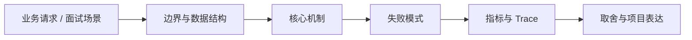

# Skill 化工作流与能力封装

## 面试定位

Skill 化工作流与能力封装 属于 AI 工程趋势与实战方案 / Tool / Protocol / Skill 生态。面试里它不是背概念题，而是用来判断你是否能把知识落到架构、数据流、指标和取舍上。
一句话定位：Skill 把触发条件、执行步骤、工具契约、模板、参考资料和验证方法封装成 Agent 可加载能力。

**必须讲清楚**
- Skill 把触发条件、执行步骤、工具契约、模板、参考资料和验证方法封装成 Agent 可加载能力。
- Skill 不是长 prompt
- trigger 和 scope 决定能否稳定复用
- eval 证明 Skill 有价值

**常见追问方向**
- Skill、Tool 和 Workflow 的区别。
- 如何设计可版本化、可评测的 Skill。
- 多个 Skill 命中时如何处理冲突和渐进加载。
- 如果这个点落到 Coding Agent：代码库任务 Harness，架构如何设计？
- 线上失败时看哪些 trace、日志、指标，怎么回滚或补偿？

## 架构与运行机制

### 核心机制

- book-to-skill、taste-skill、架构图 skill 都说明工程知识正在被打包成可加载过程资产。
- Skill 要渐进加载，不应把所有材料塞进上下文。

### 通用数据流

可以按用户目标、模型、上下文、状态、工具、执行循环、评测、安全和可观测性来讲。数据流是用户任务进入编排层，Context Builder 汇总系统指令、用户约束、RAG 证据、短期状态和工具结果，模型输出结构化动作，宿主程序执行工具并把 observation 写回 State 和 Trace。

### 工程落点

- 为 Skill 定义触发条件、反例、适用文件类型和风险等级。
- 入口 instruction 只放流程和验证点，长参考放 references，模板放 templates。
- 工具调用受 tool contract、权限、超时和 side effect 约束。
- 用 golden tasks 对比启用前后的 eval_pass_rate 和 user_revision_rate。
- Skill 包含 trigger、scope、instruction、references、templates、scripts、eval、version。
- 指标看 task_success_rate、eval_pass_rate、user_revision_rate。
- 把每个关键步骤都映射到可观测指标，避免只描述功能。
- 回答时主动说明哪些信息是强一致状态，哪些只是上下文或缓存视图。

## 可画图

图 1：Skill 化工作流与能力封装 的回答要从业务入口进入，先讲边界和数据结构，再讲机制、失败模式、指标和取舍。

## 系统设计案例

### Skill 化工作流与能力封装 的面试级设计题

典型设计题是企业内部 Agent、Coding Agent、Paper Agent 或 Web Agent：外层 deterministic workflow 管理权限、预算、审批和最终提交，内层 Agent loop 处理开放探索，Eval Gate 根据 golden case、轨迹评分、工具结果和人工反馈决定是否继续。

**可画架构**
- 入口层校验用户请求、权限、租户、参数和幂等键。
- 业务服务层决定同步处理、异步处理、缓存读写、数据库回源或降级返回。
- 状态层保存业务状态、缓存版本、事件状态和恢复点。
- 执行层处理存储访问、下游调用、异步任务和补偿动作，并把结构化结果写入 trace。
- 观测层用指标、日志和链路追踪证明系统可运行、可排障、可复盘。

**数据流**
- 请求进入入口层后生成 request_id/run_id。
- 业务服务读取缓存、数据库或异步事件状态，选择执行路径。
- 执行结果写回状态存储，并向监控系统上报延迟、错误和业务结果。
- 保护策略根据成功标准、失败次数、SLA 和风险等级决定继续、降级、补偿或停止。

## 真实问题与排障

真实线上问题一般从任务成功率、工具调用成功率、invalid args、上下文漂移、幻觉率、引用准确率、token 成本、延迟、guardrail block rate 和 human handoff rate 看起。回答时要把模型问题、检索问题、工具问题、状态问题和权限问题分开归因。

**排查顺序**
- 先确认用户可感知问题：错误率、延迟、成功率、数据一致性或结果质量是否异常。
- 再沿数据流定位是哪一段出了问题：入口、状态、缓存、数据库、异步事件、外部依赖或消费端。
- 对比最近发布、配置变更、流量变化、数据倾斜和下游限流。
- 先止血：限流、降级、回滚、暂停消费、隔离高风险工具或切换只读模式。
- 最后把失败样例进入 regression/eval，避免同类问题复发。

**重点指标**
- task_success_rate
- eval_pass_rate
- user_revision_rate
- skill_misfire_rate
- latency_overhead

**常见误区**
- trigger 过宽
- 模板化严重
- 没有版本和回归评测

## 业界方案与技术取舍

AI Agent 的取舍是开放任务能力换来了不确定性、成本、延迟和治理复杂度。面试追问通常会围绕 workflow 与 agent 边界、memory 与 RAG 区别、function calling 是否等于 agent、eval 怎么证明不是 demo、如何做安全边界展开。

**方案对比**
- Skill 是可加载的过程资产，不是更长的 prompt。
- 它把 trigger、scope、instruction、references、templates、scripts 和 eval 绑定在一起。
- Skill 的价值要通过任务成功率和返工率证明。

**复习时要能讲出的细节**
- 这个知识点解决什么问题，不解决什么问题。
- 关键数据结构、状态变化、失败边界和可观测指标是什么。
- 面试官继续追问时，能从架构图、数据流、线上排障和项目证据四个角度展开。
- 能说明为什么这个取舍适合当前业务，而不是只背业界名词。

## 深入技术细节

Skill 把触发条件、执行步骤、工具契约、模板、参考资料和验证方法封装成 Agent 可加载能力。

面试深挖时要把对象、状态、协议、执行顺序和失败分支讲出来。不要只说“可以用 Redis/数据库/MQ 解决”，而要说明 key、字段、版本、超时、重试、幂等、降级和观测指标如何共同工作。

## 关键数据结构与协议

| 字段 | 所属对象 | 作用 | 排障价值 |
| :--- | :--- | :--- | :--- |
| `skill_id` / `version` | Skill metadata | 标识能力包和版本 | 排查升级后行为变化 |
| `trigger` / `anti_trigger` | 触发规则 | 描述何时使用、何时不要使用 | 降低误触发和能力冲突 |
| `scope` | 适用范围 | 限定文件类型、任务类型、风险等级和产物 | 防止 Skill 被泛化到错误场景 |
| `references` / `templates` | 渐进资料 | 指向长参考、模板和示例 | 避免一次性塞满上下文 |
| `tool_contract` | 工具契约 | 记录可用工具、权限、超时和 side effect | 排查工具失败和安全边界 |
| `eval_suite` / `conflict_priority` | 评测治理 | 定义 golden tasks、优先级和冲突处理 | 证明 Skill 真的提升质量 |

## 深问准备

被追问边界时，先说这个方案适合什么、不适合什么，再给反例。被追问线上故障时，按影响面、止血、根因、修复、回归五段回答。被追问项目时，把回答落到你做过的接口、缓存、队列、数据库、监控或 Agent 工程链路。

- 反例要明确，例如强事务事实源不能交给缓存或搜索读模型。
- 指标要可执行，例如 p95、error_rate、retry_rate、lag、miss_rate、stale_rate。
- 回归要可复现，例如固定输入、故障注入、压测脚本或 golden case。

## 趋势落地补充

Skill 化的价值在于把“人每次都要提醒 Agent 的工作习惯”变成可版本化资产。好的 Skill 不只写步骤，还要写触发条件、反例、需要读取哪些 reference、可调用哪些工具、失败时如何恢复、产物如何验证。它应该让 Agent 少临场发挥，多按稳定流程拿证据。

动手实验可以把一个重复任务做成 Skill，例如“把技术短帖改写成本站知识点”。入口 instruction 只放流程，模板放 templates，来源规则放 references，验证脚本放 scripts。对比启用前后的 eval_pass_rate、user_revision_rate、tool_error_rate 和 latency_overhead，才能证明 Skill 真的提升了质量，而不是让回答变长。

## 生产验收清单

- Skill metadata 要写清 trigger、anti-trigger、scope、风险等级、依赖工具、输入文件类型和期望产物。
- Instruction 只放执行流程和判断点，长参考资料放 references，固定结构放 templates，可运行检查放 scripts。
- 多个 Skill 命中时要有优先级和冲突处理，例如先用安全/调试流程，再用领域 Skill。
- 版本升级要用 golden tasks 回归，比较任务成功率、返工率、误触发率、工具错误率和延迟开销。
- Skill 失败时要能降级为普通 workflow，并把失败原因写入 trace，避免 Agent 反复加载错误能力。
- 触发条件要写反例，例如“读 PDF”不等于“创建 PDF”，“前端 QA”不等于“重写设计系统”。反例能减少误触发，比继续堆步骤更重要。
- 参考资料要渐进加载：入口只告诉 Agent 何时读哪份 reference，避免每次任务都把全部资料塞进上下文。

## 公开阅读校验

公开读者读这一篇，应该能区分 Skill、Tool 和 Workflow。Tool 是可调用能力，Workflow 是任务编排，Skill 是把触发条件、执行步骤、参考资料、模板、工具契约和验证方法打包成可加载过程资产。它不是更长的 prompt，而是让 Agent 在特定任务上少临场发挥、多按经过验证的流程执行。

一个好 Skill 要写 anti-trigger。很多失败来自“看起来相关但其实不该用”：比如看到 PDF 就触发文档生成，看到前端页面就重写设计系统，看到代码审查就做大范围重构。把反例写清楚，往往比继续补步骤更能提升稳定性。多 Skill 命中时，还要有优先级，例如安全、调试和验证流程通常应该先于领域生成流程。

验收要用 golden tasks，而不是只看一次演示。对比启用前后的 task_success_rate、user_revision_rate、skill_misfire_rate、tool_error_rate 和 latency_overhead。如果 Skill 让结果更稳定、返工更少、误触发更低，它才值得沉淀；如果只是把上下文变长，它反而会增加成本和漂移。

## 项目表达样例

面试里可以把项目讲成“把团队高频操作沉淀成 Skill 仓库”：先从真实任务日志里找重复流程，例如文档解析、前端 QA、代码审查、PPT 生成；再为每个 Skill 写 trigger、anti-trigger、scope、依赖工具、reference 路由、模板和验证命令；最后用 golden tasks 回归，比较启用前后的结果质量、返工轮次和误触发。

排障时要看 Skill 是没触发、误触发、读错 reference、模板不适配，还是工具契约不清。比如“PDF 阅读”Skill 被用于“生成 PDF”，就是 anti-trigger 不够；“前端 UX”Skill 每次都加载全部设计资料，就是渐进披露失败；“代码审查”Skill 提出无法复现的问题，就是 eval_suite 缺少真实仓库样例。这样读者会把 Skill 当成可治理的软件资产，而不是 prompt 收藏夹。

## 来源与延伸阅读

- [taste-skill](https://github.com/Leonxlnx/taste-skill)：用于确认官方语义边界、命令行为和工程约束。
- [fireworks-tech-graph](https://github.com/yizhiyanhua-ai/fireworks-tech-graph)：用于确认官方语义边界、命令行为和工程约束。
- [Anthropic: Effective tools for agents](https://www.anthropic.com/engineering/effective-tools-for-agents)：用于确认官方语义边界、命令行为和工程约束。
