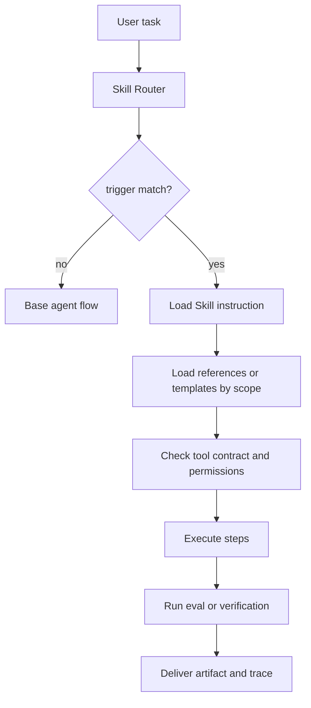

# Skills 与能力封装

## 一句话定义

Skill 是把某类可复用工作方式封装成 trigger、instruction、tool contract、scope、version、assets 和 eval 的能力单元，让 Agent 在合适场景按稳定流程完成任务，而不是每次从零推理。

## 面试定位

面试官问 Skill，通常想区分它和 tool、prompt、workflow 的边界。Tool 是可调用动作，Skill 是“什么时候用、怎么用、用哪些材料、如何验证”的过程封装。

一个严谨回答要说明：Skill 如何触发，如何渐进加载上下文，如何约束工具调用，如何版本化，以及如何用评测证明这个封装真的让任务更稳定。

## 为什么需要它

Agent 做复杂任务时，很多能力并不是单次 API 调用。例如代码审查、写 PRD、生成图文并茂的技术文档、排查 CI、整理会议纪要，都需要一套步骤、模板、引用材料和验证方法。

如果所有步骤都写在系统提示里，context 会膨胀，也难以维护。Skill 的价值是把领域经验放在可发现、可版本化、可测试的包里，只在 trigger 命中时加载必要 instruction。

## 核心架构

图 1：Skill 从触发、渐进加载、工具契约到验证交付的运行链路。

图中 Skill Router 只负责判断是否命中；Load Skill instruction 读取入口流程；Load references or templates by scope 表示按任务范围渐进加载资料，而不是一次性塞入全部知识。Tool contract and permissions 是安全边界，Skill 不能绕过工具权限。最后的 eval 或 verification 决定产物是否可交付，trace 记录 skill version、引用材料和验证结果，便于回放。

| 组件 | 作用 | 设计重点 |
| :--- | :--- | :--- |
| trigger | 判断何时启用 | 明确正例、反例和优先级 |
| instruction | 描述执行步骤 | 可操作、可验证、避免空话 |
| tool contract | 约束可用工具 | 输入 schema、权限、失败处理 |
| scope | 控制适用边界 | 项目、语言、任务类型 |
| version | 管理演进 | 兼容性、回滚、变更记录 |
| eval | 验证效果 | golden cases、rubric、回归集 |

## 架构与运行机制

Skill 的运行一般分为发现、加载、执行和验证。发现阶段用 trigger 匹配任务意图；加载阶段只取必要 instruction、模板或参考文件；执行阶段根据 tool contract 调用工具；验证阶段运行测试、rubric 或人工审查。

好的 Skill 不应该把所有知识一次性塞进上下文。它应该用渐进加载：入口文件只写触发条件和流程，长参考资料放到 references，固定格式放到 templates，重复脚本放到 scripts。

## 运行机制

1. Skill Router 根据用户请求、文件类型、项目上下文和显式名称匹配 trigger。
2. Agent 读取入口 instruction，确认适用范围和必须遵守的步骤。
3. 根据任务 scope 加载少量相关 reference、template 或 asset。
4. 执行时遵守 tool contract，包括权限、输入输出 schema、超时和错误恢复。
5. 产物生成后运行 eval、测试或 checklist。
6. Trace 记录启用的 skill version、引用材料和验证结果。

## 关键设计取舍

| 取舍 | 好处 | 风险 | 建议 |
| --- | --- | --- | --- |
| 大 Skill | 知识集中 | 上下文重、难维护 | 拆成领域小技能 |
| 小 Skill | 精准轻量 | 调度复杂 | 用清晰 trigger 管理 |
| 强制流程 | 稳定可审计 | 灵活性下降 | 高风险任务更适合 |
| 宽泛建议 | 适配面广 | 难验证 | 面向生产要有 eval |

## 生产落地细节

- trigger 要写清命中条件，避免多个 Skill 同时抢任务。
- instruction 应包含步骤、检查点、失败处理和交付格式。
- tool contract 要声明工具权限、输入输出 schema、side effect 和审批要求。
- scope 要限制语言、框架、业务域或文件类型，防止误用。
- version 和 eval 需要绑定，升级后用回归任务确认输出没有退化。

上线 Skill 时还要区分“强制流程”和“辅助参考”。代码审查、财务操作、邮件发送这类高风险任务适合强制流程，必须执行检查点；写作润色、资料整理这类任务可以把 Skill 作为参考包，让 Agent 根据上下文裁剪。否则 Skill 会变成僵硬模板，反而降低复杂任务质量。

## 系统设计案例

为“技术知识点文章改写”设计 Skill，可以把流程拆成：读取现有内容，查官方来源，设计架构图，补数据流和指标，重写排障与面试追问，最后运行 Markdown lint 与浏览器抽样 QA。

数据流是：用户任务命中写作 Skill，入口 instruction 决定要加载技术博客写作模板、Mermaid 图表约束和内容质量 rubric。产物写入后，eval 检查是否有 H1、图、表、来源、指标和真实取舍。这样 Skill 不是一段提示词，而是可复用的交付流程。

## 真实问题与排障

Skill 失效常见于 trigger 过宽、instruction 含糊、工具权限不清或模板过期。排障先看 trace：哪个 Skill 被选中，加载了哪些 reference，执行到哪一步失败，验证是否真的运行。

如果输出越来越模板化，通常是 Skill 把格式写得太死，却缺少领域素材和评价样例。修复方法是补充高质量 examples、负例和 eval，而不是继续加提示词。

## 常见误区与排障

- 把 Skill 当成“更长的 prompt”。
- trigger 写得太泛，导致无关任务误触发。
- 没有 tool contract，高风险工具被自由调用。
- 缺少 version 和 eval，升级后无法判断质量变化。
- 模板复用过度，产物看起来像同一篇文章换标题。

## 面试追问

- Skill 与 tool 的区别是什么？
- 如何避免多个 Skill 的 instruction 冲突？
- Skill 需要怎样做版本管理和灰度？
- 如何证明某个 Skill 提升了任务成功率？
- 什么内容应该放在 instruction，什么应该放在 reference 或 template？

## 项目化表达

项目中可以说：“我把高频任务沉淀为 Skill，每个 Skill 有 trigger、instruction、tool contract、scope、version 和 eval。这样 Agent 不靠临场发挥，而是按可验证流程完成任务，并能在失败时回放具体步骤。”

## 深入技术细节

Skill 的核心不是长提示词，而是可加载的任务包。入口 instruction 应只包含触发、范围、流程和验证点；长参考资料放 references，固定格式放 templates，重复执行逻辑放 scripts，示例放 examples。运行时按 scope 渐进加载，避免把无关知识塞进上下文。

Skill Router 要处理优先级和冲突。如果多个 Skill 命中，应按显式用户指令、任务类型、文件类型、风险等级和 scope 选择；必要时记录 `trigger_reason`，让 trace 能解释为什么用了某个 Skill。工具调用仍要受 tool contract 约束，Skill 不能绕过权限、审批和审计。

## 关键数据结构与协议

| 字段 | 作用 | 质量风险 |
| --- | --- | --- |
| `trigger` | 何时启用 | 过宽会误触发 |
| `scope` | 适用边界 | 过窄会漏用 |
| `instruction` | 执行步骤 | 空泛则不可验证 |
| `tool_contract` | 可用工具和权限 | 不清会越权 |
| `version` | 演进管理 | 无法回滚 |
| `eval` | 验证效果 | 无法证明收益 |

协议上 Skill 输出也要有验证结果。trace 记录 `skill_name`、`skill_version`、`references_loaded`、`tools_used`、`verification_result` 和 `fallback_reason`。这样 Skill 失败时可以判断是触发错、材料缺、工具失败还是评测不够。

## 深问准备

被问“Skill 和 workflow 区别”时，可以回答：workflow 是确定控制流，Skill 是 Agent 可加载的过程知识，通常仍由 Agent 根据上下文执行步骤。Skill 可以调用 workflow 或 tool，但它本身更像可版本化的操作手册加验证规范。

被问“如何证明 Skill 提升质量”，用 golden tasks 对比启用前后的 `task_success_rate`、`eval_pass_rate`、`tool_error_rate`、`latency_p95` 和 `user_revision_rate`。如果 Skill 只让回答变长却不提升通过率，就不算有效。

## 公开阅读校验

公开文章讲 Skill，要避免把它写成“提示词合集”。读者真正关心的是：这个能力包在什么场景被触发、加载哪些材料、允许用哪些工具、失败时如何退出、产物如何验证。Skill 的价值不是让 Agent 看起来更懂，而是把重复任务沉淀成可版本化、可审计、可回放的执行流程。

评审一个 Skill 是否成熟，可以看四个证据。第一，trigger 有正例和反例，避免无关任务误触发。第二，instruction 是可执行步骤，不只是原则。第三，references、templates、scripts 和 examples 按 scope 渐进加载，避免上下文膨胀。第四，eval 有 golden tasks、失败样例和回归指标。缺少这些证据时，Skill 更像经验文档，不像可交付能力。

还要说明 Skill 与 Tool、Workflow、MCP 的边界。Tool 是动作接口，Workflow 是确定控制流，MCP 更偏外部资源和工具协议，Skill 则是“何时用什么步骤和材料完成任务”的过程知识。一个 Skill 可以调用工具，也可以引用 MCP 暴露的资源，但它不能绕过权限、审计和验证。这个边界对企业落地很重要，否则 Skill 会被误用成越权捷径。

Skill 的运行效果也要能被运营。平台应记录每次命中的 `trigger_reason`、加载了哪些 reference、用了哪些工具、在哪一步失败、最终验证是否通过。如果某个 Skill 频繁触发却产物被人工大改，可能是 trigger 过宽；如果工具错误率升高，可能是 tool contract 不清；如果输出高度模板化，可能是 examples 太少或 eval 只检查格式。把这些数据收集起来，Skill 才能像产品能力一样迭代。

对团队协作来说，Skill 还需要所有权和发布流程。每个 Skill 应有 owner、version、changelog、兼容范围和回滚方式；高风险 Skill 的变更要经过 golden tasks 回归。这样一个团队改了代码审查 Skill，不会悄悄影响文档生成、邮件发送或财务审批场景。这个治理视角能把文章从概念介绍推进到平台设计。

## 来源与延伸阅读

- [Anthropic: Writing effective tools for agents](https://www.anthropic.com/engineering/writing-tools-for-agents)：支撑“能力封装需要围绕 Agent 可理解的接口、样例和评测迭代”的观点。
- [Anthropic: Building effective agents](https://www.anthropic.com/engineering/building-effective-agents)：支撑把 workflow、tool use、human feedback 和 evaluation 组合成稳定 Agent 系统的框架。
- [OpenAI Agents SDK Tools](https://openai.github.io/openai-agents-python/tools/)：支撑 tool contract、工具调用和运行时工具接入的基础概念。
- [Model Context Protocol 文档](https://modelcontextprotocol.io/docs)：支撑“外部能力发现和工具/资源连接需要协议边界”的讨论，帮助区分 Skill、Tool 与外部上下文协议。
