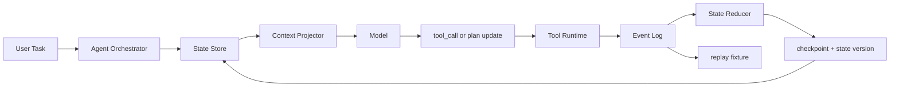

# Agent State 管理

## 面试定位

State 管理是判断 Agent 是否能从 demo 走向工程系统的分水岭。面试官问它时，真正关心的是长任务如何恢复、工具结果如何沉淀、上下文压缩后如何继续执行、并发冲突如何处理，以及线上事故能不能通过 trace 和 replay 复盘。回答时不要把 State 说成聊天历史，聊天历史只是输入材料之一，State 是宿主系统维护的结构化事实层。

## 一句话定义

Agent State 是一次任务执行过程中的结构化运行状态，保存 goal、constraints、plan、current step、tool observation、artifact 引用、open risks、checkpoint 和 state version。它的价值是让 Agent 在 context window 变化、工具失败、用户中断、模型重试或服务重启后，仍能从可信状态继续，而不是让模型靠上一轮自然语言猜进度。

## 为什么需要它

没有 State 的 Agent 很容易变成“长聊天”。短任务看不出问题，任务一长就会暴露：模型忘记已经尝试过哪些路径，工具失败后重复提交，压缩上下文时丢掉关键约束，多用户并发时互相污染。State Store 把运行事实从 prompt 中拿出来，用 schema、版本、checkpoint 和 replay 能力管理。

它和 Memory 的边界也要说清。State 服务当前 run 或 task，强调强一致、可恢复、可审计。Memory 保存跨任务的偏好、经验或学习进度，强调长期作用域、TTL、纠错和隐私治理。把二者混在一起，会导致临时状态污染长期记忆，也会让长期偏好覆盖当前事实。

## 核心架构

图 1：Agent State 管理架构，展示 Orchestrator、State Store、Context Projector、Tool Runtime、Event Log、Reducer 和 Replay fixture 之间的状态闭环。

图里有两个关键边界。模型只能看到 Context Projector 投影后的状态摘要，不能直接写可信 State。真实状态变更来自工具 observation、用户确认、验证器 verdict 或 reducer 计算出的 state diff。

## 架构与运行机制

State 的数据流一般分为六步。第一，任务创建时写入 initial state，包括目标、成功标准、允许工具、用户约束和风险等级。第二，每次模型动作都生成 action event，包含 tool name、arguments hash、step id 和预期 observation。第三，工具返回 observation 或 structured error。第四，State Reducer 根据当前 state version 计算 state diff。第五，State Store 写入新版本和 checkpoint。第六，Context Projector 按当前 step 选择少量状态进入下一轮上下文。

要特别强调 state version。没有版本，Agent 在并发任务、重试、恢复时无法知道自己基于哪一版状态做决策。对写操作还要带 `idempotencyKey`，否则 timeout 后重试可能造成重复扣款、重复发消息或重复提交 patch。

## 运行机制

State schema 不需要一开始很复杂，但必须清楚分层：

- Task State：goal、constraints、plan、currentStep、doneCondition。
- Execution State：toolResults、lastObservation、openRisks、retryBudget、stopReason。
- Artifact Refs：文件、截图、PDF 页码、检索结果、测试日志的引用。
- Audit State：state version、checkpoint、actor、permission decision、policy verdict。

恢复时不应把完整历史塞回 prompt。正确做法是读取最新 checkpoint，确认工具版本和 artifact 是否还可用，再通过 Context Projector 生成“当前任务摘要 + 下一步候选 + 风险”。如果 checkpoint 不可信，系统应回退到上一个可信版本或转人工。

## 关键设计取舍

| 方案 | 适用场景 | 优点 | 风险 | 面试表达 |
| --- | --- | --- | --- | --- |
| 只用 messages | 短问答、低风险 demo | 实现最快 | 压缩后丢状态，难恢复 | 可以做 baseline，不适合长任务 |
| JSON State Store | 单 Agent 长任务 | schema 清楚，易 checkpoint | 需要 reducer 和版本管理 | 推荐作为生产起点 |
| Event Sourcing | 高审计、可回放任务 | replay 和事故复盘强 | 存储和治理成本高 | 适合 coding、web、财务类工具任务 |
| Graph State | 多节点编排 | 节点边界清晰 | 框架绑定较强 | 适合 LangGraph 类状态图 |

## 生产落地细节

生产实现要把 State Store、Event Log、Artifact Store 分开。热状态可放 KV 或数据库，完整事件可以写 JSONL 或日志系统，大 artifact 放对象存储并在 state 中保存引用。每次写入都记录 model、prompt manifest、tool schema version、policy version 和 state version，避免 replay 时环境漂移。

指标要围绕恢复能力设计，而不只是功能成功率。重点看 `resume_success_rate`、`checkpoint_latency`、`state_conflict_rate`、`duplicate_action_rate`、`lost_constraint_rate` 和 `replay_pass_rate`。如果 lost constraint 上升，说明 Context Projector 裁剪错误。如果 conflict rate 上升，要检查并发写入和 optimistic lock。

## 系统设计案例

Coding Agent 修改代码时，State 至少保存目标、已读文件、候选修改、patch diff、测试命令、失败日志、当前风险和下一步计划。运行测试失败后，失败日志进入 artifact，State 只保存摘要和引用。下一轮模型看到的是“哪条测试失败、对应文件、已尝试修复、剩余预算”，而不是几万行终端输出。

Travel Agent 更强调外部副作用。State 要保存行程约束、候选方案、报价时间、确认状态、支付工具状态和 idempotencyKey。提交订单 timeout 后，系统先根据 State 和外部订单查询确认是否已创建，再决定 retry、rollback 或 human-in-the-loop。

## 真实问题与排障

线上最常见的问题是“模型明明做过，却又重复做”。排障先看 state version 是否更新，再看 observation 是否进入 Event Log，最后看 Context Projector 是否把最新状态投给模型。第二类问题是恢复后目标漂移。通常是 checkpoint 只保存了工具结果，没有保存原始 constraints 和 done condition。第三类问题是重复副作用，要检查写工具是否缺少 idempotencyKey 和 side effect status。

## 常见误区与排障

- 把聊天历史当 State，导致压缩后丢失任务事实。
- 允许模型直接改可信状态，没有 reducer 和 verifier。
- checkpoint 只存自然语言摘要，无法 replay。
- 大文件直接塞 State，导致状态不可读、不可控。

排障顺序是先看影响面，再沿 run_id 找 step_id，然后比较 state diff、tool observation 和 policy verdict，最后把事故样本沉淀为 replay case。

## 面试追问

1. State 和 Memory 的区别是什么？重点考察作用域、可信度、TTL 和隐私。
2. 长任务压缩后如何恢复？重点考察 checkpoint、state projection 和 artifact 引用。
3. 多用户并发如何隔离？重点考察 user/session/workspace scope 和 optimistic lock。
4. 写操作 timeout 后怎么办？重点考察 idempotencyKey、状态查询和补偿。

## 项目化表达

可以把这个知识点落到 Coding Agent 或 Web Agent。表达方式是：我没有只把消息塞进 prompt，而是设计了 State Store、Event Log、Artifact Store 和 Context Projector。每次工具调用都会产生 state diff，关键版本会 checkpoint。失败后可以用 replay fixture 复现路径，用指标判断恢复是否有效。

## 深入技术细节

State Management 的核心是可信状态变更。模型输出 action 只是提议，真正的状态更新来自 Tool Runtime observation、用户确认、Verifier verdict 或 Reducer 计算出的 state diff。State Store 应支持 optimistic lock、state_version、checkpoint 和 artifact refs，避免并发、重试和恢复时状态错乱。

Event Log 和 State Store 要分开。Event Log 保存发生过什么，State Store 保存当前可信状态，Artifact Store 保存大对象。这样既能快速恢复当前任务，又能 replay 事故路径。大日志、截图、PDF 和 diff 不应直接塞入 State，只保存引用和 hash。

生产系统还要区分可重算状态和不可重算状态。计划摘要、当前步骤、open risks 可以由事件重放或 reducer 重建；外部订单号、支付确认、用户授权和人工审批则属于不可随意重算的副作用事实，必须带幂等键、时间戳和来源系统。这个边界决定了恢复时能不能自动继续，也决定了 timeout 后是重试、查询外部状态还是转人工。

## 关键数据结构与协议

| 字段 | 作用 | 风险 |
| :--- | :--- | :--- |
| `state_version` | 并发控制 | 旧状态覆盖 |
| `state_diff` | 变更记录 | 无法回滚 |
| `checkpoint_id` | 恢复点 | resume 失败 |
| `artifact_ref` | 大对象引用 | 状态膨胀 |
| `idempotency_key` | 写操作去重 | 重复副作用 |
| `verifier_verdict` | 完成判断 | 假完成 |

协议上恢复时先读取 checkpoint，再确认 artifact 可用和 policy/tool version 是否兼容；若不兼容，回退到上一可信 checkpoint 或转人工。

## 深问准备

被问“State 和 Memory 区别”时，回答：State 是当前任务可信事实，生命周期随 run；Memory 是跨任务偏好或经验，带 scope、TTL 和纠错机制。两者都可进入 context，但可信度和用途不同。

被问“写操作 timeout 后怎么办”，用 state 和 idempotency key 查外部状态。确认未发生才重试，已发生则返回成功或补偿，未知则人工接管。不能凭模型判断重复执行。

## 来源与延伸阅读

- [OpenAI: A practical guide to building agents](https://cdn.openai.com/business-guides-and-resources/a-practical-guide-to-building-agents.pdf)：官方工程指南，用于支持 Agent 编排、工具、guardrails 和状态恢复的边界设计。
- [LangGraph](https://github.com/langchain-ai/langgraph)：框架官方仓库，用于说明状态图、checkpoint 与长任务恢复的工程模型。
- [Anthropic: Building effective agents](https://www.anthropic.com/engineering/building-effective-agents)：官方工程文章，用于支持 workflow 与 agent 边界，以及复杂度递增的设计原则。
