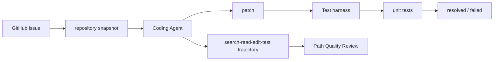

# SWE-bench 与代码任务评测

## 面试定位

SWE-bench 考的是你是否理解 coding agent 的真实评测闭环。面试官不是让你背榜单，而是看你能否把 issue、repository、patch、unit tests、harness 和 trajectory 转成工程质量判断。

## 一句话定义

SWE-bench 是用真实 GitHub issue 和 repository snapshot 评估模型生成 patch 能力的基准，核心是让 Agent 修改代码并通过相关 unit tests。

## 为什么需要它

传统代码生成题太短，无法覆盖真实工程问题。真实 issue 需要理解仓库结构、定位跨文件逻辑、生成最小 patch、运行测试、处理依赖和避免破坏既有行为。SWE-bench 把 coding agent 从“写一个函数”推进到“修一个真实软件问题”。

## 核心架构

图 1：SWE-bench 把真实 issue、仓库快照、Agent patch、测试 harness 和轨迹审查串成一个代码任务评测闭环。

这张图要读成两条链路。上半部分是结果链路：issue 和 repo snapshot 进入 Coding Agent，Agent 产出 patch，harness 应用补丁并运行测试，最终得到 resolved 或 failed。下半部分是过程链路：Agent 的搜索、阅读、编辑、测试、回滚和重试轨迹会进入 Path Quality Review，用来判断它是合理定位后修复，还是靠碰运气、改测试、改配置或引入无关 diff 通过了公开测试。

测试通过是强信号，但不是完整质量结论。还要看补丁是否过拟合、是否改无关文件，以及 trajectory 是否可解释。

## 架构与运行机制

每个实例包含问题描述、代码仓库、目标提交附近的环境和测试。Agent 读取 issue，搜索 repository，生成 patch。harness 应用补丁、安装依赖、运行 unit tests，并输出 resolved 指标。更严谨的评测还会保留 trajectory，分析定位路径、测试命令、失败恢复和最终 diff。

核心数据流是 issue 与 repository snapshot 进入 Agent，Agent 输出 patch，harness 应用补丁并运行 unit tests，报告再结合 trajectory 与 review rubric 判断质量。

SWE-bench Verified 通过人工过滤提高样本可靠性。Lite、Verified、Full 等集合适合不同成本和覆盖范围。企业内部可以借鉴这种结构，把线上 bug、PR 和回归测试沉淀成私有 eval。

公开数据集的选择要和目标匹配。Full 更适合研究覆盖面，Lite 更适合快速迭代，Verified 更适合发布前对比，因为样本经过人工复核，降低了题意不清、测试错误和不可解任务带来的噪声。企业内部不能直接照搬排行榜口径，应该先定义自己的任务边界：是评估“能否修复后端 bug”，还是“能否完成前端 UI 修复”，还是“能否在 CI 约束下提交可 review 的 PR”。边界不同，harness、评分和人工复核比例都会不同。

## 运行机制

评测流程要固定环境，否则结果不可比。Docker 或隔离环境安装依赖，patch 应用失败、测试超时、测试不稳定都要单独分类。failure taxonomy 可以包括 `localization_failed`、`patch_compile_error`、`test_timeout`、`overfit_tests`、`irrelevant_diff` 和 `missing_regression_test`。

更细一点，resolved 指标只回答“这次 patch 是否让指定测试通过”。它不直接回答“这个 patch 能不能长期维护”。因此生产级 coding agent eval 通常会把 hard gate 和 soft review 分开：hard gate 包括 patch apply、install、lint、unit tests、hidden tests；soft review 包括 diff 最小性、是否修改测试、是否引入新依赖、是否绕过安全检查、是否能解释失败路径。这样既保留自动评测的可重复性，也避免把测试覆盖之外的风险误判成能力提升。

## 关键设计取舍

| 评测维度 | 优点 | 风险 | 工程补充 |
| --- | --- | --- | --- |
| unit tests | 客观可自动化 | 覆盖有限 | 加 hidden tests |
| patch review | 看可维护性 | 成本高 | 抽样或高风险必审 |
| trajectory eval | 能归因 | trace 成本高 | 失败样本全量保留 |
| Verified 子集 | 噪声低 | 样本少 | 适合作发布 gate |

## 生产落地细节

私有 SWE-style eval 应保存 issue_id、repo_version、base_commit、patch、test_command、exit_code、logs_ref、changed_files 和 review verdict。指标包括 `resolved_rate`、`patch_apply_rate`、`test_pass_rate`、`irrelevant_diff_rate`、`cost_per_resolved` 和 `regression_escape_rate`。

落地时还要保存环境信息：语言版本、依赖 lockfile、镜像摘要、测试 shard、超时时间、允许工具列表和网络策略。否则同一个 patch 在不同机器上得到不同结果，很难判断是模型退化、依赖漂移还是 harness 不稳定。对线上发布门禁来说，建议把样本分成 smoke、regression、hard、adversarial 四层：smoke 快速发现明显退化，regression 覆盖历史 bug，hard 保留复杂跨文件任务，adversarial 专门测试模型是否会改测试、删断言、绕开安全限制。

## 系统设计案例

公司内部可以把真实线上 bug 转成 eval case。输入是 bug 描述和 repo snapshot，期望输出是 patch。harness 运行相关单测和回归测试。若 Agent 修改了配置绕过测试，即使 tests 过了，patch review 和 trajectory eval 仍应失败。

## 真实问题与排障

如果 resolved_rate 低，先区分定位失败还是 patch 失败。定位失败看搜索和上下文读取。patch 失败看编译错误和测试日志。测试超时看环境和命令。若分数高但人工 review 差，说明 benchmark 被过拟合或 verifier 覆盖不足。

排障不要只看总分。总分下降 5 个点可能来自完全不同原因：检索阶段读错文件、编辑阶段生成不可编译代码、测试阶段环境安装失败、模型为了通过测试修改了 fixture，或者最近的工具权限变更让 Agent 不能运行必要命令。可观测性上至少要能按 `failure_stage`、`repo`、`language`、`test_command`、`model_id`、`tool_policy_version` 聚合。这样才能回答“是某类仓库退化，还是整个 coding harness 退化”。

## 常见误区与排障

- 把 SWE-bench 当排行榜谈资，不讲 harness。
- 只看 tests passed，不看 patch 最小性。
- 忽略 flaky tests 和环境复现。
- 不记录 search-read-edit-test trajectory。

## 面试追问

1. SWE-bench 和 LeetCode 区别？真实仓库、真实 issue、真实测试。
2. 单测通过为什么还不够？可能过拟合、改错边界或破坏未测行为。
3. 如何做企业内部版本？用线上 bug、repo snapshot、回归测试和 review rubric。
4. 如何评估 coding agent 过程？看 trajectory、diff、测试和人工 review。

## 项目化表达

可以说：我会用 SWE-bench 思路设计 Coding Agent Eval。每个 case 有 issue、repository snapshot、允许工具、patch 输出、unit tests 和 trajectory review。发布前看 resolved_rate 与回归逃逸率。

## 深入技术细节

SWE-bench 的价值在于把代码任务评测从“生成片段”变成“真实仓库修复闭环”。一次 case 至少包含 issue 描述、repo snapshot、base commit、依赖环境、期望 patch 行为和测试命令。Agent 的运行轨迹应该记录 search、read、edit、test、revert、retry 等步骤，而不是只保存最终 diff。

Harness 是评测可信度的核心。它负责应用 patch、安装依赖、运行测试、处理超时和分类失败。失败不能只有 failed，要细分 `patch_apply_failed`、`install_failed`、`test_timeout`、`compile_error`、`test_failed`、`irrelevant_diff` 和 `flaky_test`。这样才能知道是定位能力差、修改能力差，还是环境复现有问题。

## 关键数据结构与协议

| 字段 | 作用 | 评测意义 |
| --- | --- | --- |
| `issue_id` | 关联问题描述 | 支持样本追踪 |
| `base_commit` | 固定仓库版本 | 保证可复现 |
| `patch` | Agent 输出变更 | 检查最小性和正确性 |
| `test_command` | harness 执行命令 | 保证结果可比 |
| `exit_code` | 测试结果 | resolved 的基础 |
| `trajectory_ref` | 工具调用轨迹 | 支持过程归因 |
| `review_verdict` | 人工或规则审查 | 防止过拟合测试 |

协议上要把 public tests、hidden tests 和 review rubric 分开。只用公开测试容易被过拟合；只靠人工 review 成本太高。更稳的是自动 harness 做硬门槛，高风险或异常 diff 再做人审。

## 深问准备

如果被问“为什么单测通过还不够”，可以回答：测试覆盖有限，Agent 可能删除断言、修改测试配置、绕开逻辑或引入未测回归。因此还要看 diff 最小性、无关文件变更、trajectory 是否合理、hidden tests 和人工抽样。

如果追问“企业内部怎么做 SWE-style eval”，可以从线上 bug、客服工单、历史 PR 和回归测试构建样本。每个样本固定 repo version 和 test command，保留失败日志和人工 verdict。指标看 `resolved_rate`、`patch_apply_rate`、`cost_per_resolved`、`irrelevant_diff_rate` 和 `regression_escape_rate`。

## 来源与延伸阅读

- [SWE-bench 官方网站](https://www.swebench.com/)：用于确认 benchmark family、leaderboard 口径和不同子集的定位。
- [SWE-bench FAQ](https://www.swebench.com/SWE-bench/faq/)：用于支持 Full、Lite、Verified、Multimodal、Multilingual 等数据集规模与适用边界。
- [SWE-bench Verified](https://www.swebench.com/verified.html)：用于说明人工过滤为什么能降低题意不清、测试错误和不可解样本带来的噪声。
- [SWE-bench GitHub](https://github.com/swe-bench/SWE-bench)：用于理解数据集、harness 和评测运行方式。
- [SWE-bench paper](https://arxiv.org/abs/2310.06770)：用于支持“真实 GitHub issue + repository snapshot + patch evaluation”的基准设计。
