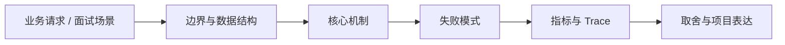

# 容量规划、热点治理与压测回归

## 面试定位

容量规划、热点治理与压测回归 属于 分布式与系统设计 / 容量、热点与灾备。面试里它不是背概念题，而是用来判断你是否能把知识落到架构、数据流、指标和取舍上。
一句话定位：容量题要从流量模型、峰值、瓶颈、热点 key、压测、容量水位、降级预案和发布回归展开。

**必须讲清楚**
- 容量规划是根据业务流量、数据规模、资源消耗和 SLA 预测系统承载能力。
- 热点是少量 key、租户、接口、分片或依赖承载了不成比例的请求。
- 压测回归是用可复现负载验证系统在目标容量和故障条件下的表现。
- 容量题要从流量模型、峰值、瓶颈、热点 key、压测、容量水位、降级预案和发布回归展开。
- 先建流量模型
- 热点比平均值更危险
- 压测要能回归

**常见追问方向**
- 先讲失败模型，再讲幂等键、重试退避、超时预算和观测指标。
- 事务题要比较 Outbox、Saga、事务消息、TCC 和补偿巡检。
- 把 DB、MQ、Redis、Web API 和 Agent 工具执行连接成一条端到端链路。
- 如果这个点落到 Coding Agent：代码库任务 Harness，架构如何设计？
- 线上失败时看哪些 trace、日志、指标，怎么回滚或补偿？

## 架构与运行机制

### 核心机制

- 峰值、突刺、热点和失败重试比平均 QPS 更能决定系统风险。
- 容量要按端到端链路看，包括入口、服务、线程池、DB、Redis、MQ、外部 API 和观测系统。
- 压测必须有真实数据分布和失败注入，否则无法暴露热点和退化路径。
- 扩容、限流、降级和缓存预热要作为容量方案的一部分。
- 容量规划不是估机器数，而是从 QPS、并发、数据量、读写比、峰值因子、下游容量和 SLA 推导瓶颈。
- 热点治理要关注单 key、单分片、单租户、单接口、单队列和单下游，而不是只看系统平均值。
- Load test / stress test / soak test：不同目标的压测类型。
- Capacity headroom：保留突发和故障切换余量。
- Hot key detection：按 key、分片、租户和接口识别热点。
- Autoscaling + prewarming：自动扩缩和活动前预热。
- 容量模型要明确单请求 CPU、内存、DB rows examined、Redis ops、MQ messages 和外部 API 调用。
- 热点治理可用本地缓存、分片、队列化、限流、预热、读模型和降级。
- 长稳压测要观察内存泄漏、GC、连接池、日志成本和监控采集容量。
- 发布前后要比较 p95/p99、错误率、资源水位和关键业务成功率。

### 通用数据流

可以按用户入口、流量路由、负载均衡、服务发现、限流熔断、超时重试、状态存储、异步事件、一致性、容量、灾备和可观测性来讲。数据流通常是请求经过网关和负载均衡进入服务，服务通过发现/配置选择依赖，按 timeout、retry、circuit breaker 和 bulkhead 执行；状态变化写 DB/MQ/缓存，观测系统用指标、日志和 Trace 判断是否过载、降级或恢复。

### 工程落点

- 为每个跨服务动作定义 request_id、idempotency_key、timeout、retry policy 和 error code。
- 为最终一致性链路设计 outbox、consumer idempotency、compensation 和 checker。
- 上线后跟踪 retry_rate、timeout_rate、duplicate_rate、compensation_lag 和 inconsistent_count。
- 压测要覆盖核心链路、降级路径、依赖限流、缓存失效、MQ 积压和故障恢复。
- 容量水位要设置告警和扩容阈值，并记录 capacity_headroom、saturation 和 cost_per_request。
- 把每个关键步骤都映射到可观测指标，避免只描述功能。
- 回答时主动说明哪些信息是强一致状态，哪些只是上下文或缓存视图。

## 可画图

图 1：容量规划、热点治理与压测回归 的回答要从业务入口进入，先讲边界和数据结构，再讲机制、失败模式、指标和取舍。

## 系统设计案例

### 容量规划、热点治理与压测回归 的面试级设计题

典型设计题是订单系统、支付链路、消息通知平台、Agent tool execution 集群或 RAG 检索服务。架构上要包含入口限流、路由策略、健康检查、服务发现、配置灰度、幂等重试、熔断降级、热点隔离、容量预估、多区域灾备、RPO/RTO 和演练。

**可画架构**
- 入口层校验用户请求、权限、租户、参数和幂等键。
- 业务服务层决定同步处理、异步处理、缓存读写、数据库回源或降级返回。
- 状态层保存业务状态、缓存版本、事件状态和恢复点。
- 执行层处理存储访问、下游调用、异步任务和补偿动作，并把结构化结果写入 trace。
- 观测层用指标、日志和链路追踪证明系统可运行、可排障、可复盘。

**数据流**
- 请求进入入口层后生成 request_id/run_id。
- 业务服务读取缓存、数据库或异步事件状态，选择执行路径。
- 执行结果写回状态存储，并向监控系统上报延迟、错误和业务结果。
- 保护策略根据成功标准、失败次数、SLA 和风险等级决定继续、降级、补偿或停止。

## 真实问题与排障

真实线上问题一般从错误率、p95/p99、timeout_rate、retry_rate、queue_depth、consumer_lag、dependency_error_rate、circuit_open_count、hot_key_qps、capacity_headroom、failover_time 和 inconsistent_count 看起。回答时要先保护核心链路，再定位是入口流量、路由、依赖、状态、一致性、容量还是发布配置问题。

**排查顺序**
- 先确认用户可感知问题：错误率、延迟、成功率、数据一致性或结果质量是否异常。
- 再沿数据流定位是哪一段出了问题：入口、状态、缓存、数据库、异步事件、外部依赖或消费端。
- 对比最近发布、配置变更、流量变化、数据倾斜和下游限流。
- 先止血：限流、降级、回滚、暂停消费、隔离高风险工具或切换只读模式。
- 最后把失败样例进入 regression/eval，避免同类问题复发。

**重点指标**
- capacity_headroom
- hot_key_qps
- saturation
- queue_depth
- cost_per_request

**常见误区**
- 只看平均 QPS
- 压测环境数据量不真实
- 没有降级和扩容预案

## 业界方案与技术取舍

系统设计的取舍是可用性、性能、一致性、成本、复杂度和可运维性之间的平衡。面试追问通常会围绕负载均衡策略、重试风暴、限流熔断、服务发现、配置灰度、选主共识、多活灾备、热点治理和容量规划展开。

**方案对比**
- Load test / stress test / soak test：不同目标的压测类型。
- Capacity headroom：保留突发和故障切换余量。
- Hot key detection：按 key、分片、租户和接口识别热点。
- Autoscaling + prewarming：自动扩缩和活动前预热。
- 预留容量提高稳定性，但增加成本。
- 自动扩容节省成本，但有冷启动和错误扩容风险。
- 降级保护核心链路，但牺牲功能完整性和用户体验。
- 分布式系统的核心不是调用更多服务，而是在失败、超时、重复和部分成功下仍能收敛。
- 幂等、重试、超时、限流、熔断、降级和补偿要作为一组机制设计。
- 一致性题要区分本地事务、远程调用、异步事件、读模型和用户可见状态。
- 容量热点题能把 Redis、DB、MQ、Java、Observability 和模型 API 成本串成整体系统设计。
- 面试时能用容量模型和压测报告表达，比只说加机器更专业。

**复习时要能讲出的细节**
- 这个知识点解决什么问题，不解决什么问题。
- 关键数据结构、状态变化、失败边界和可观测指标是什么。
- 面试官继续追问时，能从架构图、数据流、线上排障和项目证据四个角度展开。
- 能说明为什么这个取舍适合当前业务，而不是只背业界名词。

## 深入技术细节

容量题要从流量模型、峰值、瓶颈、热点 key、压测、容量水位、降级预案和发布回归展开。 容量规划是根据业务流量、数据规模、资源消耗和 SLA 预测系统承载能力。 热点是少量 key、租户、接口、分片或依赖承载了不成比例的请求。 压测回归是用可复现负载验证系统在目标容量和故障条件下的表现。 峰值、突刺、热点和失败重试比平均 QPS 更能决定系统风险。 容量要按端到端链路看，包括入口、服务、线程池、DB、Redis、MQ、外部 API 和观测系统。 压测必须有真实数据分布和失败注入，否则无法暴露热点和退化路径。 扩容、限流、降级和缓存预热要作为容量方案的一部分。

面试深挖时要把对象、状态、协议、执行顺序和失败分支讲出来。不要只说“可以用 Redis/数据库/MQ 解决”，而要说明 key、字段、版本、超时、重试、幂等、降级和观测指标如何共同工作。

## 关键数据结构与协议

| 字段 | 所属对象 | 作用 | 排障价值 |
| :--- | :--- | :--- | :--- |
| `capacity_model_id` | 容量模型 | 标识一次容量评估版本 | 对比压测和线上结果 |
| `peak_qps` | 流量模型 | 目标峰值请求量 | 判断是否达到活动容量 |
| `peak_concurrency` | 流量模型 | 峰值并发连接或任务数 | 解释线程池和队列水位 |
| `hot_key_ratio` | 热点画像 | Top key/tenant 占比 | 识别平均值掩盖的问题 |
| `saturation_signal` | 容量水位 | CPU、连接池、队列、DB rows 等瓶颈 | 判断是否接近拐点 |
| `headroom_percent` | 容量策略 | 预留故障和突刺余量 | 支持扩容决策 |
| `degrade_plan` | 降级预案 | 明确非核心功能关闭顺序 | 保护核心链路 |

## 深问准备

被追问边界时，先说这个方案适合什么、不适合什么，再给反例。被追问线上故障时，按影响面、止血、根因、修复、回归五段回答。被追问项目时，把回答落到你做过的接口、缓存、队列、数据库、监控或 Agent 工程链路。

- 反例要明确，例如强事务事实源不能交给缓存或搜索读模型。
- 指标要可执行，例如 p95、error_rate、retry_rate、lag、miss_rate、stale_rate。
- 回归要可复现，例如固定输入、故障注入、压测脚本或 golden case。

## 公开阅读校验

这篇文章要避免把容量规划写成“估机器数”。更专业的主线是：先建业务流量模型，再拆每次请求消耗哪些资源，识别端到端瓶颈，最后用压测和线上指标校准模型。平均 QPS 只能作为入口，真正决定风险的是峰值、突刺、热点、重试放大、缓存失效和下游限流。

热点治理要明确对象。热点可能是单 key、单用户、单租户、单接口、单分片、单队列、单模型、单外部 API，也可能是某个发布版本引入的异常查询。治理方式也不同：本地缓存、请求合并、预热、分片、队列化、限流、隔离池、读模型、降级或人工处理。不能把所有热点都回答成“加缓存”。

压测验收要覆盖三类场景：目标容量下是否达标，超过容量时是否可控退化，依赖失败时是否保护核心链路。压测数据分布要接近真实业务，尤其要包含 hot key、长尾用户、大租户、慢依赖、MQ 积压、Redis 失效和 DB 高扫描。只用均匀随机数据压测，会把最危险的问题隐藏掉。

项目表达可以用指标闭环：容量模型看 `peak_qps`、`peak_concurrency`、`cost_per_request`；运行水位看 p95/p99、queue depth、connection pool usage、DB rows examined、Redis ops、MQ lag、dependency error rate；恢复能力看 degrade success rate、failover time 和 headroom。这样读者能看到从规划、压测到生产排障的完整链路。

## 来源与延伸阅读

- [Google SRE Book: Addressing Cascading Failures](https://sre.google/sre-book/addressing-cascading-failures/)：用于确认官方语义边界、命令行为和工程约束。
- [Prometheus Documentation](https://prometheus.io/docs/introduction/overview/)：用于确认官方语义边界、命令行为和工程约束。
- [Redis Documentation](https://redis.io/docs/latest/)：用于确认官方语义边界、命令行为和工程约束。
