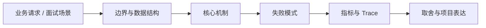

# 一致性模型、共识与 Leader 选举

## 面试定位

一致性模型、共识与 Leader 选举 属于 分布式与系统设计 / 服务发现、配置与协调。面试里它不是背概念题，而是用来判断你是否能把知识落到架构、数据流、指标和取舍上。
一句话定位：一致性和选主题要从线性一致、最终一致、租约、脑裂、Raft 日志复制、quorum、fencing 和业务场景取舍展开。

**必须讲清楚**
- 一致性模型定义读写操作在并发和故障下能看到什么结果。
- 共识是在多个节点之间对日志或状态达成一致的机制。
- Leader 选举是在多个候选节点中选择唯一协调者或写入者。
- 一致性和选主题要从线性一致、最终一致、租约、脑裂、Raft 日志复制、quorum、fencing 和业务场景取舍展开。
- 一致性是语义选择
- 选主必须防脑裂
- fencing 保护旧 leader

**常见追问方向**
- 先讲失败模型，再讲幂等键、重试退避、超时预算和观测指标。
- 事务题要比较 Outbox、Saga、事务消息、TCC 和补偿巡检。
- 把 DB、MQ、Redis、Web API 和 Agent 工具执行连接成一条端到端链路。
- 如果这个点落到 Coding Agent：代码库任务 Harness，架构如何设计？
- 线上失败时看哪些 trace、日志、指标，怎么回滚或补偿？

## 架构与运行机制

### 核心机制

- 强一致通常牺牲可用性或延迟，最终一致通常增加补偿和用户状态表达。
- Leader 不是永久正确，所有写入要带 term、lease 或 fencing token。
- 网络分区下要防止两个 leader 同时写入。
- 业务要区分控制面强一致和数据面高可用。
- 不是所有系统都需要强一致，面试要先说明业务是否能接受旧读、重复执行和最终收敛。
- Leader 选举解决单写者或协调者问题，但必须处理网络分区、租约过期、旧 leader 写入和脑裂。
- Raft：通过 leader、term、log replication 和 quorum 达成共识。
- Lease + fencing：租约控制活跃 leader，fencing 拒绝旧 leader 写入。
- Quorum read/write：多数派读写减少脑裂风险。
- Read repair / reconciliation：最终一致系统通过修复和对账收敛。
- 分布式锁如果没有 fencing token，锁过期后的旧持有者仍可能写坏数据。
- 时钟不能作为唯一正确性来源，租约要考虑漂移和暂停。
- 选主频繁抖动通常说明健康检查、网络、GC pause 或 quorum 配置有问题。
- 用户可见状态要明确处理中、已提交、待同步和冲突修复。

### 通用数据流

可以按用户入口、流量路由、负载均衡、服务发现、限流熔断、超时重试、状态存储、异步事件、一致性、容量、灾备和可观测性来讲。数据流通常是请求经过网关和负载均衡进入服务，服务通过发现/配置选择依赖，按 timeout、retry、circuit breaker 和 bulkhead 执行；状态变化写 DB/MQ/缓存，观测系统用指标、日志和 Trace 判断是否过载、降级或恢复。

### 工程落点

- 为每个跨服务动作定义 request_id、idempotency_key、timeout、retry policy 和 error code。
- 为最终一致性链路设计 outbox、consumer idempotency、compensation 和 checker。
- 上线后跟踪 retry_rate、timeout_rate、duplicate_rate、compensation_lag 和 inconsistent_count。
- 需要单写者的任务调度、分片迁移和全局配置发布要有 fencing token 或版本校验。
- 共识系统不可用时要明确业务退化策略，而不是把所有请求挂死。
- 把每个关键步骤都映射到可观测指标，避免只描述功能。
- 回答时主动说明哪些信息是强一致状态，哪些只是上下文或缓存视图。

## 可画图

图 1：一致性模型、共识与 Leader 选举 的回答要从业务入口进入，先讲边界和数据结构，再讲机制、失败模式、指标和取舍。

## 系统设计案例

### 一致性模型、共识与 Leader 选举 的面试级设计题

典型设计题是订单系统、支付链路、消息通知平台、Agent tool execution 集群或 RAG 检索服务。架构上要包含入口限流、路由策略、健康检查、服务发现、配置灰度、幂等重试、熔断降级、热点隔离、容量预估、多区域灾备、RPO/RTO 和演练。

**可画架构**
- 入口层校验用户请求、权限、租户、参数和幂等键。
- 业务服务层决定同步处理、异步处理、缓存读写、数据库回源或降级返回。
- 状态层保存业务状态、缓存版本、事件状态和恢复点。
- 执行层处理存储访问、下游调用、异步任务和补偿动作，并把结构化结果写入 trace。
- 观测层用指标、日志和链路追踪证明系统可运行、可排障、可复盘。

**数据流**
- 请求进入入口层后生成 request_id/run_id。
- 业务服务读取缓存、数据库或异步事件状态，选择执行路径。
- 执行结果写回状态存储，并向监控系统上报延迟、错误和业务结果。
- 保护策略根据成功标准、失败次数、SLA 和风险等级决定继续、降级、补偿或停止。

## 真实问题与排障

真实线上问题一般从错误率、p95/p99、timeout_rate、retry_rate、queue_depth、consumer_lag、dependency_error_rate、circuit_open_count、hot_key_qps、capacity_headroom、failover_time 和 inconsistent_count 看起。回答时要先保护核心链路，再定位是入口流量、路由、依赖、状态、一致性、容量还是发布配置问题。

**排查顺序**
- 先确认用户可感知问题：错误率、延迟、成功率、数据一致性或结果质量是否异常。
- 再沿数据流定位是哪一段出了问题：入口、状态、缓存、数据库、异步事件、外部依赖或消费端。
- 对比最近发布、配置变更、流量变化、数据倾斜和下游限流。
- 先止血：限流、降级、回滚、暂停消费、隔离高风险工具或切换只读模式。
- 最后把失败样例进入 regression/eval，避免同类问题复发。

**重点指标**
- leader_change_count
- quorum_unavailable_count
- fencing_reject_count
- replication_lag
- stale_read_count

**常见误区**
- 把最终一致说成强一致
- 只说选主不说 fencing
- 忽略网络分区和时钟漂移

## 业界方案与技术取舍

系统设计的取舍是可用性、性能、一致性、成本、复杂度和可运维性之间的平衡。面试追问通常会围绕负载均衡策略、重试风暴、限流熔断、服务发现、配置灰度、选主共识、多活灾备、热点治理和容量规划展开。

**方案对比**
- Raft：通过 leader、term、log replication 和 quorum 达成共识。
- Lease + fencing：租约控制活跃 leader，fencing 拒绝旧 leader 写入。
- Quorum read/write：多数派读写减少脑裂风险。
- Read repair / reconciliation：最终一致系统通过修复和对账收敛。
- 强一致语义清晰，但跨区域延迟和故障可用性成本高。
- 最终一致可用性强，但需要补偿、对账和用户沟通。
- 单 leader 简化写入，但可能成为瓶颈和故障切换点。
- 分布式系统的核心不是调用更多服务，而是在失败、超时、重复和部分成功下仍能收敛。
- 幂等、重试、超时、限流、熔断、降级和补偿要作为一组机制设计。
- 一致性题要区分本地事务、远程调用、异步事件、读模型和用户可见状态。
- 一致性题可以连接 DB MVCC、Redis 锁、MQ 最终一致性和配置中心。
- 讲清 fencing token 和旧 leader 拒写，是系统设计面试里的关键细节。

**复习时要能讲出的细节**
- 这个知识点解决什么问题，不解决什么问题。
- 关键数据结构、状态变化、失败边界和可观测指标是什么。
- 面试官继续追问时，能从架构图、数据流、线上排障和项目证据四个角度展开。
- 能说明为什么这个取舍适合当前业务，而不是只背业界名词。

## 深入技术细节

一致性和选主题要从线性一致、最终一致、租约、脑裂、Raft 日志复制、quorum、fencing 和业务场景取舍展开。 一致性模型定义读写操作在并发和故障下能看到什么结果。 共识是在多个节点之间对日志或状态达成一致的机制。 Leader 选举是在多个候选节点中选择唯一协调者或写入者。 强一致通常牺牲可用性或延迟，最终一致通常增加补偿和用户状态表达。 Leader 不是永久正确，所有写入要带 term、lease 或 fencing token。 网络分区下要防止两个 leader 同时写入。 业务要区分控制面强一致和数据面高可用。

面试深挖时要把对象、状态、协议、执行顺序和失败分支讲出来。不要只说“可以用 Redis/数据库/MQ 解决”，而要说明 key、字段、版本、超时、重试、幂等、降级和观测指标如何共同工作。

## 关键数据结构与协议

| 字段 | 所属对象 | 作用 | 排障价值 |
| :--- | :--- | :--- | :--- |
| `term` | 共识轮次 | 标识 leader 任期，所有写入和日志复制都要携带 | 判断旧 leader 是否仍在写入 |
| `log_index` | 复制日志 | 标识命令在日志中的顺序 | 定位 follower 落后、重复提交和回滚点 |
| `commit_index` | 集群状态 | 标识已被多数派确认的最高日志位置 | 判断读请求能否看到已提交状态 |
| `lease_expire_at` | leader 租约 | 控制 leader 对外服务的时间窗口 | 排查 GC pause、时钟漂移和租约重叠 |
| `fencing_token` | 外部写入凭证 | 写 DB、对象存储或任务执行前校验新旧 leader | 拒绝旧 leader 的延迟写入 |

## 公开阅读校验

读者看这一篇时，要能区分三个层次：一致性模型回答“读写语义是什么”，共识协议回答“多个节点如何就顺序达成一致”，Leader 选举回答“谁暂时负责协调写入”。如果文章只说“用 Raft 保证一致”，还不够专业；公开文章应该说清楚 term、log index、commit index、quorum 和 fencing 如何共同阻止旧 leader 继续写入。

项目表达可以落到一个任务调度或配置发布系统：调度器通过共识选出 leader，leader 给每次分片迁移生成递增 fencing token，worker 写业务表时必须带 token；如果 leader 在 GC pause 后恢复，虽然本地以为自己仍然有效，但下游存储会因为 token 过旧而拒绝写入。这样的例子比单纯背“脑裂”更容易被面试官认可。

上线验证要观察 `leader_change_count`、`election_timeout_count`、`quorum_unavailable_count`、`fencing_reject_count`、`replication_lag` 和 `stale_read_count`。故障演练至少覆盖网络分区、leader 暂停、少数派写入、follower 追日志和旧 leader 恢复。结论要克制：强一致适合控制面、账务提交和全局配置，不适合所有高频数据面读写。

## 深问准备

被追问边界时，先说这个方案适合什么、不适合什么，再给反例。被追问线上故障时，按影响面、止血、根因、修复、回归五段回答。被追问项目时，把回答落到你做过的接口、缓存、队列、数据库、监控或 Agent 工程链路。

- 反例要明确，例如强事务事实源不能交给缓存或搜索读模型。
- 指标要可执行，例如 p95、error_rate、retry_rate、lag、miss_rate、stale_rate。
- 回归要可复现，例如固定输入、故障注入、压测脚本或 golden case。

## 来源与延伸阅读

- [etcd Documentation: Raft](https://etcd.io/docs/v3.5/learning/)：用于确认官方语义边界、命令行为和工程约束。
- [AWS Builders Library: Static stability using Availability Zones](https://aws.amazon.com/builders-library/static-stability-using-availability-zones/)：用于确认官方语义边界、命令行为和工程约束。
- [PostgreSQL Documentation: Multiversion Concurrency Control](https://www.postgresql.org/docs/current/mvcc.html)：用于确认官方语义边界、命令行为和工程约束。
