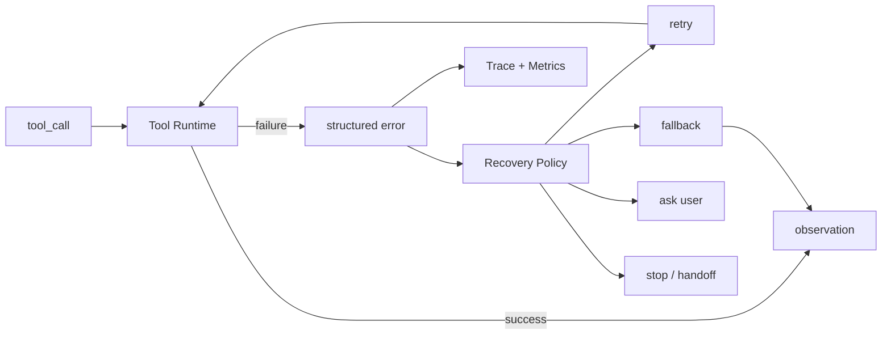
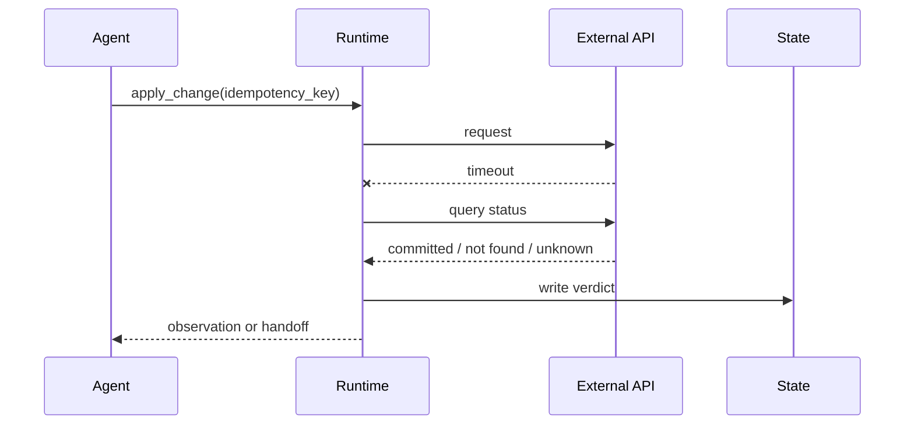

# 工具失败恢复

## 面试定位

工具失败恢复题考的是你是否把 Agent 当生产系统。回答要覆盖 timeout、retryable、error_code、fallback、compensation、trace 和停止条件，不能只说“让模型重试”。

## 一句话定义

工具失败恢复是把外部工具错误转成可理解、可统计、可恢复的 structured error，并由宿主系统决定重试、降级、换工具、补偿、追问用户或人工接管。

模型可以参与下一步选择，但 retryable 和风险判断不能只靠模型猜。

## 为什么需要它

工具失败比模型失败更常见：API 超时、限流、权限拒绝、空结果、参数错误、下游 schema 变化、浏览器 selector 漂移。没有结构化错误，模型会凭空补答案或盲目重试。

## 核心架构

图里的关键是 Recovery Policy。错误返回只描述事实，是否重试、降级或补偿由策略决定。

## 架构与运行机制

数据流是：工具执行失败后返回 `{ error_code, message, retryable, hint, partial_data, safe_to_retry }`。宿主根据错误类型、预算、幂等性和风险等级选择恢复动作。恢复结果写入 trace，模型看到的是可行动 observation，而不是堆栈。

## 运行机制

timeout、rate limit、5xx 可以有退避重试。permission denied、invalid arguments、business rule violation 通常不该盲目重试。写操作失败要区分是否已生效，必要时查状态或执行 compensation。

## 关键设计取舍

| 错误类型 | 推荐处理 | 风险 | 指标 |
| --- | --- | --- | --- |
| timeout | 幂等前提下退避重试 | 重复副作用 | timeout_rate |
| rate limit | 限流和排队 | 延迟升高 | rate_limit_hit |
| invalid args | 让模型修参或追问用户 | 循环修复 | invalid_args_rate |
| permission denied | 拒绝并解释 | 用户困惑 | permission_denial_rate |
| partial success | 查状态再补偿 | 状态不一致 | compensation_rate |

## 生产落地细节

每个工具要声明 retry policy、timeout、idempotent、side effect 和 compensation plan。写工具必须有 idempotency key。错误要进入 eval，常见失败要有 fixture。

指标包括 `tool_error_rate`、`retry_success_rate`、`fallback_success_rate`、`compensation_rate`、`human_handoff_rate` 和 `error_budget_burn`。

## 系统设计案例

航班改签工具提交时超时，不能立即重复提交。正确做法是用 idempotency key 查询改签状态。如果未提交，再安全重试；如果已提交，返回成功 observation；如果状态未知，转人工或补偿流程。

## 真实问题与排障

如果工具错误率上升，先按 error_code 聚合。看是下游慢、参数错误、权限变更、schema 漂移还是调用量突增。再看 retry 是否放大压力，fallback 是否生效。

## 常见误区与排障

常见误区是吞掉工具错误，或把异常堆栈直接给模型。另一个误区是所有错误都重试，造成重试风暴和重复副作用。

## 面试追问

1. retryable 如何判断？
2. timeout 后写操作能不能重试？
3. structured error 包含什么？
4. fallback 和 compensation 怎么设计？

## 项目化表达

Coding Agent 的测试失败不能当工具崩溃，要作为 observation。Web Agent 的 click 失败要返回 selector drift 和 screenshot。Travel Agent 的提交失败要查状态和幂等。

## 深入技术细节

工具失败恢复的第一原则是把错误事实和恢复决策分开。Tool Runtime 只返回结构化事实：`error_code`、`message`、`retryable`、`safe_to_retry`、`idempotency_key`、`partial_result`、`side_effect_status`、`retry_after_ms`、`correlation_id` 和 `hint`。Recovery Policy 再根据工具元数据、预算、风险和当前 state 决定 retry、fallback、ask user、compensate、handoff 或 stop。

写操作的超时最危险，因为“客户端没收到响应”不代表服务端没执行。正确链路是先用 idempotency key 查询状态，确认未生效再重试；如果已生效，返回成功 observation；如果状态未知，进入人工接管或补偿流程。这个细节能区分有生产经验的回答和“失败就重试”的回答。

## 关键数据结构与协议

| 错误字段 | 含义 | 恢复动作 |
| --- | --- | --- |
| `retryable` | 技术上可重试 | 仍需看幂等和预算 |
| `safe_to_retry` | 不会重复副作用 | 允许自动退避重试 |
| `side_effect_status` | unknown/committed/not_started | 决定查状态或补偿 |
| `retry_after_ms` | 下游限流建议 | 避免 retry 风暴 |
| `partial_result` | 部分成功数据 | 支持降级或续跑 |
| `correlation_id` | 下游请求编号 | 支持跨系统排障 |

协议上要区分工具异常和业务失败。测试不通过、搜索无结果、权限拒绝不一定是工具崩溃，而是有效 observation。只有下游不可用、schema 不兼容、timeout、rate limit 等才进入工具错误恢复。混淆这两类问题会让 Agent 盲目重试业务上不该重试的动作。

## 深问准备

面试追问“如何避免 retry 风暴”时，可以讲指数退避、jitter、全局 rate limit、熔断、队列化和错误预算。还要说明 retry 不是模型决定的自由动作，而是 Recovery Policy 基于错误码和工具声明自动控制。

追问“fallback 如何设计”时，可以按能力降级：主搜索失败换备用索引，实时价格失败返回缓存并标注 stale，写操作失败只返回 preview 不执行。fallback 必须暴露质量差异，不能假装与主路径等价，否则会制造隐藏错误。

还可以补一句治理边界：所有恢复动作都要写入 trace，并进入离线回放集。否则线上看似自动恢复，实际可能在悄悄吞掉错误、扩大延迟或把成本转移到人工处理。成熟系统会按错误类型设置 error budget，超过阈值后自动降级或暂停高风险工具。

## 来源与延伸阅读

- [Anthropic Building effective agents](https://www.anthropic.com/engineering/building-effective-agents)
- [OpenAI A practical guide to building agents](https://cdn.openai.com/business-guides-and-resources/a-practical-guide-to-building-agents.pdf)
