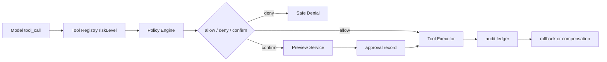

# 工具权限与 Human-in-the-loop

## 面试定位

工具权限是 Agent 安全落地的核心。面试官问它时，重点不是“弹个确认框”，而是 read/write 分级、外部副作用、requiresConfirmation、preview、approval、audit、rollback、幂等和业务 ACL。强回答会明确：模型只能提出 tool_call 意图，真正权限判断必须由宿主程序执行。

## 一句话定义

工具权限决定 Agent 能读什么、写什么、访问哪些资源、什么时候需要 human-in-the-loop。Human-in-the-loop 是一条完整链路，包括风险识别、preview、approval、执行、audit、rollback 和补偿，而不是一个孤立确认按钮。

## 为什么需要它

Agent 能调用工具后，风险从“说错话”升级为“做错事”。读工具可能泄露敏感数据，写工具可能发邮件、删除文件、提交订单、修改代码或支付。权限层把工具按 riskLevel、permissionScope、reversible、externalEffect、sensitiveData 分级，让低风险动作自动执行，高风险动作进入确认或拒绝。

## 核心架构

图 1：工具权限与 Human-in-the-loop 执行链路。图中权限决策不依赖模型自述理由，而依赖用户身份、资源归属、工具元数据、业务 ACL 和当前任务 scope。

## 架构与运行机制

Tool Registry 记录工具的 read/write 类型、riskLevel、requiresConfirmation、scope、reversible、externalEffect、sensitiveData、owner 和 timeout。Policy Engine 根据 actor、tenant、resource、environment、business rule 和 riskLevel 做 allow、deny 或 confirm。Preview Service 生成 dry-run 结果、影响范围、风险说明和 rollback plan。Approval Service 记录 actor 决策，Executor 执行前再次校验 args_hash 和 permission。

Human-in-the-loop 记录要包含 actor、role、tool_name、args_hash、preview_snapshot、decision、reason、timestamp、expires_at、rollback_plan。对于财务、删除、发布、对外发送等动作，approval 过期后必须重新生成 preview。

## 运行机制

数据流是模型提出 tool_call，宿主解析参数，Registry 补充风险元数据，Policy Engine 检查权限。低风险只读工具可直接执行。高风险写操作先 dry-run，确认前展示真实参数、目标对象、影响范围和回滚方式。执行时使用 idempotencyKey 防重复，结果和 error_code 写入 audit ledger。

## 关键设计取舍

| 动作类型 | 默认策略 | 原因 | 风险 | 面试表达 |
| --- | --- | --- | --- | --- |
| 只读低敏 | allow | 提升效率 | 仍需权限过滤 | 自动但可审计 |
| 读敏感数据 | deny 或 confirm | 防泄漏 | 误拦影响体验 | 依赖业务 ACL |
| 可逆写操作 | preview + approval | 需要用户知情 | 交互变慢 | 以安全换可控 |
| 不可逆/财务 | dual approval | 风险高 | 流程重 | 必须 audit 和 rollback |

## 生产落地细节

确认界面不能只显示“是否继续”。它要展示工具名、真实参数、影响对象、风险、证据、过期时间和 rollback plan。确认后的执行必须重新校验 args_hash，防止确认的是 A，执行的是 B。所有拒绝、确认、执行、失败、补偿都要关联 run_id、step_id、user_id、resource_id 和 trace_id。

关键指标包括 `permission_denial_rate`、`approval_rate`、`unsafe_tool_call_block_rate`、`rollback_success_rate`、`audit_coverage`、`duplicate_side_effect_count` 和 `policy_false_positive_rate`。如果 approval_rate 过高，说明工具风险分级太粗。若 audit_coverage 不完整，高风险动作就无法复盘。

## 系统设计案例

退款 Agent 中，查询订单是只读工具，可以自动执行。创建退款预览是低风险写前步骤，可以自动生成。确认退款会产生财务影响，必须 preview + approval。approval record 保存金额、订单、原因、操作者、args_hash、过期时间和 rollback plan。执行失败时根据 error_code 走 retry、compensation 或人工工单。

Coding Agent 中，read_file 是只读工具，apply_patch 是写工具，run_tests 是验证工具。apply_patch 可以自动执行在 sandbox 中，但提交、发布、删除文件或运行危险 shell 命令必须进入确认。

## 真实问题与排障

如果出现误执行，先查 approval record 是否存在，再查 args_hash 是否一致，然后查 Policy Engine 的 decision 和工具 riskLevel。如果用户确认后仍发生重复副作用，要检查 idempotencyKey 和 executor 重试逻辑。如果权限拒绝过多，按工具、用户角色和资源类型分桶，确认是策略过严还是工具可见性错误。

## 常见误区与排障

- 工具默认全权限。
- 确认弹窗不展示真实参数。
- approval 不记录 actor 和 args_hash。
- 执行层不做二次权限校验。
- rollback plan 只写在文档里，没有进入审计链路。

## 面试追问

1. 哪些工具可以自动执行？重点是只读、低敏、可审计。
2. human-in-the-loop 记录哪些字段？重点是 actor、preview、decision、args_hash、rollback。
3. 如何防止确认后参数被替换？重点是 args_hash 和执行前二次校验。
4. 多 Agent 共用工具怎么控权？重点是 Registry、Policy Engine 和 tenant scope。

## 项目化表达

可以说：我把工具权限做成 Tool Permission Gateway。模型只输出 tool_call。网关根据 riskLevel 和业务 ACL 决定 allow、deny 或 confirm。高风险工具必须 preview、approval、audit 和 rollback。这样项目不是“模型想做什么就做什么”，而是受控执行系统。

## 深入技术细节

工具权限要把“模型可见性”和“执行授权”分开。Context Builder 可以根据任务暴露某个工具 schema，但 Dispatcher 执行时仍要校验 actor、tenant、resource ownership、business state、risk level、confirmation 和 idempotency key。可见不等于可执行。

高风险写操作推荐 preview/apply 双阶段。Preview Service 返回影响对象、参数、风险、费用、回滚计划和过期时间；Approval Service 记录 actor、decision 和 args_hash；Executor 执行前重新计算 args_hash，确认用户批准的就是即将执行的动作。

## 关键数据结构与协议

| 字段 | 作用 | 防护点 |
| :--- | :--- | :--- |
| `actor_id` | 操作者 | 责任归属 |
| `resource_id` | 目标对象 | 防越权 |
| `risk_level` | 风险分级 | 确认策略 |
| `preview_snapshot` | 影响预览 | 用户知情 |
| `args_hash` | 参数锁定 | 防替换 |
| `idempotency_key` | 重试安全 | 防重复副作用 |

协议上 approval 不能永久有效。价格、订单状态、文件 diff 或权限变化后，旧 approval 应失效，必须重新生成 preview。

## 深问准备

被问“哪些工具能自动执行”，回答：低敏只读、可审计、不会产生外部副作用的工具可以自动；读敏感数据、写操作、财务、删除、发布、外发消息必须 deny 或 confirm。

被问“多 Agent 共用工具怎么控权”，回答：Registry 统一 tool metadata，Policy Engine 按 agent role、user role、tenant、resource 和 task scope 决策。Agent 的 prompt 不能作为权限来源。

## 生产验收清单

工具权限上线前要先做工具清单审计。每个工具必须声明 `tool_name`、`owner`、`read_or_write`、`risk_level`、`permission_scope`、`resource_type`、`requires_confirmation`、`reversible`、`external_effect`、`timeout_ms`、`idempotency_key_strategy` 和 `audit_policy`。缺少这些字段的工具不应暴露给 Agent。只读工具也要过滤资源归属，不能因为“不写数据”就跳过权限。

Human-in-the-loop 的验收要覆盖完整状态机：模型提出 tool_call，系统生成 dry-run/preview，用户确认，执行前重新检查权限和 args_hash，执行后写 audit ledger。如果确认记录过期、参数变化、资源状态变化或用户权限变化，执行必须被拒绝并重新生成 preview。对于退款、发邮件、发布、删除、提交代码、转账这类外部副作用动作，还要验证重复点击、重试、超时和部分成功都不会产生重复副作用。

排障验收则要能复盘一条高风险动作：谁发起、模型给了什么参数、Policy Engine 为什么允许/拒绝/确认、用户看到了什么 preview、实际执行参数是否一致、下游返回什么、是否触发补偿。关键指标包括 `approval_expired_count`、`args_hash_mismatch_count`、`duplicate_side_effect_count`、`audit_missing_count` 和 `rollback_success_rate`。这些指标比“弹了确认框”更能证明工具权限真的可控。

## 公开阅读校验

公开读者需要看到 human-in-the-loop 不是 UI 组件，而是一条权限状态机。确认前有风险识别和 preview，确认时有 actor、role、args_hash 和 expires_at，执行前有二次权限校验，执行后有 audit、rollback 或 compensation。少了任一环节，确认按钮都可能只是心理安慰。

这篇文章还应强调“模型可见工具”和“用户可执行工具”不是同一件事。模型可以在上下文里看到某个工具 schema，但 Dispatcher 仍要按用户身份、租户、资源归属、业务状态和 risk level 做执行授权。反过来，低风险工具自动执行也要写审计记录，因为只读工具仍可能触达敏感数据。

对企业读者来说，最有价值的检查口径是高风险动作的复盘能力：能否还原用户看见的 preview、确认的参数、执行时的参数、下游结果和补偿动作。如果系统只能证明“用户点过确认”，却不能证明确认的就是实际执行的动作，那么权限设计还没有达到生产可信水平。

## 来源与延伸阅读

- [OpenAI: A practical guide to building agents](https://cdn.openai.com/business-guides-and-resources/a-practical-guide-to-building-agents.pdf)：用于工具、安全和 human-in-the-loop 设计。
- [OpenAI Agents SDK](https://platform.openai.com/docs/guides/agents-sdk/)：用于理解 tools、guardrails、handoff、tracing 的框架位置。
- [AgentGuide: Agent 核心追问清单](https://github.com/adongwanai/AgentGuide/blob/main/docs/04-interview/03-agent-questions.md)：用于面试追问组织。
