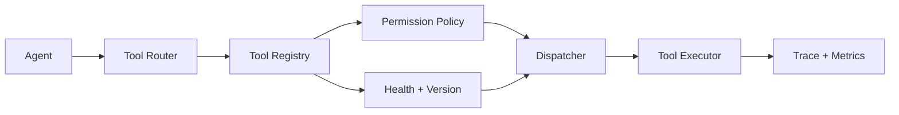
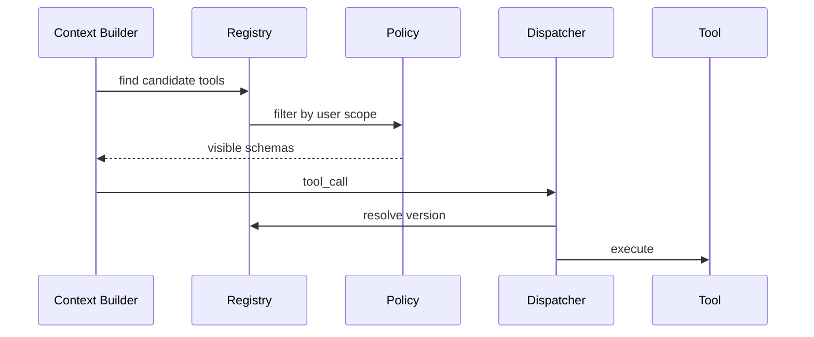

# 工具注册与调度

## 面试定位

工具注册表题考的是规模化 Tool Runtime。面试官想听你讲 registry、dispatcher、version、owner、permission、health、risk level 和动态裁剪，而不是 if-else 调工具。

## 一句话定义

Tool Registry 是集中管理工具定义、元数据、权限、版本和执行入口的系统；Dispatcher 根据模型的 tool call 找到工具实现，并在权限和运行时策略通过后执行。

它解决多工具、多 Agent、多租户下的发现、治理和复用问题。

## 为什么需要它

工具少时可以手写分支。工具多起来后，定义散落会导致权限不一致、版本混乱、重复实现、审计缺失。Registry 把工具当成可治理资产，而不是 prompt 里的几段说明。

## 核心架构

图 1：Tool Registry、Router、Policy、Dispatcher 和 Executor 的职责边界。

图里 Registry 不直接执行工具。它保存工具定义、版本、owner、权限、风险等级、健康状态和执行引用；Router 决定当前任务应该暴露哪些候选工具；Policy 判断用户、租户、资源和风险是否允许调用；Dispatcher 把模型输出的 tool name 解析为具体 `tool_id@version`；Executor 才负责真正运行，并把结果、错误和指标写入 Trace。

## 架构与运行机制

数据流是：Context Builder 根据任务从 Registry 检索候选工具，过滤用户无权限或不健康工具，把精简 schema 暴露给模型。模型返回 tool call 后，Dispatcher 再查 registry，校验 version、permission、risk、timeout 和 owner，最后调用 executor。

## 运行机制

工具 metadata 至少包含 name、description、input schema、output schema、domain、riskLevel、permissionScope、read/write、idempotent、timeout、owner、version 和 health。

大量工具时不要全部塞给模型。可以先用 router 或检索选出候选，再暴露少量相关工具。

这里的“可见工具列表”和“可执行工具集合”不是一回事。可见工具列表是给模型决策用的精简 schema，应该按任务和权限裁剪；可执行工具集合是运行时实际可以解析的工具资产，必须经过 registry、policy、version pinning 和 health check 校验。即使模型在上下文里看不到某个高风险工具，也不能只靠 prompt 防护，Dispatcher 仍要拒绝越权或版本不兼容的 tool call。

## 关键设计取舍

| 模式 | 适用场景 | 收益 | 风险 |
| --- | --- | --- | --- |
| Static Registry | 小规模强类型项目 | 简单可靠 | 动态能力弱 |
| Dynamic Registry | 企业多租户助手 | 按权限裁剪 | 治理复杂 |
| Tool Router | 大量工具 | 降低误选 | router 本身需评测 |
| Versioned Tools | 多团队维护 | 可灰度回滚 | 版本兼容成本 |
| Health Check | 外部依赖多 | 自动降级 | 误判会影响可用性 |

## 生产落地细节

Registry 要支持工具版本、owner、审计、禁用、灰度和依赖健康。高风险工具要声明 confirmation policy。不同 Agent 复用同一工具时，权限不能写在 Agent prompt 里，要由 registry 和 policy 统一控制。

指标包括 `tool_selection_accuracy`、`tool_call_success_rate`、`permission_denial_rate`、`schema_compatibility_error`、`tool_health_failure_rate` 和 `deprecated_tool_usage`。

生产里还要记录“为什么这个工具被暴露”和“为什么这个工具被执行”。前者用于排查误选：候选召回、相似工具、description 重叠、router 评分和权限裁剪；后者用于排查越权与兼容：解析到哪个版本、参数校验是否通过、是否命中 confirmation policy、是否走了灰度或回滚。没有这两类审计，工具多起来后很难解释一次错误动作到底是模型选错、router 召回错、registry 元数据错，还是 policy 漏拦。

## 系统设计案例

企业 Agent 有 CRM、工单、知识库、日历工具。Registry 按 domain 和权限暴露候选工具。销售用户看不到财务写工具，普通员工只能读公开知识库。工具升级时通过 version 灰度。

图 2：工具暴露和工具执行是两段不同的协议。Context Builder 负责暴露可见 schema，Dispatcher 负责执行前二次解析和校验。

## 真实问题与排障

工具误选时，先看候选工具是否过多、description 是否重叠、router 是否召回错误。工具执行失败时，看 version、health、permission 和 schema compatibility。

常见线上故障有三类。第一类是暴露错误：用户看到不该看到的工具，通常是权限裁剪或租户上下文缺失。第二类是解析错误：模型输出了旧 schema 或别名，Dispatcher 找不到兼容版本。第三类是执行错误：registry 认为工具 healthy，但下游实际不可用，或者工具声明 idempotent 但真实执行有副作用。排障时要按 `visible_tools_snapshot`、`resolved_tool_id`、`policy_verdict`、`executor_version`、`health_snapshot`、`structured_error` 逐层定位。

## 常见误区与排障

常见误区是把工具列表硬编码在 prompt 中。排障要看 Registry 视角：当时用户可见哪些工具，为什么选中这个版本，权限是否生效。

## 面试追问

1. Tool Registry 存哪些 metadata？
2. 多 Agent 共用工具如何管权限？
3. 工具版本变更如何兼容？
4. 大量工具如何避免模型误选？

## 项目化表达

Coding Agent 可以注册 read、patch、test、diff 工具。Travel Agent 可以注册 search、preview、apply 工具。所有写工具都通过 registry 标注 high risk 和 confirmation。

## 深入技术细节

Tool Registry 的核心是把工具从“prompt 文案”升级为可治理的运行时资产。工具定义应包含 `tool_id`、`name`、`description`、`input_schema`、`output_schema`、`domain`、`owner`、`version`、`risk_level`、`side_effect`、`permission_scope`、`idempotent`、`timeout_ms`、`health_status`、`deprecation_policy` 和 `confirmation_policy`。这些字段同时服务 Context Builder、Dispatcher、Policy 和 Audit。

运行链路是两次解析：第一次在上下文构建阶段，系统从 registry 检索候选工具，按用户权限、任务意图、健康状态和风险等级裁剪，只暴露少量 schema 给模型；第二次在执行阶段，Dispatcher 根据模型 tool call 再查 registry，校验版本、权限、参数、超时和 side effect，再调用 executor。这样即使模型输出了不该用的工具，运行时仍能拒绝。

## 关键数据结构与协议

| 字段 | 设计要点 | 生产影响 |
| --- | --- | --- |
| `risk_level` | read/write/high-risk 分级 | 决定是否需要确认 |
| `permission_scope` | 用户和租户权限 | 防止越权工具暴露 |
| `version` | schema 和行为版本 | 支持灰度与回滚 |
| `health_status` | 依赖可用性 | 支持自动降级 |
| `idempotent` | 是否可安全重试 | 指导失败恢复 |
| `owner` | 责任团队 | 支持告警和治理 |

协议上要定义 tool call resolution：模型给出的 `tool_name` 和参数只是意图，Dispatcher 必须解析到具体 `tool_id@version`。如果 tool 已废弃、schema 不兼容、用户无 scope 或健康检查失败，返回 structured error，而不是让模型凭经验换一个看似相似的工具。

## 深问准备

如果面试官问“大量工具如何避免误选”，可以回答三层：候选检索减少工具面，description 和 examples 区分边界，tool router 用 eval 评测召回和误选。指标包括 `tool_selection_accuracy`、`unused_exposed_tools`、`schema_error_rate`、`permission_denial_rate` 和 `tool_call_success_rate`。

如果追问“工具升级如何兼容”，要讲 version pinning 和 dual run。旧 Agent 可以继续绑定旧版本，新版本先 shadow 或灰度，比较输出 schema、错误率和业务指标。高风险工具升级必须有回滚策略和审计字段，否则一次 schema 漂移就可能让 Agent 大面积失败。

## 来源与延伸阅读

- [OpenAI: A practical guide to building agents](https://cdn.openai.com/business-guides-and-resources/a-practical-guide-to-building-agents.pdf)：用于支持工具、guardrails、handoff 和 workflow 边界的整体设计思路。
- [OpenAI Agents SDK Tools](https://openai.github.io/openai-agents-python/tools/)：用于支持工具声明、tool schema、hosted tools 与 agent tool 的运行时语义。
- [Model Context Protocol: Tools](https://modelcontextprotocol.io/docs/concepts/tools)：用于说明 MCP 工具以名称、描述、输入 schema 和结构化结果暴露给模型应用。
- [Model Context Protocol: Authorization](https://modelcontextprotocol.io/specification/draft/basic/authorization)：用于支持多服务、多租户工具接入时必须把授权放在协议和宿主层治理。
