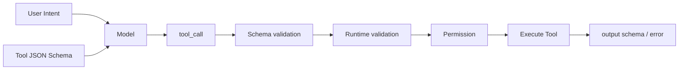
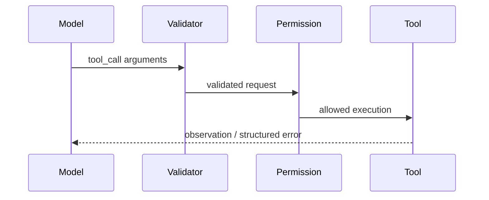

# 工具 Schema 设计

## 面试定位

工具 Schema 设计题考的是 Agent-computer interface。回答要讲清工具名、description、JSON Schema、required、enum、output schema、validation、错误码、权限和风险等级。

## 一句话定义

工具 Schema 是模型和宿主系统之间的接口契约，描述工具何时使用、输入参数是什么、输出结构是什么、失败如何表达、有哪些权限和副作用。

好的 schema 会降低 invalid arguments、误选工具和上下文污染；坏 schema 会让模型看似能调用工具，实际上不可控。

## 为什么需要它

模型不是后端服务调用方，它靠工具名、描述和参数 schema 理解能力边界。如果工具叫 `do_task`，参数是任意字符串，模型就无法稳定判断什么时候调用，也无法让宿主做强校验。

Schema 是第一道防线，但不是唯一防线。格式校验之后还要做 runtime validation 和 permission check。

## 核心架构

图 1：工具 Schema 从用户意图和工具说明进入模型选择，再经过格式校验、业务校验、权限门禁、执行和结构化输出。

图里有两层 validation。JSON Schema 管格式，例如字段类型、required、enum 和数值范围；Runtime validation 管业务语义，例如对象归属、资源状态、额度、幂等和权限。Permission 单独成层，是因为“参数合法”不代表“当前用户可以执行”。Output schema 同样是契约，它决定 Agent 能否判断工具成功、失败、可重试还是需要人工确认。

## 架构与运行机制

数据流是：Context Builder 选择少量相关工具 schema，模型输出 tool call，宿主做 JSON Schema validation，再做业务 validation 和 permission gate，工具执行后返回符合 output schema 的 observation 或 structured error。

## 运行机制

工具名要动词加对象，如 `search_policy`、`create_refund_preview`。description 要写使用场景、不要使用的场景、输入限制和业务前置条件。参数要用 required、enum、minimum、maximum、format、nullable 明确边界。

output schema 要短而可追溯，包含 source、id、summary、status、error_code、retryable 和 next_action。

## 关键设计取舍

| 设计点 | 推荐做法 | 收益 | 风险 |
| --- | --- | --- | --- |
| 工具粒度 | 小而明确 | 易权限控制 | 调用步骤增加 |
| 参数枚举 | enum 限制合法值 | 降低歧义 | 维护成本 |
| 输出结构 | summary + source + status | 可追溯 | 过度摘要丢细节 |
| 错误格式 | error_code + retryable | 易恢复 | 需要统一规范 |
| 风险等级 | read/write/high-risk | 可治理 | 标注不准会误拦 |

## 生产落地细节

每个工具应有 version、owner、timeout、retry policy、risk level 和 audit fields。写工具要支持 dry-run preview 和 idempotency key。敏感返回值要脱敏，分页或大结果要返回 handle，而不是一次塞入上下文。

指标包括 `valid_call_rate`、`invalid_args_rate`、`schema_error_rate`、`permission_denial_rate` 和 `tool_result_used_rate`。

## 系统设计案例

退款工具不要直接设计成 `refund(order_id, amount)`。更稳妥的是 `create_refund_preview(order_id, reason)` 和 `apply_refund(preview_id, idempotency_key)`。模型先生成预览，用户确认后才能提交。

## 真实问题与排障

如果工具常常 invalid args，先看 description 是否含糊，required 和 enum 是否缺失，示例是否误导。如果工具选错，检查候选工具是否过多、名称是否相似、边界是否重叠。

事故复盘可以按四步讲。第一，影响面：统计 invalid_args_rate、permission_denial_rate、unsafe_action_block_rate、真实执行失败和用户可见失败。第二，止血：临时隐藏高风险工具、开启 dry-run、收窄 tool visibility 或把写操作切到人工确认。第三，根因：回放 tool_call，检查是 schema 过松、description 误导、runtime validation 缺失、权限 scope 错误还是 output schema 让模型误读。第四，回归：把失败调用加入 schema eval，验证相似工具、边界参数、越权参数和工具错误输出都能被正确处理。

## 常见误区与排障

常见误区是把后端 API 原样暴露给模型。后端 API 面向程序员，Agent 工具面向模型，要更短、更语义化、更可校验。

## 面试追问

1. 好工具 schema 有哪些字段？
2. JSON Schema 能否替代业务校验？
3. output schema 为什么重要？
4. 高风险工具如何设计？

## 项目化表达

Coding Agent 的 `apply_patch` 要有路径、diff、预期影响和权限。Web Agent 的 click/type 要返回 before/after observation。RAG 工具要返回 evidence id 和 source。

## 深入技术细节

工具 schema 要同时优化模型选择和运行时校验。模型侧依赖工具名、description、参数名和 examples 判断何时调用；运行时侧依赖 JSON Schema、业务校验、权限和风险等级决定能否执行。好的 schema 会把不确定性提前暴露，例如 `requires_confirmation`、`dry_run_supported`、`idempotency_key_required` 和 `side_effect`，让 orchestrator 能做安全策略。

输出 schema 和输入 schema 同样重要。返回值应包含 `status`、`data`、`evidence_ref`、`summary`、`error_code`、`retryable`、`next_action_hint` 和 `raw_ref`。大对象不要直接塞进上下文，而是返回 handle 或 evidence id。否则模型会被长文本污染，也无法稳定判断工具是否成功。

工具目录也需要治理。Context Builder 不应把所有工具一次性暴露给模型，而应根据任务、用户权限、风险等级和当前状态裁剪候选工具。否则即使每个 schema 单独合理，组合起来也会产生歧义：`search_user`、`lookup_customer`、`get_profile` 同时出现时，模型很可能误选。生产系统通常要给工具加 owner、version、deprecated 标记和评测样本，让 schema 变更能被回归测试覆盖。

高风险工具最好拆成 preview 和 commit 两段。比如退款先 `create_refund_preview`，返回 preview_id、金额、风险提示和需要确认的字段；确认后 `apply_refund` 才执行，并携带 idempotency_key。这样 schema 不只是“让模型填参数”，而是把人类确认、幂等、防重复提交和审计链路都放进协议。

## 关键数据结构与协议

| 字段 | 设计原则 | 反例 |
| --- | --- | --- |
| `name` | 动词 + 对象，语义明确 | `do_task` |
| `description` | 写适用和禁止场景 | 只写“调用 API” |
| `required` | 必填字段显式声明 | 依赖模型猜 |
| `enum` | 限制有限业务值 | 任意字符串 |
| `risk_level` | 标明 read/write/high-risk | 所有工具同风险 |
| `error_code` | 可恢复错误分类 | 返回自然语言异常 |

协议上要区分 schema validation 和 business validation。JSON Schema 只能证明格式正确，不能证明订单属于当前用户、资源状态允许修改、金额没有超过上限。后者必须由 Tool Runtime 或后端服务执行。

## 深问准备

被问“schema 越细越好吗”时，可以回答：关键字段要强约束，低风险自由文本可以放宽；过细会增加维护成本和 invalid args，过松会增加误调用和运行时拒绝。设计目标是让模型容易填对，同时让宿主能拒绝危险调用。

被问“如何调优 schema”，看样本：工具误选就改命名、description 和候选裁剪；参数错误就补 required、enum 和 examples；输出误读就加强 `status`、`evidence_ref` 和 `next_action_hint`；越权多就回到 permission scope 和可见性过滤。

## 公开阅读校验

公开读者需要理解工具 schema 是 Agent-computer interface，不是后端 API 文档的复制。后端 API 面向确定程序，Agent schema 面向模型决策和宿主治理，因此要同时服务“模型选得对”“参数填得对”“宿主拒得住”“结果读得懂”。只把已有 REST 参数贴给模型，通常会放大误选、越权和无效参数。

一份可上线的 schema 至少应覆盖四层契约。输入契约定义 name、description、required、enum、format 和 examples；业务契约定义 resource ownership、状态前置条件和金额/数量边界；权限契约定义 risk_level、permission_scope、requires_confirmation 和 side_effect；输出契约定义 status、data、evidence_ref、error_code、retryable、next_action_hint 和 raw_ref。JSON Schema 只能覆盖第一层，不能替代后面三层。

文章还应提醒读者用样本驱动调优。invalid args 多，优先看 required、enum 和 examples；工具误选多，优先看命名、description 和候选裁剪；输出误读多，优先看 status 与 evidence_ref；权限拒绝多，则回到资源 scope 和工具可见性。这样 schema 设计就从“写接口说明”变成了可以用指标迭代的工程能力。

## 来源与延伸阅读

- [OpenAI Function Calling](https://developers.openai.com/api/docs/guides/function-calling)：用于支持工具调用需要结构化参数、schema 约束和宿主侧校验，而不是让模型输出任意文本。
- [OpenAI A practical guide to building agents](https://cdn.openai.com/business-guides-and-resources/a-practical-guide-to-building-agents.pdf)：用于支持工具、guardrails、human oversight 和 eval 共同构成 Agent 的生产边界。
- [Anthropic Building effective agents](https://www.anthropic.com/engineering/building-effective-agents)：用于支持工具应简单、清晰、可组合，并由外层 workflow/guardrail 约束高风险动作。
