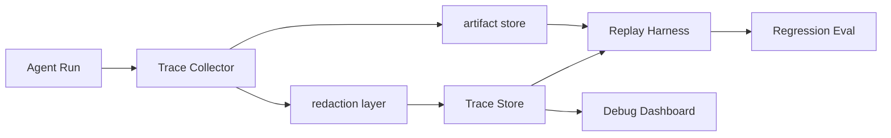

# Trace 与回放

## 面试定位

Trace 与回放是 Agent 可观测性的核心。面试官问它时，不是在问“打日志”，而是在问线上失败能不能复现、能不能归因、能不能变成回归样本。回答要覆盖 run_id、step_id、span、artifact、redaction、Replay Harness 和指标。

## 一句话定义

Trace 记录一次 Agent run 的输入、上下文版本、模型调用、tool_call、observation、state diff、policy verdict、成本和延迟。Replay 是用保存的 trace、fixture 和 artifact 复现关键路径，用于 debug、回归测试、审计和版本升级验证。

## 为什么需要它

没有 trace，Agent 失败只能靠猜。模型答错可能来自 prompt、检索、工具、状态、权限、外部系统或用户输入。Trace 把这些事件组织成可查询的 span。Replay Harness 则把一次线上失败变成可重复实验，帮助你验证“修复是否真的修复了原问题”。

## 核心架构

图 1：Trace 与回放架构，展示 Agent run 如何被采集为结构化 trace，经脱敏后写入 Trace Store 和 Artifact Store，再由 Replay Harness 转成回归评测样本。

Trace Store 保存结构化 span 和索引字段，Artifact Store 保存大对象，例如截图、DOM、PDF 页、命令输出和检索候选。Replay Harness 读取二者重建路径。

图中 Trace Store 与 Artifact Store 分离，是为了同时满足查询效率和证据保真。调试时通常先按 run_id、step_id、span_type、policy verdict 检索结构化 span，再按 artifact_ref 打开截图、DOM、PDF 页或命令输出。回放时也不是重新访问实时网页或实时数据库，而是优先使用当时冻结的 artifact 和工具 fixture，减少环境漂移。

## 架构与运行机制

一次 run 会生成多个 span。model span 保存 model、prompt manifest、token usage、输出契约和 verdict。tool span 保存 tool_name、schema_version、arguments_hash、status、error_code、latency、retryable。retrieval span 保存 query、filters、candidate ids、rerank score 和 selected evidence。guardrail span 保存 policy_version、decision、reason 和 human-in-the-loop 记录。

核心数据流是运行时写入 span，采集层做 redaction，Trace Store 保存索引字段，Artifact Store 保存大对象，Replay Harness 再用这些引用重建失败路径。只有这条数据流闭环，trace 才能从日志变成可回放证据。

每个 span 都要能关联 run_id 和 step_id。大对象不要直接塞 trace，保存 artifact 引用和 hash。敏感信息必须在采集层做 redaction，不能先落盘再清理。

## 运行机制

Replay 不追求让随机模型输出逐字一致，而是冻结关键环境：prompt manifest、工具返回、检索候选、artifact 快照和 policy version。回放时可以只重跑某个组件，例如新的 Context Builder 是否还保留关键约束，新的 tool schema 是否仍能处理原参数。

线上失败进入 Failure Taxonomy 后，系统生成 replay fixture。修复完成后，Replay Harness 重跑这条 fixture。若原失败路径不再出现，才说明回归被覆盖。

## 关键设计取舍

| 设计点 | 方案 | 优点 | 风险 | 面试表达 |
| --- | --- | --- | --- | --- |
| Trace 粒度 | run / step / span | 定位精确 | 数据量上升 | 高风险任务保留更细 |
| Artifact 保存 | 摘要 + 引用 | 成本可控 | 原始证据可能过期 | 关键证据需 snapshot |
| Redaction | 采集层脱敏 | 降低泄漏 | 实现复杂 | 敏感信息不先落盘 |
| Replay | 固定 fixture | 可回归 | 环境冻结成本 | 事故样本必须可复现 |

## 生产落地细节

Trace schema 可以从最小字段开始：run_id、step_id、parent_step_id、timestamp、span_type、input_ref、output_ref、state_diff_ref、verdict。后续按模型、工具、检索、guardrail 增加字段。成功低风险 trace 可以采样，高风险动作、失败和人工接管必须全量保留。

关键指标包括 `trace_coverage`、`replay_success_rate`、`redaction_violation_count`、`artifact_missing_rate`、`debug_time_to_root_cause` 和 `regression_case_count`。如果 replay_success_rate 低，通常是 fixture 没冻结外部工具或 artifact 已过期。

## 系统设计案例

Web Agent 误点按钮后，需要 trace 记录点击前 DOM、目标 selector、截图、click 坐标、点击后 URL、console error 和 verifier verdict。Replay 时固定 DOM snapshot 和工具结果，验证新策略是否仍会误点。Coding Agent 需要保存读文件列表、patch diff、测试命令、失败摘要和环境版本，才能复现错误修复路径。

RAG 系统则要保存 query rewrite、召回候选、rerank 后证据、最终引用和 unsupported claim 检查结果。没有这些 span，答错后无法判断是检索错还是生成错。

## 真实问题与排障

常见问题是 trace 太粗，只保存最终回答。排障时无法知道模型看过什么证据。第二类问题是 artifact 缺失，回放时网页或文档已经变了。第三类问题是未脱敏 trace 进入日志系统，带来安全风险。修复时要优先补采集层 redaction 和 artifact snapshot 策略。

## 常见误区与排障

- 把普通日志当 trace，没有 run/step/span 结构。
- 只保存模型输入输出，不保存工具 observation。
- 回放依赖实时外部服务，结果不可复现。
- 敏感字段先写入后清理，留下泄漏窗口。

## 面试追问

1. trace 和 log 的区别是什么？重点是结构化路径与可回放。
2. Replay 需要冻结什么？重点是工具返回、检索候选、artifact 和 prompt manifest。
3. 敏感数据怎么处理？重点是 redaction、权限和 TTL。
4. trace 如何转 eval？重点是 failure taxonomy 和 regression case。

## 项目化表达

可以说：我把每次 Agent run 写成 span trace，失败样本自动生成 replay fixture。Debug 时可以从 run_id 看到每个 step 的工具、状态、证据和 verdict。修复后用 Replay Harness 重跑事故路径，避免同类问题再次上线。

## 深入技术细节

Trace 要服务三个目标：线上排障、离线评测和回归复现。因此它不能只是日志文本，而要是 span tree。每个 span 记录 `run_id`、`step_id`、`parent_step_id`、`span_type`、`input_ref`、`output_ref`、`state_diff_ref`、`policy_verdict`、`latency_ms`、`cost` 和 `error_code`。模型、工具、检索、guardrail 和 human confirmation 都是不同 span 类型。

Replay 的重点不是复现随机模型的每个 token，而是冻结关键边界：prompt manifest、工具返回、检索候选、policy version、artifact snapshot 和 state projection。修复后可以只重放某个组件，例如新 reranker 是否仍会丢掉正确证据，新 tool schema 是否能解析旧参数。

Trace 设计还要服务版本比较。一次 replay case 应记录原始模型版本、prompt 版本、工具 schema、检索索引版本和安全策略版本。升级其中任意一层后，系统可以只替换被测组件，其余输入保持冻结，从而判断质量变化来自哪里。没有这些版本字段，回放结果很容易变成“这次看起来好了”，却无法证明修复覆盖了原事故。

## 关键数据结构与协议

| 字段 | 用途 | 常见缺失后果 |
| :--- | :--- | :--- |
| `run_id` | 串联一次任务 | 无法跨系统排查 |
| `span_type` | 区分模型/工具/检索 | 无法归因 |
| `artifact_ref` | 保存大对象引用 | replay 证据缺失 |
| `policy_version` | 固定安全策略 | 修复不可比较 |
| `prompt_manifest` | 固定提示上下文 | 回放不可复现 |
| `redaction_status` | 脱敏状态 | 日志泄漏风险 |

协议上敏感信息要在采集层脱敏。不能先把完整请求落盘再异步清理，因为泄漏窗口已经存在。高风险失败和人工接管 trace 必须全量保留，低风险成功可以采样。

## 深问准备

被问“trace 和 log 区别”时，可以回答：log 记录事件文本，trace 记录可关联的结构化路径；replay 依赖 trace 的 span、artifact 和 policy 版本，而不是靠人读日志复盘。

被问“如何把 trace 转 eval”，先用 failure taxonomy 标注失败类型，再把工具返回、检索候选和 artifact 冻结为 fixture，最后把修复后的组件重跑。指标看 `replay_success_rate`、`artifact_missing_rate` 和 `debug_time_to_root_cause`。

## 公开阅读校验

公开读者要从这篇文章里读懂一个判断：trace 不是“多打点日志”，而是 Agent 系统的证据链。一次可复盘的 run 至少要能回答模型看到了什么、调用了什么工具、工具返回了什么 observation、状态怎么变、策略为什么允许或拒绝、最终为什么停止。只保存最终回答或自然语言摘要，无法证明失败来自检索、工具、状态、权限还是模型本身。

Replay 的边界也要讲清楚。回放不是要求模型逐 token 复现，而是冻结关键输入和外部事实：prompt manifest、tool fixture、retrieval candidates、artifact snapshot、policy version 和 state projection。这样升级模型、工具 schema 或 reranker 后，系统可以只替换被测组件，判断原事故是否被真正修复。

上线验收时，可以把 trace/replay 作为事故治理能力检查：高风险动作 trace 是否全量采集，敏感字段是否在采集层脱敏，artifact 是否有 hash 与 TTL，失败样本是否进入 regression case，回放结果是否能定位到具体组件。能回答这些问题，文章才从“观测概念”进入“生产可用性”。

## 来源与延伸阅读

- [OpenAI Agents SDK](https://platform.openai.com/docs/guides/agents-sdk/)：官方文档，用于理解 tracing、tools 与 guardrails 在 Agent 框架中的位置。
- [OpenAI: A practical guide to building agents](https://cdn.openai.com/business-guides-and-resources/a-practical-guide-to-building-agents.pdf)：官方工程指南，用于支持 Agent 工程观测、回放和安全设计。
- [Inspect](https://inspect.aisi.org.uk/)：评测框架官方文档，用于说明 eval task、scorer 与可复现样本组织方式。
