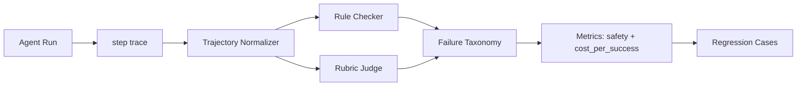

# Trajectory Eval

## 面试定位

Trajectory Eval 用来评估 Agent 的完整执行路径。面试官问它，是想看你能不能超过“最终答案对不对”的层次，去分析 step trace 中每一步的工具选择、状态更新、证据使用、安全边界、成本和停止条件。它特别适合解释为什么一个 Agent 可能最终答对，但路径危险、成本过高或不可复盘。

## 一句话定义

Trajectory Eval 是对一次 Agent run 的多步路径做评测，输入是 step trace，输出是对 tool_selection、state_update、evidence use、safety、efficiency、stop condition 和 cost_per_success 的评分与失败归因。它连接 Component Eval 和端到端业务评测，解决“过程是否可信”的问题。

## 为什么需要它

Agent 的质量不只体现在最终答案。一个 Coding Agent 最终修好了测试，但可能读了不该读的文件。一个 Web Agent 完成了表单，但可能绕过了用户确认。一个 RAG Agent 答案正确，但引用路径混乱。E2E 只看结果会漏掉这些问题，Component Eval 又看不到多步互动。Trajectory Eval 正好评估完整路径。

## 核心架构

图 1：Trajectory Eval 架构，展示 Agent run 经过 step trace、轨迹归一化、规则检查、rubric judge、失败分类和指标聚合后进入回归样本库。

这张图强调：轨迹评测先把不同框架的 trace 归一化，再用规则和 rubric 共同评价。规则负责硬约束，rubric 负责路径质量。

## 架构与运行机制

step trace 的 schema 至少要包含 run_id、step_id、action_type、tool_name、args_hash、observation_summary、state_diff、policy_verdict、cost、latency 和 stop_reason。没有这些字段，就很难判断 Agent 是因为工具错、状态错、证据错还是策略错。

Trajectory Eval 通常分三层。第一层是规则检查，例如是否调用禁用工具、是否超过 max steps、是否缺 citation、是否在写操作前缺 confirmation。第二层是路径质量评分，例如工具选择是否必要、是否绕路、是否更新了状态。第三层是人工或 LLM judge，对复杂路径做抽样复核。

## 运行机制

数据流是 Agent 每一步写 trace，Normalizer 脱敏并转成统一 schema，Rule Checker 先检查硬约束，Rubric Judge 再评估 path_quality。低分样本进入 failure taxonomy，例如 wrong_tool、stale_state、missing_evidence、unsafe_action、inefficient_loop、bad_stop。

Trajectory Eval 要和 Component Eval 配合。工具参数错误多，回到 tool eval。引用缺失多，回到 citation verifier。路径绕远但组件都正常，才说明 planner、loop 或 stop policy 需要调整。

## 关键设计取舍

| 方法 | 适用场景 | 优点 | 风险 | 面试表达 |
| --- | --- | --- | --- | --- |
| Rule Checker | 安全、预算、必需步骤 | 稳定、可阻断发布 | 难覆盖语义路径 | 硬约束规则化 |
| Rubric Judge | 路径质量、工具选择 | 覆盖复杂路径 | 需要校准 | 和人工样本对齐 |
| Trace Replay | 失败复现 | 可定位、可回归 | 需要冻结环境 | 事故样本沉淀 |
| Human Review | 高价值任务 | 可信度高 | 成本高 | 用于校准 judge |

## 生产落地细节

生产系统应把每条轨迹打上任务类型和风险等级。Coding Agent 的 rubric 看是否读对文件、patch 是否最小、是否运行测试。Web Agent 看 observe-act-observe 是否闭环、是否误点、是否验证页面状态。RAG Agent 看证据是否先于结论、citation 是否支持 claim。不同任务不能用同一个 rubric 粗暴评分。

关键指标包括 `trajectory_pass_rate`、`tool_selection_accuracy`、`unsafe_action_block_rate`、`avg_steps`、`retry_loop_rate`、`state_update_error_rate` 和 `cost_per_success`。`cost_per_success` 比单次成本更有意义，因为一个低成本但低成功率的 Agent 并不便宜。

## 系统设计案例

Coding Agent 轨迹可以要求：先定位文件，再读取上下文，再应用 patch，再跑相关测试，最后解释风险。若 trace 显示它没有读文件就修改，Rule Checker 直接失败。若它读了 30 个无关文件才改一行，Rubric Judge 给 efficiency 低分。若测试失败后仍声称完成，stop condition 和 verifier 都要扣分。

Web Agent 轨迹可以要求每次 click 后必须有新的 DOM 或 screenshot observation。没有 observation 的连续动作应被判为不可信路径。

## 真实问题与排障

如果任务成功率下降，但 component eval 都过，说明多步编排可能出问题。排查时先按 failure taxonomy 分桶。wrong_tool 上升看 Tool Selector。stale_state 上升看 State Reducer。unsafe_action 上升看 guardrails。inefficient_loop 上升看 planner 和 stop policy。

## 常见误区与排障

- 只看最终答案，不看路径是否安全。
- trace 字段太少，无法评分。
- LLM judge 没有人工校准。
- 不同任务共用一套 rubric。

## 面试追问

1. Trajectory Eval 和 Component Eval 区别是什么？重点是过程质量和组件归因。
2. step trace 要存哪些字段？重点是 action、observation、state diff、policy verdict。
3. 如何评估工具选择？重点是必要性、正确性、风险和成本。
4. 为什么要看 cost_per_success？重点是成功率和成本的联合指标。

## 项目化表达

可以说：我把 Agent run 统一成 step trace，然后按任务类型用规则和 rubric 评分。失败轨迹会进入 regression case。这样不仅知道“答错了”，还能知道错在工具选择、状态更新、安全策略还是停止条件。

## 深入技术细节

Trajectory Eval 的核心输入是标准化 step trace。不同 Agent 框架的原始日志格式不同，Normalizer 要统一成 `run_id`、`step_id`、`action_type`、`tool_name`、`args_hash`、`observation_ref`、`state_diff_ref`、`policy_verdict`、`verifier_verdict`、`cost`、`latency` 和 `stop_reason`。只有统一 schema，才能跨任务比较。

评分应分硬规则和软 rubric。硬规则包括禁用工具、缺少确认、超过 max steps、无 citation、没有测试却宣称完成；软 rubric 评估路径是否高效、是否读了正确文件、是否先取证再下结论。LLM judge 可用于软评分，但要用人工样本校准。

落地时要把评分结果回连到可执行改进项。`wrong_tool` 应回到工具选择器或工具描述，`stale_state` 回到 State Reducer 和 Context Projector，`missing_evidence` 回到检索、引用校验或上下文预算，`bad_stop` 回到 done condition 与 verifier。这样 Trajectory Eval 不只是质量报表，而是能驱动下一轮组件评测和回归用例建设。

## 关键数据结构与协议

| 字段 | 评估维度 | 作用 |
| :--- | :--- | :--- |
| `action_type` | 工具选择 | 判断动作必要性 |
| `observation_ref` | 事实依据 | 验证是否看见结果 |
| `state_diff_ref` | 状态更新 | 发现污染或丢失 |
| `policy_verdict` | 安全 | 判断是否越界 |
| `stop_reason` | 终止策略 | 识别早停/循环 |
| `failure_label` | 归因 | 进入回归集 |

协议上，最终成功不等于轨迹合格。绕过安全确认、读取无关敏感文件、过度重试或缺少证据的路径，即使结果看似正确，也应在 trajectory eval 中失败或降分。

## 深问准备

被问“Trajectory Eval 和 Component Eval 区别”时，可以回答：Component Eval 测单个工具、检索器或 verifier，Trajectory Eval 测多步编排路径。前者找组件质量，后者找系统协作问题。

被问“如何处理 judge bias”，用规则先挡硬约束，再让 LLM judge 评估语义路径；judge prompt、模型版本和人工校准样本都要版本化。关键发布门禁不能只靠未校准 judge。

## 公开阅读校验

公开文章讲 Trajectory Eval，要让读者看到它评估的是“执行路径是否可信”，不是最终答案是否好看。一个 Agent 可能答对，但路径里读取了无关敏感文件、绕过确认、重复调用高风险工具、或者没有 evidence 就下结论。Trajectory Eval 的价值正是把这些过程风险暴露出来。

可上线的轨迹评测应分硬规则和软评分。硬规则处理安全、预算、必须步骤和禁止动作，例如缺少 confirmation、没有 citation、超过 max steps、测试未跑却声称完成；软评分处理路径质量，例如工具选择是否必要、是否先观察再动作、是否维护了 state、是否高效。两者混在一起，会导致安全问题被平均分掩盖。

读者还应理解 failure taxonomy 是改进入口。`wrong_tool` 对应工具描述或 router，`stale_state` 对应 State Reducer，`missing_evidence` 对应检索和引用校验，`bad_stop` 对应 verifier 和 done condition。没有这种归因，Trajectory Eval 只是一份分数表；有了归因，才会变成可驱动工程迭代的评测系统。

落地验收可以要求每条轨迹都有三份产物：标准化 step trace、规则检查结果和人工校准样本映射。比如 Coding Agent 的轨迹要能证明它读过相关文件、没有改无关测试、失败后没有跳过验证；Web Agent 的轨迹要能证明每次点击后都有新 observation；RAG Agent 的轨迹要能证明证据先于结论。这样评测报告才不是抽象分数，而是能复盘到具体步骤的质量证据。

## 来源与延伸阅读

- [OpenAI: A practical guide to building agents](https://cdn.openai.com/business-guides-and-resources/a-practical-guide-to-building-agents.pdf)：官方工程指南，用于支持 agent loop、guardrails、tools 和 tracing 的工程组织。
- [Inspect](https://inspect.aisi.org.uk/)：评测框架官方文档，用于说明 eval task、scorer 和可复现评测设计。
- [Anthropic: Building effective agents](https://www.anthropic.com/engineering/building-effective-agents)：官方工程文章，用于解释何时需要更复杂的 agentic path，以及何时使用简单 workflow。
