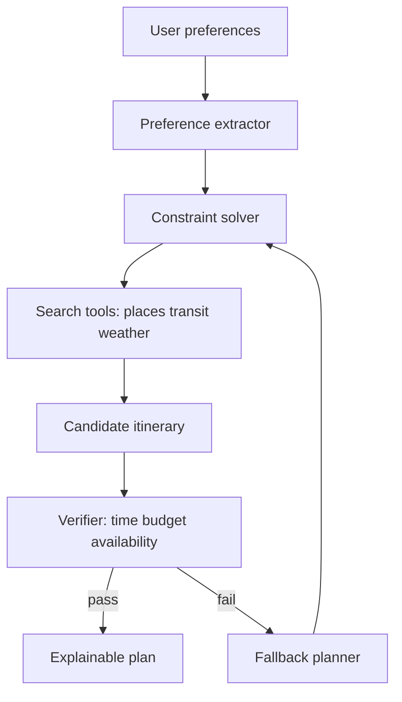

# Travel Agent 项目线

## 一句话定义

Travel Agent 是把用户偏好、预算、时间、地点、availability 和约束转成 itinerary 的规划项目。工程重点是 constraint solver、preference 建模、实时信息来源、fallback 和高风险动作的人类确认。

## 面试定位

旅行规划项目看起来生活化，但非常适合展示 Agent 工程能力：多约束规划、外部 API、工具调用、安全边界、不可用信息处理和评测。

面试里要避免把它讲成“模型生成旅游攻略”。你需要说明架构、数据流、指标、取舍和追问，尤其是哪些能力只是推荐，哪些动作不能自动执行。

## 为什么需要它

旅行计划有明显的约束：日期、预算、交通、营业时间、地理距离、用户偏好、同行人和天气。普通聊天模型可以写建议，但很容易忽略真实 availability 或冲突约束。

Travel Agent 的价值是把自然语言偏好转成结构化约束，调用可信来源检查可行性，再生成可解释 itinerary。

## 核心架构

图 1：Travel Agent 的核心链路是偏好抽取、约束求解、实时工具、可行性验证和 fallback，而不是直接生成攻略。

这张图要注意两个边界。第一，Search tools 只能提供候选和实时快照，不能替代 solver 做全局约束组合；第二，Verifier 是硬门槛，它检查时间、预算、营业状态、路线、天气和用户禁忌。只有 verifier 通过后才输出 explainable plan；失败时必须回到 fallback planner，并说明原方案为什么不可行。

| 模块 | 输入 | 输出 | 风险 |
| :--- | :--- | :--- | :--- |
| preference extractor | 自然语言需求 | budget、pace、interests | 误解偏好 |
| constraint solver | 结构化约束 | 可行候选 | 约束冲突 |
| availability checker | API 和时间 | 开放状态 | 信息过期 |
| itinerary planner | 候选地点 | day plan | 距离不合理 |
| fallback | 不可用原因 | 替代方案 | 解释不足 |

## 架构与运行机制

系统先把用户输入转成结构化 preference，例如城市、日期、预算、节奏、兴趣、禁忌和交通方式。constraint solver 用这些字段筛选候选，而不是让模型直接幻想行程。

实时信息要带 source 和 time。营业时间、价格、天气、交通、酒店和票务都可能变化，系统应在答案中标注不确定性。预订、付款、登录和取消订单属于高风险动作，必须 human-in-the-loop 或明确 unsupported。

Travel Agent 的工程价值来自“可解释的可行性”，不是文案漂亮。一个推荐项如果没有 `checked_at`、来源、营业窗口、预计停留、前后交通时间和失败原因，就很难被用户信任。尤其在旅行场景里，过期营业时间、错误交通耗时和价格误差会直接造成用户损失，因此系统应该把实时字段和估算字段分开展示：实时字段可标注来源与更新时间，估算字段要给置信度和替代方案。

## 运行机制

1. 收集用户偏好和硬约束，缺关键字段时追问。
2. 将偏好转成结构化 constraints 和 preference weights。
3. 调用地点、交通、天气或内部数据源生成候选。
4. Constraint solver 组合 itinerary，并检查时间、预算和距离。
5. Verifier 检查 availability、冲突和用户禁忌。
6. 不可行时触发 fallback，给出替代方案和理由。

## 关键设计取舍

| 取舍 | 好处 | 代价 | 建议 |
| --- | --- | --- | --- |
| 模型直接规划 | 快 | 可行性差 | 只用于草案 |
| 约束求解 | 可解释 | 规则建设成本 | 核心链路使用 |
| 实时 API | 更准确 | 延迟和费用 | 关键字段使用 |
| 自动预订 | 体验顺 | 风险高 | 默认不支持 |

## 生产落地细节

- itinerary 中每个地点要有 source、time、estimated_duration、travel_time 和 reason。
- budget、availability、distance 和 opening hours 必须由 verifier 检查。
- 用户偏好和硬约束分开建模，硬约束不可被模型随意放宽。
- fallback 要说明原计划为什么不可行，而不是只换一个景点。
- 指标包括 constraint_satisfaction_rate、availability_error_rate、route_feasibility、user_revision_rate 和 fallback_success_rate。

高风险动作要拆成 preview 和 apply 两段。preview 只生成可比较方案、费用区间、取消规则和风险提示；apply 才会触发预订、付款、改签或取消。apply 前至少要确认用户身份、费用、订单归属、取消规则、幂等键和最终供应商。没有这些字段时，系统应该显示 unsupported 或 ask user，而不是让模型补齐。

## 系统设计案例

用户说“周末两天去上海，预算 2000，喜欢建筑和咖啡，不想太赶”。系统提取城市、日期、预算、兴趣和节奏，搜索候选地点，按地理位置和开放时间组合 day plan。

数据流是：preference -> constraints -> candidate places -> itinerary -> verifier -> explanation。若某景点闭馆，fallback planner 替换同区域同主题地点，并解释原因。

## 真实问题与排障

常见问题是行程时间不可行、地点关门、预算超出或忽略用户禁忌。排障先看 preference extractor 是否误读，再看 availability 来源时间，最后检查 solver 是否把软约束当硬约束。

如果用户大量手动修改，说明 preference model 或 itinerary verifier 不够好，应把修改样本加入 eval。

线上排障可以按四层看。第一层是输入理解：城市、日期、预算、同行人、节奏和禁忌是否抽取正确。第二层是候选质量：places、routes、weather、price 的来源和更新时间是否可靠。第三层是求解质量：是否违反硬约束，是否把相距很远的地点排在一起，是否忽略休息和交通缓冲。第四层是解释质量：用户是否能看懂为什么推荐、为什么替换、哪些信息可能过期。每个失败样本都应该保留原始需求、结构化约束、候选集合、solver 决策、verifier verdict 和最终用户修改。

## 常见误区与排障

- 只让模型写旅游攻略，不验证可行性。
- 实时数据没有 source/time。
- 把预订和付款做成自动动作。
- 不区分硬约束和偏好。
- 没有 fallback，遇到不可用就编造。

## 面试追问

- 如何评测约束满足率？
- 实时 API 失败时怎么办？
- 用户偏好冲突时如何追问？
- 什么时候需要人类确认？
- 如何防止过期价格或营业时间误导用户？

## 项目化表达

项目里可以说：“Travel Agent 的核心是约束规划，不是攻略生成。preference extractor 把需求结构化，constraint solver 生成 itinerary，availability verifier 检查现实可行性，高风险动作默认 unsupported 或 human-in-the-loop。”

## 深入技术细节

Travel Agent 的工程难点在于硬约束和软偏好的分离。硬约束包括日期、预算上限、签证/身份、不可去地点、营业时间、交通可达性；软偏好包括节奏、兴趣、餐饮风格、步行距离、景点密度。系统应把它们建成 `constraints` 和 `preference_weights`，solver 不得为了让答案好看而放宽硬约束。

每个 itinerary item 都应带 `place_id`、`source`、`open_window`、`estimated_duration`、`travel_time_from_previous`、`cost_estimate`、`reason`、`confidence` 和 `checked_at`。Verifier 检查路线时间、营业状态、预算、距离、用户禁忌和天气影响。生成解释时要标注哪些字段来自实时 API，哪些只是估算。

## 关键数据结构与协议

| 字段 | 类型 | 作用 |
| --- | --- | --- |
| `hard_constraints` | 规则集合 | 不可违反 |
| `preference_weights` | 权重 | 排序候选方案 |
| `candidate_set` | 地点/交通/酒店候选 | solver 输入 |
| `availability_snapshot` | source + checked_at | 判断是否过期 |
| `itinerary_item` | 行程节点 | 支持验证和解释 |
| `fallback_reason` | 不可行原因 | 生成替代方案 |

协议上，搜索和规划可以自动，预订、付款、取消、改签等外部副作用默认 unsupported 或 human confirmation。即使工具可用，也要 preview、费用确认、订单归属校验和 idempotency key。

## 深问准备

如果被问“实时 API 失败怎么办”，可以回答分层降级：关键字段不可用时不自动下结论，返回 unavailable 或 stale 标注；非关键字段可以用缓存或候选替代，并说明置信度。绝不能编造营业时间、价格或余票。

如果追问“怎么评测 Travel Agent”，指标包括 `constraint_satisfaction_rate`、`route_feasibility_score`、`availability_error_rate`、`budget_violation_rate`、`user_revision_rate` 和 `fallback_success_rate`。失败样本要记录用户约束、候选来源、solver 决策和 verifier verdict。

## 来源与延伸阅读

- [Google Maps Platform 文档](https://developers.google.com/maps/documentation)：用于支持地点、路线、地理编码等旅行工具应来自可追踪数据源，而不是模型臆测。
- [Google Places API Nearby Search](https://developers.google.com/maps/documentation/places/web-service/nearby-search)：用于说明候选地点搜索需要明确 location、radius、type 等约束字段。
- [Google Places API Place Details](https://developers.google.com/maps/documentation/places/web-service/details)：用于支持营业时间、评分、地址、电话等地点详情需要按字段请求和更新时间判断。
- [Google Routes API](https://developers.google.com/maps/documentation/routes)：用于支持路线耗时、距离和交通方式应由 route service 验证。
- [Anthropic: Building effective agents](https://www.anthropic.com/engineering/building-effective-agents)：用于支持 workflow、routing、tool use 与 human oversight 的 agent 工程边界。
- [OpenAI Agents SDK Tools](https://openai.github.io/openai-agents-python/tools/)：用于支持工具化检索、规划和执行动作的实现方式。
- [OpenAI Agents SDK Guardrails](https://openai.github.io/openai-agents-python/guardrails/)：用于支持预订、付款、取消等高风险动作前的输入/输出校验与拦截。
