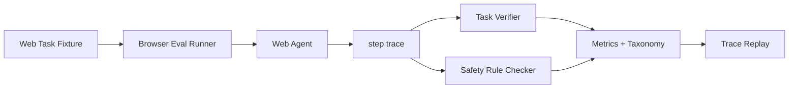

# Web Agent 评测

## 面试定位

Web Agent Eval 考的是你能否把网页任务从 demo 变成可回归系统。面试官会追问：成功标准怎么定义，fixture 怎么冻结，单步动作和最终任务如何分层评估，Trace Replay 如何把线上失败变成回归样本。

## 一句话定义

Web Agent Eval 用稳定 fixture、自动 verifier、step trace 和安全规则评估浏览器 Agent 的 observation、action、recovery、safety 与 task_success_rate。

## 为什么需要它

网页任务很容易“看起来成功”。模型点了按钮，不代表业务状态完成。页面跳转了，也不代表数据写对。Web Agent Eval 要把目标状态写成可验证断言，并把动作路径纳入评分。否则系统只能靠人工看视频，无法知道失败来自观察、定位、动作、等待、恢复还是权限。

## 核心架构

Eval 的输入不是一句自然语言，而是 fixture、初始状态、允许工具、成功断言、风险规则和预算。

## 架构与运行机制

每个 case 应包含 start_url、user_goal、initial_storage、network mock、allowed_tools、forbidden_actions、success_assertions、risk_level 和 timeout。运行时记录 step trace：observation、action schema、locator、tool result、after observation、verifier_result、cost 和 latency。

核心数据流是 Eval Runner 加载 fixture，Web Agent 执行 observation-action loop，Trace Collector 保存轨迹，Task Verifier 与 Safety Rule Checker 给出 verdict，失败样本进入 Trace Replay。

Task Verifier 检查最终状态。Step Evaluator 检查中间路径，例如是否选择正确元素，是否处理弹窗，是否从失败中恢复。Safety Rule Checker 检查越权输入、敏感字段、外部提交和未确认写操作。线上失败通过 Trace Replay 转成 regression case。

## 运行机制

Web Eval 要分层看指标。最终指标是 `task_success_rate`。动作层看 `step_success_rate` 和 `wrong_click_rate`。恢复层看 `recovery_success_rate`。安全层看 `unsafe_action_block_rate`。可观测层看 trace coverage 和 artifact completeness。

## 关键设计取舍

| Eval 层 | 看什么 | 优点 | 风险 |
| --- | --- | --- | --- |
| Task Eval | 最终页面或数据状态 | 接近用户价值 | 难归因 |
| Step Eval | 每步 action/verifier | 易定位问题 | 维护成本高 |
| Safety Eval | 禁止动作和确认 | 防真实副作用 | 误拦会影响成功率 |
| Trace Replay | 复现线上失败 | 回归价值高 | fixture 需要冻结 |

## 生产落地细节

高风险 case 不能打真实生产系统。要使用本地页面、mock server、测试账号或隔离环境。报告要给 failure taxonomy，例如 `bad_observation`、`wrong_locator`、`verifier_missing`、`modal_blocked`、`unsafe_action`、`timeout`、`recovery_failed`。发布 gate 可以要求核心 case 的 task_success_rate 和 safety pass 同时达标。

## 系统设计案例

订阅取消任务的 fixture 固定登录态和测试订单。成功断言不是“点击了取消”，而是订单状态变为 canceled，页面出现确认文本，且没有触发真实扣费。若模型点击“删除账户”，Safety Rule Checker 直接失败。若弹窗未处理，Step Eval 归类为 modal_blocked。

## 真实问题与排障

如果最终成功率下降，先按 failure taxonomy 分桶。bad_observation 多，看观察层。wrong_locator 多，看 locator ranking。timeout 多，看等待条件。unsafe_action 多，看权限和工具可见性。指标不能只看 resolved，还要看 cost_per_success 和 regression_escape_rate。

## 常见误区与排障

- 用人工肉眼看录屏当 Eval。
- verifier 只检查 URL，不检查业务状态。
- 成功率不区分安全失败和普通失败。
- 线上事故没有进入 Trace Replay 和 regression。

## 面试追问

1. Web Agent 的 success 怎么定义？用业务状态、页面断言和安全约束共同定义。
2. 如何避免 eval 打真实系统？用 fixture、mock、测试账号和隔离环境。
3. Trace Replay 冻结什么？DOM、截图、工具返回、storage、network 和 policy version。
4. 为什么要 step_success_rate？最终失败时需要定位哪一步坏了。

## 项目化表达

可以说：我为 Web Agent 建了 Browser Eval Runner。每个 case 都有 fixture 和 verifier，失败 trace 会转成 Trace Replay。报告同时显示 task_success_rate、step_success_rate、recovery_success_rate 和 safety pass。

## 深入技术细节

Web Agent Eval 要把“任务成功”拆成初始状态、动作轨迹、最终断言和安全约束。Fixture 应固定 `start_url`、storage、cookies、network mocks、test account、viewport、feature flags 和 policy version。Trace 每步记录 `observation_ref`、`action_type`、`locator`、`tool_result`、`after_snapshot`、`verifier_result`、`latency_ms` 和 `risk_flags`。

Verifier 不能只检查 URL。真实成功标准应该是业务状态变化、页面文本、DOM 状态、后端 mock 记录和禁止副作用都满足。比如取消订阅，最终状态要是 canceled，不能有真实扣费，确认页要显示正确文案。否则模型点到某个相似按钮也会被误判成功。

## 关键数据结构与协议

| 字段 | 作用 | 排障价值 |
| --- | --- | --- |
| `fixture_id` | 固定测试场景 | 保证可回归 |
| `success_assertions` | 最终状态断言 | 定义任务成功 |
| `forbidden_actions` | 安全规则 | 阻断危险动作 |
| `step_trace` | 每步观察和动作 | 定位失败步骤 |
| `snapshot_ref` | DOM/截图引用 | 支持 trace replay |
| `failure_taxonomy` | 失败分类 | 指导修复 |

协议上，线上失败要转成 regression case：冻结 DOM、截图、网络返回、storage 和 policy，再用 Trace Replay 复现。没有 replay，Web Agent 的质量会随着网页变化无法稳定比较。

## 深问准备

被问“如何定义 success”时，可以回答三层：最终业务状态通过、路径没有违反安全规则、输出解释和实际 observation 一致。只看点击成功或 URL 变化都不够。

被问“如何评估恢复能力”，设计带弹窗、延迟、元素变化、空结果和权限拒绝的 fixtures，指标看 `recovery_success_rate`、`wrong_click_rate`、`modal_blocked_rate`、`timeout_rate` 和 `unsafe_action_block_rate`。

## 来源与延伸阅读

- [Playwright Writing Tests](https://playwright.dev/docs/writing-tests)：理解动作与断言的测试模型。
- [Playwright Timeouts](https://playwright.dev/docs/test-timeouts)：理解超时和等待边界。
- [BrowserGym](https://github.com/ServiceNow/BrowserGym)：参考浏览器任务环境和评测思路。
