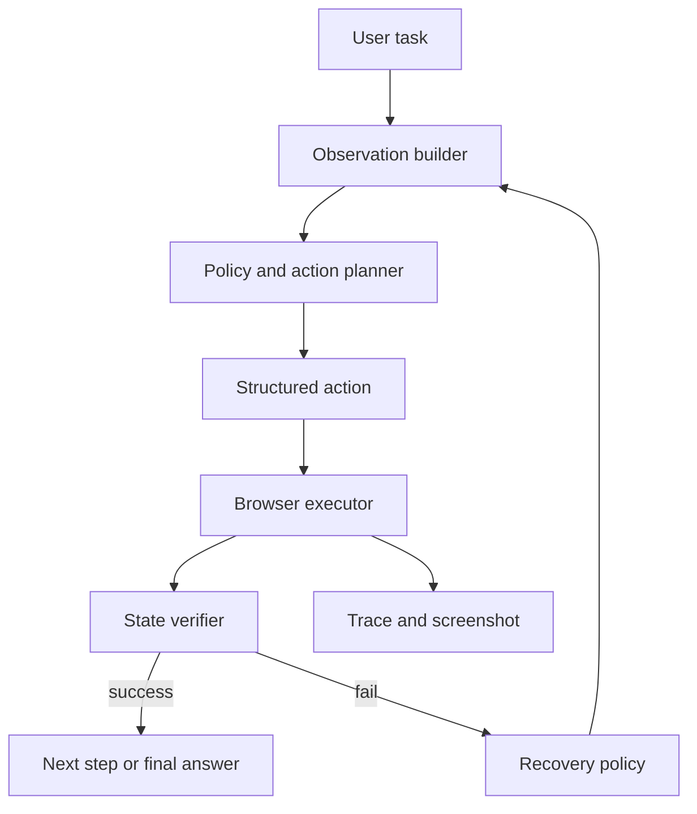

# Web Agent 项目线

## 一句话定义

Web Agent 项目是让 Agent 基于 observation、action、selector、trace、fixture 和 recovery 策略完成网页任务。工程重点是页面观察、结构化动作、状态验证、失败回放和安全边界。

## 面试定位

这个项目很适合展示 Agent loop、浏览器自动化、工具封装和评测。面试官会追问它是不是“让模型乱点页面”，所以必须讲清观察层、动作层、验证层和 trace。

回答要覆盖架构、数据流、指标、取舍和追问。尤其要说明如何避免点击错元素、如何恢复失败、如何评测任务成功。

## 为什么需要它

网页任务不是单纯文本生成。Agent 需要理解页面状态、选择可交互元素、执行动作、等待变化、验证结果，并在失败时恢复。

Web Agent 的价值是把浏览器自动化变成可控工具链。模型负责决策，宿主程序负责 selector 策略、权限、auto-wait、verifier 和 audit。

## 核心架构

图 1：Web Agent 项目把用户任务转成页面观察、策略规划、结构化动作、浏览器执行、状态验证和失败恢复，并在每步保存 trace 与截图。

图里的关键边界是 Observation builder、Structured action 和 State verifier。Observation builder 决定模型看到什么页面事实；Structured action 把自由文本意图收敛成可校验的 click/type/select/wait；State verifier 判断页面或业务状态是否真的变化。Recovery policy 只有在 verifier 失败后才触发，避免模型在没有证据的情况下重复点击。Trace and screenshot 不是附属物，而是线上排障、演示可信度和回归评测的证据。

| 层次 | 作用 | 关键字段 | 指标 |
| :--- | :--- | :--- | :--- |
| observation | 页面可见状态 | DOM、accessibility tree、screenshot | observation_error |
| action | 结构化操作 | click、type、select、wait | action_success |
| selector | 定位元素 | role、text、css fallback | selector_stability |
| verifier | 检查预期状态 | expected_state | step_success |
| recovery | 失败恢复 | retry、backtrack | recovery_success |

## 架构与运行机制

Observation builder 应优先使用 DOM 和 accessibility tree，截图或视觉模型作为补充。页面里的文本可能是 untrusted content，不能让它直接改变系统指令或权限。

action 必须结构化，例如 click、type、select、extract、wait、navigate。每个动作都带 selector、riskLevel、expected_state 和 timeout。执行后 verifier 检查页面是否进入预期状态，而不是只看动作 API 是否成功。

## 运行机制

1. 用户目标进入 Agent loop。
2. Observation builder 提取页面标题、表单、按钮、链接和可交互元素。
3. 模型选择结构化 action，Policy Gate 检查风险。
4. Browser executor 执行动作，并使用 auto-wait。
5. Verifier 检查 URL、DOM、文本、表单值或截图状态。
6. 失败时 recovery policy 重试、换 selector、回退或请求用户确认。
7. trace 保存 observation、action、screenshot、verdict 和耗时。

## 关键设计取舍

| 取舍 | 好处 | 代价 | 建议 |
| --- | --- | --- | --- |
| DOM 观察 | 稳定、便宜 | 视觉布局不足 | 默认主通道 |
| screenshot 观察 | 贴近人眼 | 成本高 | 复杂页面补充 |
| 自由动作 | 灵活 | 风险大 | 生产要 schema |
| fixture eval | 可回归 | 建设成本 | 核心任务必备 |

## 生产落地细节

- selector 优先用 role、label、text 和 test id，CSS 只做 fallback。
- 高风险动作如支付、删除、提交表单必须 requiresConfirmation。
- fixture 要覆盖成功路径、动态加载、弹窗、表单错误和权限失败。
- trace replay 要能复现 observation、action 和 verifier verdict。
- 指标包括 task_success_rate、step_success_rate、selector_failure_rate、recovery_success_rate、unsafe_action_block_rate 和 latency_p95。

落地时可以把项目拆成三条主线。第一条是执行链路：observation、action schema、locator resolver、executor、verifier、recovery。第二条是安全链路：权限 scope、risk_level、requiresConfirmation、forbidden_actions、audit log。第三条是评测链路：fixture、trace replay、failure taxonomy、regression gate。面试时按这三条讲，能避免项目听起来只是“让模型调用 Playwright”。

## 系统设计案例

做一个网页登录和资料填写 Web Agent，系统先观察页面表单，生成 type 和 click 动作。每次输入后 verifier 检查字段值，提交前 Policy Gate 判断是否涉及敏感信息或不可逆动作。

数据流是：observation -> action -> executor -> verifier -> trace。若按钮定位失败，recovery policy 尝试 role selector、文本 selector 或重新观察页面。

## 真实问题与排障

如果 Agent 点击错按钮，先看 observation 是否缺少可交互元素，selector 是否不稳定，页面是否发生动态变化。若动作成功但结果错，检查 expected_state 是否写得太弱。

如果任务成功率波动，优先看 fixture 是否覆盖页面变化，trace 中的失败是否集中在某类 selector 或等待策略。

排障要按影响面、止血、根因和回归走。影响面看失败集中在哪些页面、动作类型和 risk_level；止血可以临时禁用高风险动作、提高确认门槛或回退到人工；根因通过 trace 判断是 bad_observation、wrong_locator、modal_blocked、timeout、permission_denied 还是 verifier_missing；回归则把该 trace 固化成 fixture，并要求同类 case 在发布前通过。

## 常见误区与排障

- 让模型输出自由文本动作。
- 只看点击是否成功，不验证页面状态。
- 过度依赖截图，忽略 accessibility tree。
- 没有 fixture 和 trace replay。
- 高风险网页动作没有确认机制。

## 面试追问

- Web Agent 的 observation 应包含什么？
- selector 策略怎么设计？
- 如何评测 step_success_rate？
- 页面动态变化时怎么恢复？
- 如何防止网页内容 prompt injection？

## 项目化表达

项目里可以说：“Web Agent 的核心不是 Playwright 调用，而是 observation/action/verifier/trace 闭环。每个动作都有 selector、expected_state 和 recovery，fixture eval 用来证明它不是只在演示页面有效。”

## 深入技术细节

Web Agent 的动作必须有结构化协议。模型输出的不是自由文本“点一下按钮”，而是 `action_type`、`target_description`、`locator_hint`、`input_value`、`expected_state`、`risk_level` 和 `timeout_ms`。执行层负责解析 locator、做 actionability check、执行 Playwright 动作、重新观察并让 verifier 判断是否成功。

安全边界要放在动作层和工具层。提交表单、删除、付款、发送消息、上传文件等都应标记 high risk，走 preview、requiresConfirmation 和 audit。网页内容即使诱导模型点击，也不能提升工具权限；Policy Gate 根据用户授权和任务 scope 决定动作能不能执行。

项目还要处理“页面是非可信输入”这个事实。网页里的提示词、按钮文本和隐藏内容都不能修改系统指令或工具权限。Observation builder 应区分页面内容、用户目标和系统策略；Policy Gate 应基于任务 scope 校验动作，而不是相信页面说“请点击授权”。这也是 Web Agent 和普通自动化脚本的差别：Agent 需要理解页面，但不能被页面重新编程。

## 关键数据结构与协议

| 字段 | 所属链路 | 作用 |
| :--- | :--- | :--- |
| `observation_id` | 观察层 | 绑定页面状态 |
| `action_id` | 动作层 | 支持 step trace |
| `expected_state` | 验证层 | 判断业务是否完成 |
| `risk_level` | 安全层 | 控制确认与阻断 |
| `recovery_decision` | 恢复层 | 解释失败处理 |
| `fixture_id` | 评测层 | 支持回归测试 |

协议上，Web Agent 评测要冻结 fixture、storage、network mock、DOM/screenshot 和 policy version。线上失败 trace 应能转成 replay case，否则页面变化会让问题无法复现。

## 深问准备

被问“如何避免点错元素”，可以回答四层：观察层召回候选元素，Locator Resolver 优先 role/label/text，执行前做可见和可操作检查，执行后 verifier 检查 expected_state。任何一层失败都写入 error code。

被问“动态页面怎么恢复”，要讲重新 observe、等待业务状态而不是 sleep、重排 locator、识别弹窗和限制重试次数。重复同一动作但没有状态变化，应触发 handoff 或用户确认。

## 公开阅读校验

公开文章讲 Web Agent 项目线时，要避免把项目写成“模型加 Playwright”。真正的项目能力在四个闭环：Observation 让模型看到可信页面状态，Action Schema 把意图收敛为可校验动作，Verifier 判断业务状态是否变化，Trace Replay 把失败变成回归样本。缺少任一闭环，项目就很容易停留在演示页可用。

项目验收也要有明确分层。基础层验证 locator 和 actionability，任务层验证最终业务状态，安全层验证 forbidden actions 和 requiresConfirmation，恢复层验证弹窗、慢加载、元素漂移和权限拒绝，回放层验证线上失败能否固定成 fixture。这样才能向面试官说明“这个 Web Agent 可工程化”，而不是只展示一次成功操作。

还要把网页内容视为不可信输入。页面里的提示、按钮文案和隐藏节点可以影响观察结果，但不能修改系统策略、工具权限或用户目标。Observation builder 应把 page content、user intent 和 policy context 分开；Policy Gate 则基于任务 scope 判定动作。这个边界是 Web Agent 和普通脚本自动化最关键的差异。

## 来源与延伸阅读

- [Playwright Actionability](https://playwright.dev/docs/actionability)：用于支持浏览器执行层必须检查元素可见、可操作和稳定，而不是直接盲点 selector。
- [Playwright Locators](https://playwright.dev/docs/locators)：用于支持 selector 策略优先使用 role、label、text 和 test id，减少 CSS 脆弱定位。
- [Anthropic: Building effective agents](https://www.anthropic.com/engineering/building-effective-agents)：用于支持 Web Agent 应把模型决策放在受控工具、反馈和 workflow 边界内。
- [OpenAI Agents SDK Tracing](https://openai.github.io/openai-agents-python/tracing/)：用于支持每步 observation、action、tool result 和 verifier verdict 都应进入 trace，便于复盘和回归。
