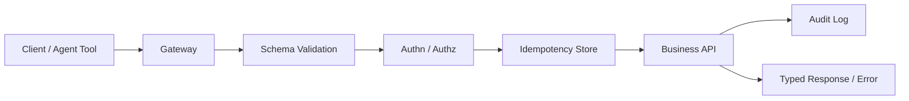

# API 契约、幂等与安全治理

## 面试定位

API 设计题不是问 REST 路径怎么命名，而是看你能否设计一个可演进、安全、可观测、可重试的接口契约。成熟回答要覆盖 request/response schema、版本、错误码、分页、幂等键、认证授权、限流、审计和兼容策略。OWASP API Security 用于确认 API 风险边界，HTTP RFC 用于确认语义，Agent tool schema 也可以被看成机器可调用 API 契约。

反例是所有错误都返回 500，权限只在前端校验，或者写接口没有幂等键。

## 一句话定义

API 契约是客户端和服务端对请求、响应、错误、版本和行为边界的稳定约定。API 安全治理是对认证、授权、输入校验、幂等、限流、审计和数据暴露的系统控制。幂等保证重复提交同一业务意图不会产生重复副作用。

## 架构与运行机制

图 1 展示了 API 请求的数据流：网关做限流和基础校验，schema 校验请求结构，认证授权保护资源，幂等存储保护写副作用，业务结果和错误按契约返回，审计日志记录高风险动作。

## 深入技术细节

契约设计要稳定可演进。新增字段要向后兼容，删除字段要有弃用期，枚举新增要考虑旧客户端，响应字段含义不能悄悄改变。错误响应应该包含 `code`、`message`、`retryable`、`request_id` 和必要 `details`，让客户端知道能否重试、是否需要用户修改输入。

写接口要支持幂等。客户端传 `Idempotency-Key`，服务端保存 key、request_hash、status、result 和过期时间。同一 key 重复请求如果 request_hash 一致，返回同一结果；如果 request_hash 不同，返回 conflict。这样能防止网络超时和用户重复点击造成重复订单、重复扣款或重复工具执行。

安全治理必须在服务端完成。前端隐藏按钮不是授权。后端要校验身份、资源归属、角色/策略、输入 schema、速率限制和审计。高风险操作要二次确认或审批。Agent 工具调用同样需要 schema、权限和审计，不能让模型自由拼参数执行。

## 关键数据结构与协议

| 字段 | 所属对象 | 作用 | 风险 |
| --- | --- | --- | --- |
| `request_id` | 请求/响应 | 追踪一次调用 | 缺失影响排障 |
| `schema_version` | API 契约 | 版本兼容 | 旧客户端破坏 |
| `error_code` | 错误响应 | 可行动错误 | 语义不稳定 |
| `retryable` | 错误响应 | 指导重试 | 错误重试风暴 |
| `idempotency_key` | 写请求 | 防重复副作用 | 粒度错误 |
| `request_hash` | 幂等记录 | 防 key 误用 | 未校验会串结果 |
| `audit_id` | 审计日志 | 高风险动作追踪 | 隐私和保留周期 |

这些字段让 API 契约可测试、可追踪、可审计。

## 系统设计案例

设计支付创建 API，架构上 Gateway 限流，Schema Validator 校验请求，Authz 校验用户和订单归属，Idempotency Store 保护重复提交，Business API 创建支付，Audit Log 记录高风险动作。数据流是 request -> schema -> authz -> idempotency -> business tx -> response/audit。

取舍是：强 schema 降低错误但影响快速迭代；幂等存储增加成本但保护副作用；细粒度审计提升安全但增加隐私和存储成本。面试追问通常会问错误码、幂等键、版本兼容、权限和限流。

## 真实问题与排障

如果支付创建出现重复订单，先看影响面：哪些客户端、是否网络超时、是否重复点击、idempotency_key 是否缺失、request_hash 是否冲突、服务端是否在事务前写幂等记录。止血可以临时要求客户端传 key、服务端按业务键去重、暂停异常入口或人工对账。

根因定位看 API 日志、幂等表、错误码、客户端重试策略和订单状态机。回滚可能是恢复旧 schema、关闭新客户端功能、修复幂等键生成或补偿重复订单。回归要模拟超时、重复提交、同 key 不同参数、权限失败和 rate limit。

## 项目化表达

项目里可以说：我为写接口统一接入 Idempotency-Key，错误响应包含 code、retryable、request_id，权限在服务端按资源归属校验。一次重复提交事故中，我们发现客户端重试没有复用幂等键，服务端也没校验 request_hash；修复后新增幂等表、冲突错误码和回归测试，指标看 `idempotency_conflict_count`、`api_error_rate`、`permission_denied_count` 和 `audit_log_count`。

Agent 工具接口也一样：tool schema 就是 API 契约，模型输出参数必须校验，高风险工具要权限、确认和审计。

## 边界条件与反例

反例一：只在前端做权限。攻击者可以直接调用 API。

反例二：错误码不可行动，客户端只能盲目重试。

反例三：同一个幂等键不同请求体仍返回旧结果。

反例四：API 版本变更没有兼容测试，旧客户端崩溃。

## 深问准备

1. 错误响应应该包含哪些字段？
2. 幂等键如何防误用？
3. Schema 如何兼容演进？
4. API 权限怎么做服务端校验？
5. Agent tool schema 和 API 契约有什么相同点？

## 面试加固与追问链路

如果面试官问“REST API 和 Agent tool schema 有什么关系”，可以回答：两者都是契约。REST 面向人写的客户端和服务端，tool schema 面向模型和宿主运行时；但都需要字段类型、必填、枚举、错误码、权限、幂等和版本。区别是 tool schema 更需要约束副作用、权限确认和参数可解释性，因为模型可能生成边界外输入。

如果追问 API 安全，可以按 OWASP API 风险展开：对象级授权失败、认证破坏、过度数据暴露、资源无限制、批量赋值、缺少审计。工程上要做服务端资源归属校验、字段白名单、分页/限流、错误码收敛、审计日志和敏感字段脱敏。

事故复盘可以讲重复提交：用户网络超时后客户端重试，服务端没有幂等，生成两笔订单。止血是按业务键冻结重复订单；根因是缺少 Idempotency-Key 和 request_hash；修复是幂等表、冲突错误码、客户端复用 key 和回归测试。

再补一个 Agent 迁移案例：一个 Web API 如果被封装成工具给模型调用，原来面向人类客户端的“提示用户确认”就要变成宿主系统的 permission gate；原来可读的错误 message 要变成模型可理解但不泄露敏感信息的 error_code；原来靠前端防重复点击的逻辑要变成服务端幂等。这样可以自然连接 tool schema、权限和 API 契约。

再补一条契约评审模板：一个 API 上线前要检查 schema 是否向后兼容、错误码是否可行动、幂等键是否覆盖写副作用、权限是否服务端校验、限流是否按租户和用户隔离、审计是否记录高风险操作。上线后看 validation_error、permission_denied、rate_limited、idempotency_conflict 和 api_error_rate，形成闭环。

如果追问“如何避免过度数据暴露”，可以回答：响应 DTO 使用字段白名单，不直接返回 ORM 实体；按角色和资源过滤字段；日志和审计只保存必要摘要；分页和导出要限制字段与条数。API 契约既要稳定，也要最小化暴露面。

最后补一个协作闭环：API 契约应该进入 CI 和发布流程。Schema 兼容性检查、契约测试、错误码文档、幂等回归、权限用例和审计字段检查都应自动化。这样前端、后端、网关、移动端和 Agent 工具封装不会因为某次字段调整同时失效。

面试收束可以说：好的 API 契约既服务人类客户端，也服务自动化测试、网关策略、审计平台和 Agent 工具调用，它是系统协作边界。

边界越清晰，故障和误用越容易被提前拦住。

这些边界也要用指标持续验证。

## 生产验收清单

API 契约上线前可以按“schema、行为、权限、幂等、观测”五类验收。schema 验收检查必填字段、枚举、格式、分页、排序、deprecated 字段和向后兼容；行为验收检查状态码、错误码、retryable、幂等冲突、rate limit 和超时语义；权限验收覆盖对象级授权、租户隔离、字段级脱敏和批量操作；幂等验收覆盖同 key 同请求、同 key 不同请求、超时后重试、处理中重复请求；观测验收检查 request_id、trace_id、audit_id、error_code 和敏感字段脱敏。

契约测试也要分 consumer 和 provider。consumer contract 防后端删除字段、改变枚举或修改错误语义；provider test 防实现偏离 OpenAPI/JSON Schema；安全测试覆盖越权、批量赋值、过度数据暴露和无界分页。对于面向 Agent 的 tool schema，还要加 permission gate、dry-run、human confirmation 和参数摘要审计，避免模型把高风险操作当普通 API 调用。

发布后看五组指标：`schema_validation_error` 表示客户端和契约不一致，`permission_denied_count` 表示权限边界被触发，`idempotency_conflict_count` 表示幂等键误用，`rate_limited_count` 表示容量保护生效，`audit_missing_count` 表示高风险操作没有留下证据。面试里能把这些指标和 CI gate 说清楚，会显得你不是只会设计接口文档，而是会治理接口生命周期。

## 公开阅读校验

公开读者看这篇时，要能带走一套 API 评审框架：契约先定义 schema、版本、错误码和兼容策略；写接口再补幂等键、request fingerprint、处理中状态和结果复用；安全治理覆盖服务端认证授权、对象级授权、字段白名单、限流和审计。只有路径命名漂亮，但错误语义、幂等和权限不可验证，不能算成熟 API 设计。

一个可验证案例是“创建支付单”：客户端生成 `Idempotency-Key`，服务端保存 `request_hash`、状态、结果摘要和过期时间；同 key 同请求返回同一结果，同 key 不同请求返回冲突；权限校验按订单归属和租户执行；响应错误码区分参数错误、权限拒绝、幂等冲突、限流和下游超时。这样读者可以直接把文章映射到接口表、幂等表、审计日志和回归用例。

事故复盘要能回答五个问题：哪个客户端触发、哪个契约版本、是否重复提交、服务端是否先写幂等记录、审计是否完整。指标看 `schema_validation_error`、`idempotency_conflict_count`、`permission_denied_count`、`rate_limited_count`、`api_error_rate` 和未知错误码数量。反例也要明确：前端隐藏按钮、错误全 500、直接返回 ORM 实体、幂等 key 不校验 body，都不适合写成公开最佳实践。

上线演练可以设计成四组用例。第一组是兼容性：旧客户端忽略新增字段，新客户端能识别 deprecated 字段，枚举新增走 unknown 分支。第二组是幂等性：同 key 同请求重复提交、同 key 不同请求、处理中重复请求、业务事务成功但响应超时。第三组是安全性：越权访问、批量赋值、无界分页、敏感字段暴露和租户串读。第四组是可观测：每个失败分支都有稳定 `error_code`、`request_id`、审计记录和 trace。

如果这类 API 被封装成 Agent tool，还要再加一层机器调用约束：tool schema 不只描述参数类型，还要标记副作用、权限级别、dry-run 能力、确认文案和幂等字段。模型生成参数后，宿主系统仍要做 schema validation、permission gate 和审计。公开文章把 Web API 和 Agent tool 的共同边界写清楚，能回应当前 AI 工程趋势，也不会脱离传统 Web 工程基本功。

## 来源与延伸阅读

- [OpenAPI Specification](https://spec.openapis.org/oas/latest.html)：官方规范，用于支持 API schema、operation、request/response 和契约文档治理。
- [Stripe API: Idempotent requests](https://docs.stripe.com/api/idempotent_requests)：官方文档，用于说明写接口幂等键、参数一致性和结果复用。
- [OWASP API Security Project](https://owasp.org/www-project-api-security/)：用于确认认证、授权、过度数据暴露、资源限制等 API 风险边界。
- [Model Context Protocol](https://modelcontextprotocol.io/)：官方文档，用于连接 Agent tool schema 与机器可调用 API 契约。
