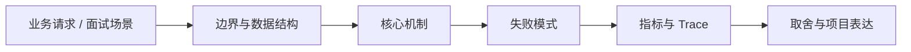

# 认证授权、Session、JWT 与 OAuth 边界

## 面试定位

认证授权、Session、JWT 与 OAuth 边界 属于 Web 工程 / 浏览器安全与认证授权。面试里它不是背概念题，而是用来判断你是否能把知识落到架构、数据流、指标和取舍上。
一句话定位：认证授权题要从身份、权限、Session、Token、JWT、OAuth、刷新、撤销、权限变更和审计展开。

**必须讲清楚**
- 认证确认调用者是谁，授权决定调用者能访问什么。
- Session 是服务端保存登录状态并通过 Cookie 引用的机制。
- OAuth 2.0 是授权第三方客户端访问资源的框架。
- 认证授权题要从身份、权限、Session、Token、JWT、OAuth、刷新、撤销、权限变更和审计展开。
- 认证不是授权
- JWT 撤销复杂
- 高风险操作要审计

**常见追问方向**
- HTTP 题先讲 cache-control、etag、cookie/session/token 和 CORS/CSRF 边界。
- API 题先讲契约、版本、错误码、幂等键、权限、限流和审计。
- AI/Web Agent 场景要连接工具 schema、权限确认、prompt injection 和可回放 trace。
- 如果这个点落到 Web Agent：公开网页任务自动化与评测，架构如何设计？
- 线上失败时看哪些 trace、日志、指标，怎么回滚或补偿？

## 架构与运行机制

### 核心机制

- 身份状态、权限状态和业务资源归属要分开建模。
- Token 要有过期、刷新、撤销、绑定设备或权限版本的策略。
- 跨站登录回调要校验 state/redirect_uri，避免 CSRF 和开放重定向。
- 所有高风险授权决策要有审计日志和 trace_id。
- Session 服务端可控、易撤销，但依赖存储；JWT 扩展性好，但权限更新和泄露后的撤销更复杂。
- OAuth 是授权框架，不等同于登录协议；实际登录常结合 OpenID Connect。
- Server-side session：集中撤销和权限控制。
- Short-lived access token + refresh token：降低泄露窗口。
- RBAC/ABAC：按角色和属性做授权。
- OAuth authorization code flow：第三方授权常见流程。
- Cookie 登录态要设置 HttpOnly、Secure、SameSite，并考虑 CSRF。
- JWT 中不要放敏感信息，签名不等于加密。
- 权限变更要让旧 session/token 失效或通过 permission_version 拦截。
- 多租户系统每次资源访问都要校验 tenant_id 归属。

### 通用数据流

可以按浏览器、CDN、网关/BFF、认证授权、API 契约、缓存、文件传输、实时连接、安全策略和可观测性来讲。数据流通常是浏览器带着 cookie/token 和 trace context 访问 CDN 或 Gateway，网关做认证、限流、CORS/CSRF/权限校验，BFF/API 按 schema 执行业务，响应通过 Cache-Control、CSP、Set-Cookie、错误码和 trace_id 把协议边界暴露清楚。

### 工程落点

- 定义 HTTP 缓存策略、会话边界、认证续期、CSRF/CORS 和敏感响应头。
- 为 API 设计 request schema、response schema、error code、idempotency key 和 version。
- 上线后跟踪 cache hit、auth error、api p95、4xx/5xx、idempotency conflict 和 security audit。
- Token 要短期有效、支持 refresh、设备管理、权限版本和泄露吊销。
- 授权要在服务端按资源归属、角色、属性和租户隔离校验，不能只靠前端隐藏按钮。
- 把每个关键步骤都映射到可观测指标，避免只描述功能。
- 回答时主动说明哪些信息是强一致状态，哪些只是上下文或缓存视图。

## 可画图

图 1：认证授权、Session、JWT 与 OAuth 边界 的回答要从业务入口进入，先讲边界和数据结构，再讲机制、失败模式、指标和取舍。

## 系统设计案例

### 认证授权、Session、JWT 与 OAuth 边界 的面试级设计题

典型设计题是管理后台、文件上传下载、实时通知、Web Agent 控制台、RAG 文档权限和 API 网关治理。架构上要包含 Cookie/SameSite/CSRF、CORS allowlist、CSP/XSS 防护、Session/Token/OAuth、CDN 缓存、签名 URL、WebSocket/SSE、BFF、版本兼容、错误码、审计和前后端契约测试。

**可画架构**
- 入口层校验用户请求、权限、租户、参数和幂等键。
- 业务服务层决定同步处理、异步处理、缓存读写、数据库回源或降级返回。
- 状态层保存业务状态、缓存版本、事件状态和恢复点。
- 执行层处理存储访问、下游调用、异步任务和补偿动作，并把结构化结果写入 trace。
- 观测层用指标、日志和链路追踪证明系统可运行、可排障、可复盘。

**数据流**
- 请求进入入口层后生成 request_id/run_id。
- 业务服务读取缓存、数据库或异步事件状态，选择执行路径。
- 执行结果写回状态存储，并向监控系统上报延迟、错误和业务结果。
- 保护策略根据成功标准、失败次数、SLA 和风险等级决定继续、降级、补偿或停止。

## 真实问题与排障

真实线上问题一般从 status_code、api_error_rate、auth_error_rate、cors_error_count、csrf_block_count、xss_report_count、cache_hit_rate、cdn_origin_fetch_rate、upload_fail_rate、ws_disconnect_rate、schema_validation_error 和 trace_id 看起。回答时要先判断是浏览器策略、缓存、认证授权、网络、API 契约、实时连接还是后端依赖问题。

**排查顺序**
- 先确认用户可感知问题：错误率、延迟、成功率、数据一致性或结果质量是否异常。
- 再沿数据流定位是哪一段出了问题：入口、状态、缓存、数据库、异步事件、外部依赖或消费端。
- 对比最近发布、配置变更、流量变化、数据倾斜和下游限流。
- 先止血：限流、降级、回滚、暂停消费、隔离高风险工具或切换只读模式。
- 最后把失败样例进入 regression/eval，避免同类问题复发。

**重点指标**
- auth_error_rate
- permission_denied_count
- token_refresh_fail_rate
- session_revoke_count
- oauth_state_mismatch_count

**常见误区**
- 混淆认证和授权
- JWT 永不过期
- OAuth 回调和 state 校验缺失

## 业界方案与技术取舍

Web 工程的取舍是用户体验、性能、安全、兼容性、可演进和可观测性之间的平衡。面试追问通常会围绕 HTTP 缓存、Cookie/Session/JWT/OAuth、CORS/CSRF/XSS/CSP、CDN、上传下载、WebSocket/SSE、BFF、API 版本、错误码和 Agent tool schema 展开。

**方案对比**
- Server-side session：集中撤销和权限控制。
- Short-lived access token + refresh token：降低泄露窗口。
- RBAC/ABAC：按角色和属性做授权。
- OAuth authorization code flow：第三方授权常见流程。
- Session 可控但需要存储和扩展治理。
- JWT 无状态但撤销、权限更新和密钥轮换更复杂。
- 更细权限模型安全性高，但开发和审计成本更高。
- Web 工程要把 HTTP 语义、缓存、认证、API 契约、安全和前后端协作放在一起看。
- 浏览器、CDN、网关、应用和后端服务各自承担不同缓存与安全责任。
- API 设计要在可演进契约、幂等、权限、错误语义和观测之间做取舍。
- 认证授权题能自然迁移到 Agent tool permission 和 MCP 工具权限。
- 面试时说清 OAuth、OIDC、Session、JWT 各自边界，会显得非常扎实。

**复习时要能讲出的细节**
- 这个知识点解决什么问题，不解决什么问题。
- 关键数据结构、状态变化、失败边界和可观测指标是什么。
- 面试官继续追问时，能从架构图、数据流、线上排障和项目证据四个角度展开。
- 能说明为什么这个取舍适合当前业务，而不是只背业界名词。

## 深入技术细节

认证授权题要从身份、权限、Session、Token、JWT、OAuth、刷新、撤销、权限变更和审计展开。 认证确认调用者是谁，授权决定调用者能访问什么。 Session 是服务端保存登录状态并通过 Cookie 引用的机制。 OAuth 2.0 是授权第三方客户端访问资源的框架。 身份状态、权限状态和业务资源归属要分开建模。 Token 要有过期、刷新、撤销、绑定设备或权限版本的策略。 跨站登录回调要校验 state/redirect_uri，避免 CSRF 和开放重定向。 所有高风险授权决策要有审计日志和 trace_id。

面试深挖时要把对象、状态、协议、执行顺序和失败分支讲出来。不要只说“可以用 Redis/数据库/MQ 解决”，而要说明 key、字段、版本、超时、重试、幂等、降级和观测指标如何共同工作。

## 关键数据结构与协议

| 字段 | 所属对象 | 作用 | 排障价值 |
| :--- | :--- | :--- | :--- |
| `session_id` | 登录态 | 引用服务端会话记录 | 排查退出、踢下线和会话复用 |
| `permission_version` | 授权状态 | 标识用户权限快照版本 | 权限降级后拦截旧 token |
| `refresh_token_id` | 续期凭证 | 绑定设备、轮换和撤销状态 | 定位刷新失败和令牌泄露 |
| `oauth_state` | OAuth 回调 | 防 CSRF 和授权串会话 | 排查 state mismatch 与钓鱼回调 |
| `redirect_uri_hash` | OAuth 客户端 | 约束回调地址 | 排查开放重定向和错误客户端 |
| `audit_id` | 授权审计 | 记录高风险授权决策 | 复盘越权、封禁和权限变更 |

## 公开阅读校验

读者看这一篇时，要能明确三条边界：认证是“你是谁”，授权是“你能访问什么”，审计是“你做过什么”。Session、JWT 和 OAuth 不是互相替代的银弹：Session 更容易撤销和权限收敛，JWT 更适合横向扩展但要处理泄露、撤销、权限版本和密钥轮换，OAuth 解决第三方授权，不等同于所有登录协议。

一个可信项目场景是管理后台权限降级：管理员撤销用户角色后，服务端递增 `permission_version`，旧 session 或 access token 即使还没过期，也会在下一次资源访问时被拒绝；高风险操作写入 `audit_id`，并能关联 `request_id`、操作者、资源、策略版本和结果。OAuth 登录还要校验 `state`、`redirect_uri` 和客户端绑定，避免开放重定向或跨站回调。

验收指标包括 `auth_error_rate`、`permission_denied_count`、`token_refresh_fail_rate`、`session_revoke_count`、`oauth_state_mismatch_count`、`suspicious_login_count` 和高风险操作审计缺失数。反例要写清楚：JWT 永不过期、退出登录只删前端状态、只在前端隐藏按钮、OAuth 回调不校验 state，都不是可公开推荐的设计。

## 深问准备

被追问边界时，先说这个方案适合什么、不适合什么，再给反例。被追问线上故障时，按影响面、止血、根因、修复、回归五段回答。被追问项目时，把回答落到你做过的接口、缓存、队列、数据库、监控或 Agent 工程链路。

- 反例要明确，例如强事务事实源不能交给缓存或搜索读模型。
- 指标要可执行，例如 p95、error_rate、retry_rate、lag、miss_rate、stale_rate。
- 回归要可复现，例如固定输入、故障注入、压测脚本或 golden case。

## 来源与延伸阅读

- [RFC 6749: The OAuth 2.0 Authorization Framework](https://www.rfc-editor.org/rfc/rfc6749)：用于确认官方语义边界、命令行为和工程约束。
- [RFC 9110: HTTP Semantics](https://www.rfc-editor.org/info/rfc9110)：用于确认官方语义边界、命令行为和工程约束。
- [OWASP API Security Project](https://owasp.org/www-project-api-security/)：用于确认官方语义边界、命令行为和工程约束。
