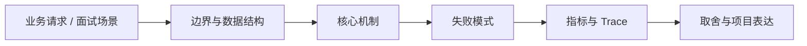

# 浏览器安全：CORS、CSRF、XSS 与 CSP

## 面试定位

浏览器安全：CORS、CSRF、XSS 与 CSP 属于 Web 工程 / 浏览器安全与认证授权。面试里它不是背概念题，而是用来判断你是否能把知识落到架构、数据流、指标和取舍上。
一句话定位：浏览器安全题要讲清同源策略、CORS 边界、CSRF 成因、XSS 防护、CSP、Cookie 属性和服务端授权。

**必须讲清楚**
- 同源策略限制脚本读取不同源的响应，是浏览器安全基础。
- CORS 是服务器声明哪些跨域来源可被浏览器读取的机制。
- CSP 是通过响应头限制脚本、样式、图片等资源加载和执行来源的策略。
- 浏览器安全题要讲清同源策略、CORS 边界、CSRF 成因、XSS 防护、CSP、Cookie 属性和服务端授权。
- CORS 不是鉴权
- CSRF 利用自动带 Cookie
- XSS 要输入输出一起防

**常见追问方向**
- HTTP 题先讲 cache-control、etag、cookie/session/token 和 CORS/CSRF 边界。
- API 题先讲契约、版本、错误码、幂等键、权限、限流和审计。
- AI/Web Agent 场景要连接工具 schema、权限确认、prompt injection 和可回放 trace。
- 如果这个点落到 Web Agent：公开网页任务自动化与评测，架构如何设计？
- 线上失败时看哪些 trace、日志、指标，怎么回滚或补偿？

## 架构与运行机制

### 核心机制

- 认证授权必须在服务端完成，CORS 只是浏览器读取控制。
- CSRF 防护要保护有副作用请求，尤其是 Cookie 自动认证场景。
- XSS 防护要覆盖输入校验、输出编码、富文本净化、CSP 和依赖治理。
- 安全策略要有 report-only、灰度和误伤监控。
- CORS 控制浏览器是否允许脚本读取跨域响应，不替代服务端认证授权。
- CSRF 利用浏览器自动携带 Cookie 发起跨站请求，XSS 则利用脚本执行窃取数据或发起恶意操作。
- CORS allowlist：限制可信 origin、method 和 header。
- SameSite Cookie：降低跨站自动带 Cookie 风险。
- CSRF token：为写操作增加不可预测校验值。
- CSP report-uri/report-to：发现潜在 XSS 和资源违规。
- Access-Control-Allow-Origin 不能在 credentials=true 时使用 `*`。
- 预检 OPTIONS 失败可能来自方法、header、凭证或网关未透传。
- 富文本渲染要做 HTML sanitizer，不能只相信后端已过滤。
- Agent 浏览器自动化要隔离登录态和工具权限，避免跨站脚本影响高权限操作。

### 通用数据流

可以按浏览器、CDN、网关/BFF、认证授权、API 契约、缓存、文件传输、实时连接、安全策略和可观测性来讲。数据流通常是浏览器带着 cookie/token 和 trace context 访问 CDN 或 Gateway，网关做认证、限流、CORS/CSRF/权限校验，BFF/API 按 schema 执行业务，响应通过 Cache-Control、CSP、Set-Cookie、错误码和 trace_id 把协议边界暴露清楚。

### 工程落点

- 定义 HTTP 缓存策略、会话边界、认证续期、CSRF/CORS 和敏感响应头。
- 为 API 设计 request schema、response schema、error code、idempotency key 和 version。
- 上线后跟踪 cache hit、auth error、api p95、4xx/5xx、idempotency conflict 和 security audit。
- CORS 要使用明确 allowlist，不能在带凭证请求里使用泛化来源。
- 高风险写操作要结合 SameSite、CSRF token、Origin/Referer 校验和服务端权限校验。
- 把每个关键步骤都映射到可观测指标，避免只描述功能。
- 回答时主动说明哪些信息是强一致状态，哪些只是上下文或缓存视图。

## 可画图

图 1：浏览器安全：CORS、CSRF、XSS 与 CSP 的回答要从业务入口进入，先讲边界和数据结构，再讲机制、失败模式、指标和取舍。

## 系统设计案例

### 浏览器安全：CORS、CSRF、XSS 与 CSP 的面试级设计题

典型设计题是管理后台、文件上传下载、实时通知、Web Agent 控制台、RAG 文档权限和 API 网关治理。架构上要包含 Cookie/SameSite/CSRF、CORS allowlist、CSP/XSS 防护、Session/Token/OAuth、CDN 缓存、签名 URL、WebSocket/SSE、BFF、版本兼容、错误码、审计和前后端契约测试。

**可画架构**
- 入口层校验用户请求、权限、租户、参数和幂等键。
- 业务服务层决定同步处理、异步处理、缓存读写、数据库回源或降级返回。
- 状态层保存业务状态、缓存版本、事件状态和恢复点。
- 执行层处理存储访问、下游调用、异步任务和补偿动作，并把结构化结果写入 trace。
- 观测层用指标、日志和链路追踪证明系统可运行、可排障、可复盘。

**数据流**
- 请求进入入口层后生成 request_id/run_id。
- 业务服务读取缓存、数据库或异步事件状态，选择执行路径。
- 执行结果写回状态存储，并向监控系统上报延迟、错误和业务结果。
- 保护策略根据成功标准、失败次数、SLA 和风险等级决定继续、降级、补偿或停止。

## 真实问题与排障

真实线上问题一般从 status_code、api_error_rate、auth_error_rate、cors_error_count、csrf_block_count、xss_report_count、cache_hit_rate、cdn_origin_fetch_rate、upload_fail_rate、ws_disconnect_rate、schema_validation_error 和 trace_id 看起。回答时要先判断是浏览器策略、缓存、认证授权、网络、API 契约、实时连接还是后端依赖问题。

**排查顺序**
- 先确认用户可感知问题：错误率、延迟、成功率、数据一致性或结果质量是否异常。
- 再沿数据流定位是哪一段出了问题：入口、状态、缓存、数据库、异步事件、外部依赖或消费端。
- 对比最近发布、配置变更、流量变化、数据倾斜和下游限流。
- 先止血：限流、降级、回滚、暂停消费、隔离高风险工具或切换只读模式。
- 最后把失败样例进入 regression/eval，避免同类问题复发。

**重点指标**
- cors_error_count
- csrf_block_count
- xss_report_count
- permission_denied_count
- security_incident_count

**常见误区**
- 把 CORS 当权限系统
- 只前端过滤 XSS
- SameSite 设置不理解导致登录异常

## 业界方案与技术取舍

Web 工程的取舍是用户体验、性能、安全、兼容性、可演进和可观测性之间的平衡。面试追问通常会围绕 HTTP 缓存、Cookie/Session/JWT/OAuth、CORS/CSRF/XSS/CSP、CDN、上传下载、WebSocket/SSE、BFF、API 版本、错误码和 Agent tool schema 展开。

**方案对比**
- CORS allowlist：限制可信 origin、method 和 header。
- SameSite Cookie：降低跨站自动带 Cookie 风险。
- CSRF token：为写操作增加不可预测校验值。
- CSP report-uri/report-to：发现潜在 XSS 和资源违规。
- 更严格 CSP 安全性更高，但可能误伤历史脚本和三方资源。
- SameSite=Strict 更安全，但可能影响跨站登录和支付回跳。
- 富文本能力越强，XSS 防护和审计成本越高。
- Web 工程要把 HTTP 语义、缓存、认证、API 契约、安全和前后端协作放在一起看。
- 浏览器、CDN、网关、应用和后端服务各自承担不同缓存与安全责任。
- API 设计要在可演进契约、幂等、权限、错误语义和观测之间做取舍。
- 浏览器安全题可以和工具权限、Web Agent、用户数据安全直接连接。
- 面试时明确 CORS 不是鉴权，是非常关键的边界意识。

**复习时要能讲出的细节**
- 这个知识点解决什么问题，不解决什么问题。
- 关键数据结构、状态变化、失败边界和可观测指标是什么。
- 面试官继续追问时，能从架构图、数据流、线上排障和项目证据四个角度展开。
- 能说明为什么这个取舍适合当前业务，而不是只背业界名词。

## 深入技术细节

浏览器安全题要讲清同源策略、CORS 边界、CSRF 成因、XSS 防护、CSP、Cookie 属性和服务端授权。 同源策略限制脚本读取不同源的响应，是浏览器安全基础。 CORS 是服务器声明哪些跨域来源可被浏览器读取的机制。 CSP 是通过响应头限制脚本、样式、图片等资源加载和执行来源的策略。 认证授权必须在服务端完成，CORS 只是浏览器读取控制。 CSRF 防护要保护有副作用请求，尤其是 Cookie 自动认证场景。 XSS 防护要覆盖输入校验、输出编码、富文本净化、CSP 和依赖治理。 安全策略要有 report-only、灰度和误伤监控。

面试深挖时要把对象、状态、协议、执行顺序和失败分支讲出来。不要只说“可以用 Redis/数据库/MQ 解决”，而要说明 key、字段、版本、超时、重试、幂等、降级和观测指标如何共同工作。

## 关键数据结构与协议

| 字段 | 所属对象 | 作用 | 排障价值 |
| :--- | :--- | :--- | :--- |
| `origin` | 浏览器请求 | 标识页面来源 | 排查 CORS 和 CSRF 校验命中原因 |
| `cors_policy_id` | 跨域策略 | 绑定允许来源、方法、头和凭证策略 | 定位错误放开或误拦截 |
| `csrf_token` | 表单/请求 | 证明请求来自合法页面上下文 | 排查跨站伪造和 token 过期 |
| `cookie_samesite` | Cookie 属性 | 限制跨站携带 Cookie | 分析登录跳转和 CSRF 防护取舍 |
| `csp_nonce` | CSP 策略 | 允许可信脚本执行 | 排查脚本注入和 CSP 误伤 |
| `security_report_id` | 安全报告 | 关联 CSP/XSS/CSRF 事件 | 聚合安全事件和复盘攻击样本 |

## 公开阅读校验

浏览器安全文章要把“浏览器策略”和“服务端权限”分开。CORS 控制浏览器是否允许前端读取跨域响应，不是后端授权；CSRF 防的是用户浏览器带着合法 Cookie 被诱导发有副作用请求；XSS 防的是攻击脚本进入页面并窃取或执行操作。服务端资源归属、角色、租户和字段级授权仍然必须存在。

项目案例可以讲后台管理系统：跨域来源只允许正式域名和预发域名，带凭证请求不能使用 `*`；写操作要求 SameSite、CSRF token、Origin/Referer 校验和二次确认；富文本先净化再输出编码，关键页面启用 CSP nonce，并先用 report-only 观察误伤。这样回答能说明你知道安全策略要灰度，而不是一次性把 CSP 开到线上。

验收指标包括 `cors_error_count`、`csrf_block_count`、`xss_report_count`、`csp_violation_count`、`security_event_rate` 和误伤工单数。事故复盘要能还原是哪条策略放开、哪个来源命中、哪个字段未编码、哪个 Cookie 属性缺失。不要把“浏览器报跨域”误认为系统安全，非浏览器客户端完全可以绕过 CORS。

## 深问准备

被追问边界时，先说这个方案适合什么、不适合什么，再给反例。被追问线上故障时，按影响面、止血、根因、修复、回归五段回答。被追问项目时，把回答落到你做过的接口、缓存、队列、数据库、监控或 Agent 工程链路。

- 反例要明确，例如强事务事实源不能交给缓存或搜索读模型。
- 指标要可执行，例如 p95、error_rate、retry_rate、lag、miss_rate、stale_rate。
- 回归要可复现，例如固定输入、故障注入、压测脚本或 golden case。

## 来源与延伸阅读

- [MDN: Cross-Origin Resource Sharing](https://developer.mozilla.org/en-US/docs/Web/HTTP/Guides/CORS)：用于确认官方语义边界、命令行为和工程约束。
- [MDN: Content Security Policy](https://developer.mozilla.org/en-US/docs/Web/HTTP/Guides/CSP)：用于确认官方语义边界、命令行为和工程约束。
- [OWASP API Security Project](https://owasp.org/www-project-api-security/)：用于确认官方语义边界、命令行为和工程约束。
