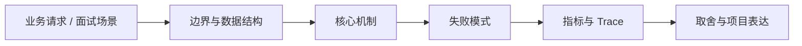

# Gateway、BFF、API 版本与兼容演进

## 面试定位

Gateway、BFF、API 版本与兼容演进 属于 Web 工程 / 实时通信、网关与前后端契约。面试里它不是背概念题，而是用来判断你是否能把知识落到架构、数据流、指标和取舍上。
一句话定位：Gateway/BFF 题要从入口治理、认证限流、聚合裁剪、版本兼容、灰度、错误码和客户端兼容展开。

**必须讲清楚**
- Gateway 是 API 入口治理层，处理横切能力和路由。
- BFF 是面向特定前端或客户端体验的后端聚合层。
- API 版本是对契约变更兼容性的管理机制。
- Gateway/BFF 题要从入口治理、认证限流、聚合裁剪、版本兼容、灰度、错误码和客户端兼容展开。
- Gateway 管入口
- BFF 服务前端体验
- 版本要兼容演进

**常见追问方向**
- HTTP 题先讲 cache-control、etag、cookie/session/token 和 CORS/CSRF 边界。
- API 题先讲契约、版本、错误码、幂等键、权限、限流和审计。
- AI/Web Agent 场景要连接工具 schema、权限确认、prompt injection 和可回放 trace。
- 如果这个点落到 Web Agent：公开网页任务自动化与评测、Coding Agent：代码库任务 Harness，架构如何设计？
- 线上失败时看哪些 trace、日志、指标，怎么回滚或补偿？

## 架构与运行机制

### 核心机制

- Gateway 做通用治理，BFF 做客户端适配，核心业务规则仍应在领域服务。
- API 字段新增默认兼容，删除、重命名和语义变化必须有迁移窗口。
- 错误码、request_id、trace_id、retryable 和文档要稳定。
- 客户端版本分布要可观测，不能盲目下线旧契约。
- Gateway 负责认证、授权、限流、路由、审计和横切治理；BFF 面向具体客户端聚合和裁剪数据。
- API 版本演进要兼容旧客户端，字段新增容易，字段删除和语义变更要灰度迁移。
- API Gateway policies：认证、限流、路由、审计。
- BFF aggregation：为 Web/Mobile/Admin 提供定制视图。
- Consumer-driven contract testing：从消费者角度验证兼容性。
- Deprecation policy：弃用公告、灰度、指标和下线窗口。
- BFF 聚合要避免 N+1 下游调用，必要时并行、缓存或批量接口。
- 版本兼容要看实际客户端版本占比和错误率。
- 网关错误要保留原始下游错误分类，同时对外返回稳定错误码。
- Agent tool schema 也需要版本、兼容和弃用策略。

### 通用数据流

可以按浏览器、CDN、网关/BFF、认证授权、API 契约、缓存、文件传输、实时连接、安全策略和可观测性来讲。数据流通常是浏览器带着 cookie/token 和 trace context 访问 CDN 或 Gateway，网关做认证、限流、CORS/CSRF/权限校验，BFF/API 按 schema 执行业务，响应通过 Cache-Control、CSP、Set-Cookie、错误码和 trace_id 把协议边界暴露清楚。

### 工程落点

- 定义 HTTP 缓存策略、会话边界、认证续期、CSRF/CORS 和敏感响应头。
- 为 API 设计 request schema、response schema、error code、idempotency key 和 version。
- 上线后跟踪 cache hit、auth error、api p95、4xx/5xx、idempotency conflict 和 security audit。
- 网关策略要有灰度、审计和回滚，避免一条规则影响全量流量。
- BFF 聚合多个下游时要设置超时、部分失败、降级和 trace 关联。
- 把每个关键步骤都映射到可观测指标，避免只描述功能。
- 回答时主动说明哪些信息是强一致状态，哪些只是上下文或缓存视图。

## 可画图

图 1：Gateway、BFF、API 版本与兼容演进 的回答要从业务入口进入，先讲边界和数据结构，再讲机制、失败模式、指标和取舍。

## 系统设计案例

### Gateway、BFF、API 版本与兼容演进 的面试级设计题

典型设计题是管理后台、文件上传下载、实时通知、Web Agent 控制台、RAG 文档权限和 API 网关治理。架构上要包含 Cookie/SameSite/CSRF、CORS allowlist、CSP/XSS 防护、Session/Token/OAuth、CDN 缓存、签名 URL、WebSocket/SSE、BFF、版本兼容、错误码、审计和前后端契约测试。

**可画架构**
- 入口层校验用户请求、权限、租户、参数和幂等键。
- 业务服务层决定同步处理、异步处理、缓存读写、数据库回源或降级返回。
- 状态层保存业务状态、缓存版本、事件状态和恢复点。
- 执行层处理存储访问、下游调用、异步任务和补偿动作，并把结构化结果写入 trace。
- 观测层用指标、日志和链路追踪证明系统可运行、可排障、可复盘。

**数据流**
- 请求进入入口层后生成 request_id/run_id。
- 业务服务读取缓存、数据库或异步事件状态，选择执行路径。
- 执行结果写回状态存储，并向监控系统上报延迟、错误和业务结果。
- 保护策略根据成功标准、失败次数、SLA 和风险等级决定继续、降级、补偿或停止。

## 真实问题与排障

真实线上问题一般从 status_code、api_error_rate、auth_error_rate、cors_error_count、csrf_block_count、xss_report_count、cache_hit_rate、cdn_origin_fetch_rate、upload_fail_rate、ws_disconnect_rate、schema_validation_error 和 trace_id 看起。回答时要先判断是浏览器策略、缓存、认证授权、网络、API 契约、实时连接还是后端依赖问题。

**排查顺序**
- 先确认用户可感知问题：错误率、延迟、成功率、数据一致性或结果质量是否异常。
- 再沿数据流定位是哪一段出了问题：入口、状态、缓存、数据库、异步事件、外部依赖或消费端。
- 对比最近发布、配置变更、流量变化、数据倾斜和下游限流。
- 先止血：限流、降级、回滚、暂停消费、隔离高风险工具或切换只读模式。
- 最后把失败样例进入 regression/eval，避免同类问题复发。

**重点指标**
- gateway_error_rate
- bff_downstream_timeout_count
- api_version_usage
- schema_validation_error
- route_rollback_count

**常见误区**
- BFF 变成业务大泥球
- API 版本只靠 URL 改名
- 网关规则无审计和回滚

## 业界方案与技术取舍

Web 工程的取舍是用户体验、性能、安全、兼容性、可演进和可观测性之间的平衡。面试追问通常会围绕 HTTP 缓存、Cookie/Session/JWT/OAuth、CORS/CSRF/XSS/CSP、CDN、上传下载、WebSocket/SSE、BFF、API 版本、错误码和 Agent tool schema 展开。

**方案对比**
- API Gateway policies：认证、限流、路由、审计。
- BFF aggregation：为 Web/Mobile/Admin 提供定制视图。
- Consumer-driven contract testing：从消费者角度验证兼容性。
- Deprecation policy：弃用公告、灰度、指标和下线窗口。
- BFF 提升前端效率，但可能复制业务逻辑。
- Gateway 集中治理方便，但错误配置影响面大。
- 多版本兼容用户友好，但维护成本高。
- Web 工程要把 HTTP 语义、缓存、认证、API 契约、安全和前后端协作放在一起看。
- 浏览器、CDN、网关、应用和后端服务各自承担不同缓存与安全责任。
- API 设计要在可演进契约、幂等、权限、错误语义和观测之间做取舍。
- Gateway/BFF 经验可以迁移到 Agent tool gateway 和 MCP tool schema 演进。
- 面试时讲出客户端版本分布和 contract test，会很工程化。

**复习时要能讲出的细节**
- 这个知识点解决什么问题，不解决什么问题。
- 关键数据结构、状态变化、失败边界和可观测指标是什么。
- 面试官继续追问时，能从架构图、数据流、线上排障和项目证据四个角度展开。
- 能说明为什么这个取舍适合当前业务，而不是只背业界名词。

## 深入技术细节

Gateway/BFF 题要从入口治理、认证限流、聚合裁剪、版本兼容、灰度、错误码和客户端兼容展开。 Gateway 是 API 入口治理层，处理横切能力和路由。 BFF 是面向特定前端或客户端体验的后端聚合层。 API 版本是对契约变更兼容性的管理机制。 Gateway 做通用治理，BFF 做客户端适配，核心业务规则仍应在领域服务。 API 字段新增默认兼容，删除、重命名和语义变化必须有迁移窗口。 错误码、request_id、trace_id、retryable 和文档要稳定。 客户端版本分布要可观测，不能盲目下线旧契约。

面试深挖时要把对象、状态、协议、执行顺序和失败分支讲出来。不要只说“可以用 Redis/数据库/MQ 解决”，而要说明 key、字段、版本、超时、重试、幂等、降级和观测指标如何共同工作。

## 关键数据结构与协议

| 字段 | 所属对象 | 作用 | 排障价值 |
| :--- | :--- | :--- | :--- |
| `request_id` | 请求 | 串联入口、缓存、DB 和下游调用 | 定位单次异常 |
| `key_schema` | Redis/存储 | 固定业务域、实体和版本 | 排查误删、串租户和旧版本 |
| `source_version` | value/event | 标识事实源版本 | 防止旧值覆盖新值 |
| `ttl_policy` | 缓存策略 | 控制过期、抖动和刷新 | 排查击穿、雪崩和旧值窗口 |
| `trace_id` | 观测链路 | 串联服务、存储和异步任务 | 复盘慢请求和失败分支 |

## 深问准备

被追问边界时，先说这个方案适合什么、不适合什么，再给反例。被追问线上故障时，按影响面、止血、根因、修复、回归五段回答。被追问项目时，把回答落到你做过的接口、缓存、队列、数据库、监控或 Agent 工程链路。

- 反例要明确，例如强事务事实源不能交给缓存或搜索读模型。
- 指标要可执行，例如 p95、error_rate、retry_rate、lag、miss_rate、stale_rate。
- 回归要可复现，例如固定输入、故障注入、压测脚本或 golden case。

## 来源与延伸阅读

- [RFC 9110: HTTP Semantics](https://www.rfc-editor.org/info/rfc9110)：用于确认官方语义边界、命令行为和工程约束。
- [OWASP API Security Project](https://owasp.org/www-project-api-security/)：用于确认官方语义边界、命令行为和工程约束。
- [Kubernetes Documentation: Service](https://kubernetes.io/docs/concepts/services-networking/service/)：用于确认官方语义边界、命令行为和工程约束。
