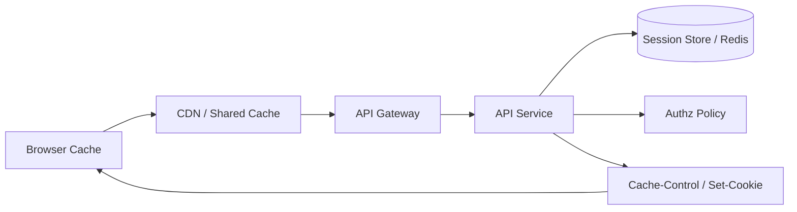

# HTTP 缓存、会话与认证边界

## 面试定位

Web 工程题要把浏览器、CDN、网关、后端和 Redis 的边界讲清楚。HTTP 缓存不是 Redis 缓存，认证不是授权，CORS 不是权限系统。RFC 9110 和 MDN HTTP Caching 用于确认 HTTP 语义和缓存头，OWASP API Security 用于支撑安全边界。

反例是把用户资料接口设成 `public max-age`，或者以为前端隐藏按钮就完成授权。工程回答要覆盖 Cache-Control、ETag、Cookie、Session、Token、CSRF、CORS、认证续期、退出登录和敏感响应缓存。

## 一句话定义

HTTP 缓存是浏览器、代理、CDN 和服务端围绕响应复用的协议机制。认证确认用户是谁，授权决定用户能访问什么资源。会话是服务端或客户端维持登录状态的机制，必须和缓存、安全头、权限变更一起设计。

## 架构与运行机制

图 1 展示了 Web 请求的数据流：浏览器和 CDN 可能缓存响应，网关和 API 负责认证授权，Session Store 保存会话状态，响应头决定缓存和 Cookie 安全属性。图中 Shared Cache 是敏感数据泄漏高风险点。

## 深入技术细节

HTTP 缓存要区分公共资源和私有响应。静态资源可以 `public, max-age, immutable`，并通过文件 hash 控制版本；用户资料、权限、订单、后台数据应使用 `private` 或 `no-store`，避免进入共享缓存。ETag 和 Last-Modified 用于协商缓存，能减少带宽但仍要考虑权限变化。

Cookie 安全属性要配齐。`HttpOnly` 防止 JS 读取，`Secure` 要求 HTTPS，`SameSite` 降低 CSRF 风险。Session 服务端可控，撤销和权限变化容易处理，但依赖存储；JWT/Token 扩展性好，但撤销、泄露、权限更新和过期策略更复杂。

CORS 只控制浏览器是否允许前端读取跨域响应，不是服务端权限系统。非浏览器客户端不受 CORS 限制，后端仍要校验认证、授权和资源归属。CSRF 防护要结合 SameSite、CSRF token、Origin/Referer 校验和敏感操作二次确认。

## 关键数据结构与协议

| 字段/头 | 作用 | 风险 |
| --- | --- | --- |
| `Cache-Control` | 控制缓存策略 | 敏感响应被共享缓存 |
| `ETag` | 协商缓存版本 | 权限变化时要失效 |
| `Set-Cookie` | 写入会话 Cookie | 属性缺失导致泄露 |
| `SameSite` | 降低 CSRF | 兼容和跳转场景复杂 |
| `Authorization` | 携带 Token | 泄露后需要撤销策略 |
| `Origin` | CORS/CSRF 校验 | 不能替代授权 |
| `session_version` | 会话版本 | 权限变更后失效 |

这些字段让 HTTP 安全从“登录了”变成可验证协议。

## 系统设计案例

设计管理后台登录态。架构上静态资源走 CDN 长缓存，API 响应默认 `no-store`，Session 保存在 Redis，Cookie 设置 HttpOnly/Secure/SameSite，网关校验认证，服务端按资源做授权。数据流是 login -> session create -> set-cookie -> request auth -> authz -> response cache header。

取舍是：Session 撤销简单但依赖 Redis；JWT 无状态但撤销复杂；更强 CSRF 防护可能影响跨站跳转；更长缓存提升性能但增加权限变化风险。面试追问通常会问 Cache-Control、JWT/Session、CORS 和 CSRF。

## 真实问题与排障

用户反馈看到他人资料时，先看影响面：哪些接口、是否经过 CDN、响应头、Cookie、用户切换、是否有代理缓存。止血可以立即旁路 CDN、设置 `no-store`、清理缓存、撤销会话、临时关闭相关接口。

根因定位看 Cache-Control、Vary、Authorization、Set-Cookie、CDN key、服务端权限校验和日志 trace。回滚可能是恢复旧缓存策略、撤销新 CDN 规则或回滚 token 续期逻辑。回归要模拟多用户、多租户、登录退出、权限变更和浏览器后退缓存。

## 项目化表达

项目里可以说：我把公共静态资源和用户态 API 分开设计缓存，静态资源长缓存，用户态响应 `private/no-store`。登录 Cookie 设置 HttpOnly/Secure/SameSite，权限变化增加 session_version。一次缓存泄漏演练中，我们验证 CDN 不缓存带 Authorization 的响应，并用 `auth_error_rate`、`csrf_block_count`、`cache_hit_rate` 和安全审计日志证明策略有效。

## 边界条件与反例

反例一：敏感接口 public cache，可能串用户。

反例二：CORS 当权限系统，非浏览器客户端可绕过。

反例三：JWT 长期有效且无法撤销，权限变更不能及时生效。

反例四：退出登录只删前端状态，服务端 session 仍有效。

## 深问准备

1. `no-store` 和 `private` 区别是什么？
2. ETag 在权限变化时有什么风险？
3. JWT 和 Session 怎么取舍？
4. CORS 为什么不是鉴权？
5. CSRF 如何防？

## 面试加固与追问链路

如果面试官追问“浏览器缓存和 CDN 缓存怎么区分”，可以回答：浏览器缓存只影响当前用户，CDN/shared cache 会影响多个用户和地区，所以用户态响应进入 CDN 风险更高。`private` 允许浏览器私有缓存但不允许共享缓存，`no-store` 要求不存储响应。涉及订单、权限、个人资料、后台数据时，更保守地使用 `no-store`。

如果追问“权限变化如何生效”，要把 HTTP 和服务端状态连起来。Session 模式可以更新 session_version 或删除 session；JWT 模式需要短有效期、refresh token、黑名单或权限版本号；Redis 权限缓存要失效。否则用户被降权后，旧 token 或旧缓存仍可能访问资源。

事故复盘可以讲缓存泄漏：某次 CDN 规则误把带 Cookie 的用户资料接口缓存。止血是旁路 CDN、清理缓存、设置 no-store；根因是 cache key 没区分认证状态；回归是多用户访问、退出登录、权限变化和浏览器后退缓存测试。

再补一个容易被追问的点：HTTP 缓存和 Redis 缓存失效不是一回事。HTTP 缓存通过响应头、浏览器和 CDN 控制，用户可能在服务端已经更新后仍看到本地缓存；Redis 缓存由服务端控制，可通过事件和版本失效。涉及权限、价格、订单状态时，要明确哪一层缓存允许 stale、最长 stale 多久、用户操作前是否需要回源校验。

再补一条认证授权模板：登录成功只说明用户身份可信，不说明他能访问所有资源。每个 API 都要校验资源归属、角色或策略；前端路由守卫只是体验优化。退出登录、改密码、封禁用户、权限降级都要能让 session/token 和服务端缓存及时失效。面试中把这些状态讲出来，会比只讲 Cookie 属性更完整。

如果追问“Cookie 被盗怎么办”，可以回答：HttpOnly 降低 XSS 读取风险，Secure 保证 HTTPS，SameSite 降低 CSRF，但仍要有登录设备管理、异常 IP/设备检测、短会话、刷新令牌轮换和服务端强制失效。安全设计不是单个 header，而是一组防线。

最后补一个前后端协作点：缓存和认证策略必须写进接口文档。前端要知道哪些接口可以缓存、哪些必须每次回源、哪些错误表示登录过期、哪些操作需要二次确认。后端要在响应头、错误码和审计日志里表达这些语义，否则浏览器、CDN 和应用状态很容易互相打架。

面试收束可以说：Web 登录态安全不是 Cookie、Token、CORS 任意一个点，而是缓存、认证、授权、CSRF、会话失效和服务端资源校验共同形成边界。

这条边界要能被测试和审计。

相关指标包括认证失败率、会话刷新失败率和安全拦截次数。

## 生产验收清单

缓存验收先按响应分类。静态资源要求文件名带 hash、长缓存、可灰度回滚；公共匿名接口要明确 `public`、`max-age`、`stale-while-revalidate` 和 CDN key；登录态接口默认 `no-store` 或至少 `private`，并验证带 `Authorization`、`Cookie`、租户和权限差异的响应不会进入共享缓存。对于 ETag，要测试权限变化、退出登录、切换账号和浏览器后退场景，避免协商缓存绕过服务端授权。

会话验收要覆盖生命周期。登录创建 session，刷新延长有效期，退出删除服务端 session，改密、封禁、权限降级和设备踢出都要让旧 session/token 失效。Session 模式要验证 Redis 故障、复制延迟和 session_version；JWT 模式要验证短有效期、refresh token rotation、黑名单或权限版本号。高风险后台系统还要有设备管理、异常登录告警和二次确认。

CSRF/CORS 验收要区分“浏览器读取限制”和“服务端授权”。CORS allowlist 要按环境和来源精确配置，不用通配符放开带凭证请求；CSRF 要测试 SameSite、CSRF token、Origin/Referer 校验和敏感方法。面试里可以强调：CORS 配错会造成浏览器侧数据暴露风险，但 CORS 正确也不能替代服务端资源归属校验。最终指标看 `csrf_block_count`、`cors_error_count`、`auth_error_rate`、`session_revoked_count` 和 `sensitive_cache_bypass_count`。

## 公开阅读校验

这篇文章的公开价值在于把缓存、登录态和权限边界放到同一张图里。读者应该能区分：HTTP 缓存由浏览器、代理和 CDN 根据响应头执行；Session/JWT 证明身份状态；授权由服务端按资源和租户判断；CORS 只是浏览器读取策略；CSRF 关注 Cookie 自动携带带来的跨站副作用。任何一层被混用，都会造成安全或一致性事故。

一个可复用案例是后台用户资料接口泄漏：CDN 误缓存了带 Cookie 的响应，cache key 没包含认证状态。止血动作是旁路 CDN、清理缓存、统一设置 `no-store`、撤销相关 session，并检查 `Vary`、`Authorization`、`Cookie` 和权限日志。修复后要用多用户、多租户、登录退出、权限降级、浏览器后退和协商缓存测试证明不会串数据。

指标要同时覆盖性能和安全：`cache_hit_rate` 不能单独代表好坏，还要看 `cdn_origin_fetch_rate`、`sensitive_cache_bypass_count`、`auth_error_rate`、`session_refresh_fail_rate`、`csrf_block_count`、`cors_error_count` 和 `session_revoked_count`。如果文章只建议“加 Cookie/JWT”而不讲撤销、权限变更和共享缓存风险，就不够严谨。

## 来源与延伸阅读

- [RFC 9110: HTTP Semantics](https://www.rfc-editor.org/info/rfc9110)：官方 RFC，用于确认 HTTP 方法、状态码和认证相关语义边界。
- [RFC 9111: HTTP Caching](https://www.rfc-editor.org/rfc/rfc9111)：官方 RFC，用于说明浏览器、代理和共享缓存的协议约束。
- [OWASP Session Management Cheat Sheet](https://cheatsheetseries.owasp.org/cheatsheets/Session_Management_Cheat_Sheet.html)：用于支持 Cookie 属性、会话生命周期和失效策略。
- [OWASP CSRF Prevention Cheat Sheet](https://cheatsheetseries.owasp.org/cheatsheets/Cross-Site_Request_Forgery_Prevention_Cheat_Sheet.html)：用于支持 SameSite、CSRF token、Origin/Referer 校验等防护边界。
