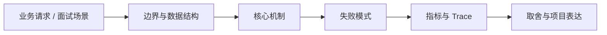

# WebSocket、SSE 与实时通信治理

## 面试定位

WebSocket、SSE 与实时通信治理 属于 Web 工程 / 实时通信、网关与前后端契约。面试里它不是背概念题，而是用来判断你是否能把知识落到架构、数据流、指标和取舍上。
一句话定位：实时通信题要从 WebSocket/SSE 选择、连接鉴权、心跳、重连、消息顺序、背压、广播和可观测性展开。

**必须讲清楚**
- WebSocket 是浏览器和服务端之间的双向长连接协议。
- SSE 是基于 HTTP 的服务端单向事件推送机制。
- 背压是接收方处理不过来时让发送方减速、丢弃或断开的机制。
- 实时通信题要从 WebSocket/SSE 选择、连接鉴权、心跳、重连、消息顺序、背压、广播和可观测性展开。
- SSE 单向简单
- WebSocket 双向但状态重
- 连接要背压和鉴权

**常见追问方向**
- HTTP 题先讲 cache-control、etag、cookie/session/token 和 CORS/CSRF 边界。
- API 题先讲契约、版本、错误码、幂等键、权限、限流和审计。
- AI/Web Agent 场景要连接工具 schema、权限确认、prompt injection 和可回放 trace。
- 如果这个点落到 Web Agent：公开网页任务自动化与评测、Coding Agent：代码库任务 Harness，架构如何设计？
- 线上失败时看哪些 trace、日志、指标，怎么回滚或补偿？

## 架构与运行机制

### 核心机制

- 先判断是否需要双向通信，单向推送优先考虑 SSE。
- 实时消息要有 event_id、sequence、ack 或可恢复游标，避免断线后丢状态。
- 长连接要与负载均衡、扩容、发布和故障切换协同。
- 消息权限要在每次订阅和发送时校验。
- SSE 适合服务端到浏览器的单向事件流，WebSocket 适合双向低延迟交互。
- 实时连接是长连接状态，必须处理鉴权续期、心跳、断线重连、消息积压、负载均衡和实例迁移。
- SSE EventSource：简单服务端推送和自动重连。
- WebSocket heartbeat：检测半开连接和客户端失联。
- Fanout service：集中处理订阅和广播。
- Replay cursor：断线后从 last_event_id 恢复。
- WebSocket 鉴权 token 过期后要支持续期或主动断开。
- SSE 需要处理代理缓冲、超时和浏览器连接数限制。
- 广播消息要考虑租户隔离、频道权限和单用户多设备。
- 发布重启要 drain 连接，避免大量客户端同时重连打爆系统。

### 通用数据流

可以按浏览器、CDN、网关/BFF、认证授权、API 契约、缓存、文件传输、实时连接、安全策略和可观测性来讲。数据流通常是浏览器带着 cookie/token 和 trace context 访问 CDN 或 Gateway，网关做认证、限流、CORS/CSRF/权限校验，BFF/API 按 schema 执行业务，响应通过 Cache-Control、CSP、Set-Cookie、错误码和 trace_id 把协议边界暴露清楚。

### 工程落点

- 定义 HTTP 缓存策略、会话边界、认证续期、CSRF/CORS 和敏感响应头。
- 为 API 设计 request schema、response schema、error code、idempotency key 和 version。
- 上线后跟踪 cache hit、auth error、api p95、4xx/5xx、idempotency conflict 和 security audit。
- 连接建立要鉴权，消息级也要校验权限，不能只在握手时信任用户。
- 慢客户端要有发送队列上限和断开策略，避免拖垮服务端内存。
- 把每个关键步骤都映射到可观测指标，避免只描述功能。
- 回答时主动说明哪些信息是强一致状态，哪些只是上下文或缓存视图。

## 可画图

图 1：WebSocket、SSE 与实时通信治理 的回答要从业务入口进入，先讲边界和数据结构，再讲机制、失败模式、指标和取舍。

## 系统设计案例

### WebSocket、SSE 与实时通信治理 的面试级设计题

典型设计题是管理后台、文件上传下载、实时通知、Web Agent 控制台、RAG 文档权限和 API 网关治理。架构上要包含 Cookie/SameSite/CSRF、CORS allowlist、CSP/XSS 防护、Session/Token/OAuth、CDN 缓存、签名 URL、WebSocket/SSE、BFF、版本兼容、错误码、审计和前后端契约测试。

**可画架构**
- 入口层校验用户请求、权限、租户、参数和幂等键。
- 业务服务层决定同步处理、异步处理、缓存读写、数据库回源或降级返回。
- 状态层保存业务状态、缓存版本、事件状态和恢复点。
- 执行层处理存储访问、下游调用、异步任务和补偿动作，并把结构化结果写入 trace。
- 观测层用指标、日志和链路追踪证明系统可运行、可排障、可复盘。

**数据流**
- 请求进入入口层后生成 request_id/run_id。
- 业务服务读取缓存、数据库或异步事件状态，选择执行路径。
- 执行结果写回状态存储，并向监控系统上报延迟、错误和业务结果。
- 保护策略根据成功标准、失败次数、SLA 和风险等级决定继续、降级、补偿或停止。

## 真实问题与排障

真实线上问题一般从 status_code、api_error_rate、auth_error_rate、cors_error_count、csrf_block_count、xss_report_count、cache_hit_rate、cdn_origin_fetch_rate、upload_fail_rate、ws_disconnect_rate、schema_validation_error 和 trace_id 看起。回答时要先判断是浏览器策略、缓存、认证授权、网络、API 契约、实时连接还是后端依赖问题。

**排查顺序**
- 先确认用户可感知问题：错误率、延迟、成功率、数据一致性或结果质量是否异常。
- 再沿数据流定位是哪一段出了问题：入口、状态、缓存、数据库、异步事件、外部依赖或消费端。
- 对比最近发布、配置变更、流量变化、数据倾斜和下游限流。
- 先止血：限流、降级、回滚、暂停消费、隔离高风险工具或切换只读模式。
- 最后把失败样例进入 regression/eval，避免同类问题复发。

**重点指标**
- active_connections
- ws_disconnect_rate
- sse_reconnect_count
- message_queue_depth
- realtime_auth_error_rate

**常见误区**
- 所有实时场景都用 WebSocket
- 没有心跳和重连语义
- 慢客户端无背压

## 业界方案与技术取舍

Web 工程的取舍是用户体验、性能、安全、兼容性、可演进和可观测性之间的平衡。面试追问通常会围绕 HTTP 缓存、Cookie/Session/JWT/OAuth、CORS/CSRF/XSS/CSP、CDN、上传下载、WebSocket/SSE、BFF、API 版本、错误码和 Agent tool schema 展开。

**方案对比**
- SSE EventSource：简单服务端推送和自动重连。
- WebSocket heartbeat：检测半开连接和客户端失联。
- Fanout service：集中处理订阅和广播。
- Replay cursor：断线后从 last_event_id 恢复。
- SSE 简单可靠，但只适合服务端到客户端。
- WebSocket 能双向交互，但状态、扩容和排障成本高。
- 消息持久化提升可靠性，但增加存储和顺序治理成本。
- Web 工程要把 HTTP 语义、缓存、认证、API 契约、安全和前后端协作放在一起看。
- 浏览器、CDN、网关、应用和后端服务各自承担不同缓存与安全责任。
- API 设计要在可演进契约、幂等、权限、错误语义和观测之间做取舍。
- 实时通信和 Agent run 进度、工具执行日志、任务状态推送高度相关。
- 面试时能把长连接治理和负载均衡、背压、权限串起来，会比只说协议差异强。

**复习时要能讲出的细节**
- 这个知识点解决什么问题，不解决什么问题。
- 关键数据结构、状态变化、失败边界和可观测指标是什么。
- 面试官继续追问时，能从架构图、数据流、线上排障和项目证据四个角度展开。
- 能说明为什么这个取舍适合当前业务，而不是只背业界名词。

## 深入技术细节

实时通信题要从 WebSocket/SSE 选择、连接鉴权、心跳、重连、消息顺序、背压、广播和可观测性展开。 WebSocket 是浏览器和服务端之间的双向长连接协议。 SSE 是基于 HTTP 的服务端单向事件推送机制。 背压是接收方处理不过来时让发送方减速、丢弃或断开的机制。 先判断是否需要双向通信，单向推送优先考虑 SSE。 实时消息要有 event_id、sequence、ack 或可恢复游标，避免断线后丢状态。 长连接要与负载均衡、扩容、发布和故障切换协同。 消息权限要在每次订阅和发送时校验。

面试深挖时要把对象、状态、协议、执行顺序和失败分支讲出来。不要只说“可以用 Redis/数据库/MQ 解决”，而要说明 key、字段、版本、超时、重试、幂等、降级和观测指标如何共同工作。

## 关键数据结构与协议

| 字段 | 所属对象 | 作用 | 排障价值 |
| :--- | :--- | :--- | :--- |
| `connection_id` | 长连接 | 标识一次 WebSocket/SSE 连接 | 排查断连、迁移和发布影响 |
| `event_id` | 推送事件 | 标识可恢复消息或游标 | 支持断线续传和重复过滤 |
| `sequence` | 消息顺序 | 表示频道内顺序或版本 | 定位乱序、丢消息和重复消息 |
| `subscription_scope` | 订阅权限 | 绑定用户、租户、频道和资源范围 | 防止越权订阅和广播泄漏 |
| `heartbeat_at` | 连接保活 | 记录心跳和活跃状态 | 识别半开连接和网络抖动 |
| `backpressure_state` | 背压控制 | 标识降速、丢弃、排队或断开 | 排查慢客户端拖垮服务端 |

## 公开阅读校验

实时通信题要先判断是否真的需要双向通信。通知、进度、只读事件通常 SSE 更简单，浏览器原生重连和基于 HTTP 的部署成本较低；协同编辑、在线游戏、终端控制、双向聊天更适合 WebSocket。无论哪种方式，都要解决连接鉴权、订阅权限、心跳、重连、消息顺序、背压、发布扩容和故障切换。

项目案例可以讲任务进度推送：客户端连接时校验 token 和租户，订阅范围写入 `subscription_scope`；服务端推送带 `event_id` 和 `sequence`，客户端断线后用 last event id 恢复；慢客户端进入 `backpressure_state=drop_or_close`，不能无限堆积内存。发布时先 draining 旧连接，避免滚动发布直接踢掉全部在线用户。

验收指标包括 `active_connection_count`、`ws_disconnect_rate`、`sse_reconnect_count`、`message_lag_ms`、`dropped_event_count`、`unauthorized_subscribe_count`、`heartbeat_timeout_count` 和单实例连接水位。反例是只校验连接时权限、不校验订阅资源、无序消息直接覆盖状态、慢客户端无限缓存、负载均衡没有处理长连接。

## 深问准备

被追问边界时，先说这个方案适合什么、不适合什么，再给反例。被追问线上故障时，按影响面、止血、根因、修复、回归五段回答。被追问项目时，把回答落到你做过的接口、缓存、队列、数据库、监控或 Agent 工程链路。

- 反例要明确，例如强事务事实源不能交给缓存或搜索读模型。
- 指标要可执行，例如 p95、error_rate、retry_rate、lag、miss_rate、stale_rate。
- 回归要可复现，例如固定输入、故障注入、压测脚本或 golden case。

## 来源与延伸阅读

- [MDN: The WebSocket API](https://developer.mozilla.org/en-US/docs/Web/API/WebSockets_API)：用于确认官方语义边界、命令行为和工程约束。
- [MDN: Server-sent events](https://developer.mozilla.org/en-US/docs/Web/API/Server-sent_events)：用于确认官方语义边界、命令行为和工程约束。
- [RFC 9110: HTTP Semantics](https://www.rfc-editor.org/info/rfc9110)：用于确认官方语义边界、命令行为和工程约束。
