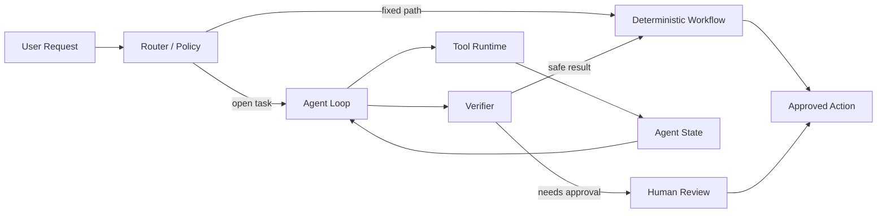
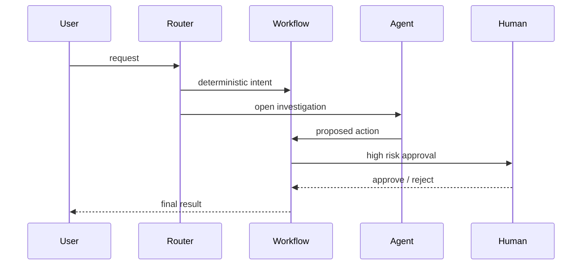

# Workflow 与 Agent 的边界

## 面试定位

这类题考察的是工程判断。面试官不希望听到“Agent 更智能”，而是希望你能用任务路径、确定性、风险、成本、评测和失败恢复来判断：哪些流程应该写成 deterministic workflow，哪些子任务值得交给 agent 动态决策。

一句高质量回答是：workflow 是代码预定义控制流，agent 是模型在反馈中参与控制流。真实系统常用 hybrid：外层 workflow 管权限、预算、审批和提交，内层 agent 处理开放探索。

## 一句话定义

Workflow 的下一步由代码、状态机或规则决定；Agent 的下一步由模型结合目标、状态、工具结果和反馈动态决定。

边界不在于有没有 LLM，而在于 LLM 是否参与控制流。一个 workflow 可以调用 LLM 做分类、抽取或总结，但这不一定是 Agent。

## 为什么需要它

如果不划边界，团队会把确定流程也做成 Agent，结果成本上升、延迟变长、失败更难复盘。反过来，如果把开放任务硬写成 workflow，就会出现分支爆炸，无法覆盖长尾情况。

判断标准是：任务路径是否可枚举，失败处理是否清楚，动作风险是否可接受，中间结果是否会改变下一步计划，是否需要动态决策。

## 核心架构

图 1：Workflow 与 Agent 的生产边界。Router 先按任务风险、路径确定性和权限范围分流，固定路径进入 deterministic workflow，开放探索进入 Agent Loop，最终高风险动作仍回到 workflow 或人工确认。

图里的核心是 Router 和边界。不是所有请求都进入 Agent。固定、高风险、强合规路径优先 workflow；开放探索可以给 Agent，但最终提交仍回到 workflow 或人工确认。

## 架构与运行机制

Workflow 的数据流通常是状态机：输入校验、分支判断、调用服务、更新状态、返回结果。它的优点是路径稳定、容易测试、容易审计。

Agent 的数据流是反馈循环：观察当前状态，决定下一步工具，执行后读取 observation，再决定继续、重试、降级或停止。它的优点是可以处理步骤不确定的任务。

判断边界时可以用“控制流是否可枚举”做第一层筛选。若下一步由状态机、审批规则或事务结果决定，并且失败分支已经清楚，优先 workflow；若下一步取决于搜索结果、页面状态、代码结构、诊断证据或工具 observation，才考虑 Agent。这个判断比“是否用了大模型”更准确，因为很多 LLM 分类、抽取、总结任务仍然只是 workflow 中的一个函数调用。

## 运行机制

工程上建议先做 workflow baseline。只有当 baseline 覆盖不了长尾，或者 Agent 在成功率、人工节省、恢复率上有明显收益，才把开放子任务升级为 Agent。

不要让 Agent 管全部流程。比如旅行系统可以让 Agent 生成候选方案，但支付、改签、取消必须由确定 workflow、权限检查和用户确认控制。

## 关键设计取舍

| 维度 | Workflow | Agent | Hybrid |
| --- | --- | --- | --- |
| 控制流 | 代码预定义 | 模型动态决策 | 外层固定，内层开放 |
| 可测试性 | 强 | 需要 eval 和 trace | 中等 |
| 成本延迟 | 可控 | 更高且波动 | 可按子任务控制 |
| 风险动作 | 易审计 | 必须加 guardrails | 推荐 |
| 适用场景 | 订单、支付、审批、同步链路 | 研究、排障、代码修复、网页操作 | 生产级 Agent 应用 |

## 生产落地细节

落地时要给每个任务标注 execution mode：workflow、agent、manual 或 hybrid。Router 根据风险、任务类型、用户权限和置信度选择路径。Agent 子流程必须有 max steps、timeout、预算、stop reason、trace 和 fallback。

上线评测要比较 workflow baseline 与 Agent 版本：`task_success_rate`、`p95_latency`、`cost_per_task`、`manual_handoff_rate`、`unsafe_action_block_rate` 和 `recovery_rate`。

## 系统设计案例

企业客服系统可以这样设计：意图识别和信息查询走 workflow；复杂投诉归因、跨系统查证和话术生成可以进入 Agent；退款、改地址、取消订单必须回到 workflow 执行。

图 2：客服场景中的 hybrid 编排。Router 把确定性意图交给 Workflow，把开放调查交给 Agent；Agent 只提出候选动作，真正退款、改地址或取消订单仍由 Workflow 和 Human Review 控制。

这个案例说明 Agent 是生产链路里的开放子系统，不是替代所有后端流程。

## 真实问题与排障

如果 Agent 化后效果变差，先看任务是否本来就适合 workflow。再看 Router 是否把固定任务误送 Agent，Agent 是否缺少状态，工具是否过粗，Verifier 是否没有阻止低置信结果。

关键指标包括 `routing_accuracy`、`agent_task_success_rate`、`fallback_rate`、`avg_steps`、`p95_latency`、`cost_per_task` 和 `manual_review_rate`。

## 常见误区与排障

常见误区是为了“显得 AI”把所有流程塞给 Agent。另一个误区是只比较最终回答质量，不比较成本、延迟、失败恢复和安全风险。

排障时按数据流看：请求分类是否正确，Agent 子任务是否边界清晰，工具 observation 是否足够，最终动作是否回到 workflow 控制面。

## 面试追问

1. 什么时候 workflow 更好？固定路径、强合规、强事务。
2. 什么时候 Agent 更好？路径开放、中间反馈改变下一步。
3. 如何证明 Agent 值得引入？拿 baseline 指标对比。
4. hybrid 怎么设计？外层 workflow 控制风险，内层 Agent 处理探索。

## 项目化表达

在 Coding Agent 中，搜索、定位和补丁尝试适合 Agent；真正写文件和运行 shell 要经过工具权限。Travel Agent 中，行程探索适合 Agent；支付和改签提交必须 workflow。Paper Agent 中，多轮检索和证据验证适合 Agent；最终引用格式和 unsupported claim 过滤要 deterministic。

## 深入技术细节

选择 workflow 还是 Agent，本质是在选择控制流归属。Workflow 的 `next_step` 由代码和状态机决定，适合规则明确、失败可枚举、审计要求高的流程。Agent 的 `next_step` 由模型结合 observation 动态决定，适合信息不完整、需要探索、工具结果会改变计划的任务。生产系统常见做法是 workflow 做控制面，Agent 做开放子任务。

落地时可以先定义 decision matrix：`path_entropy`、`failure_cost`、`state_branching_factor`、`tool_side_effect_risk`、`eval_observability`、`latency_budget` 和 `human_handoff_cost`。只有路径不确定且能用 eval 证明收益时，才把任务交给 Agent。

灰度时建议先让 Agent 只读运行，记录它会调用哪些工具、会提出哪些动作、与现有 workflow 的结果差异有多大。第二阶段让 Agent 输出 proposal，由人工或 workflow gate 执行。第三阶段才把低风险、可回滚、可观测的子任务自动化。这样做的好处是每一步都有 baseline 对照，坏路径可以沉淀成 trajectory eval 和 replay case，而不是上线后才发现 Agent 把确定性流程做复杂了。

## 关键数据结构与协议

| 字段 | Workflow | Agent |
| :--- | :--- | :--- |
| `control_flow` | 代码预定义 | 模型动态选择 |
| `state_transition` | 固定状态机 | observation 驱动 |
| `failure_policy` | 枚举处理 | trace + recovery |
| `risk_control` | 后端规则 | guardrail + workflow gate |
| `eval_mode` | 单元/集成测试 | trajectory + outcome eval |
| `handoff` | 人工或下一流程 | 子任务或人工确认 |

协议上，Agent 输出应是 proposal 或 tool intent，最终高风险动作回到 workflow executor。这样能保留 Agent 的探索能力，又把权限、事务、幂等和审计放在确定性系统里。

## 深问准备

被问“业务方坚持用 Agent 怎么办”，可以先做 workflow baseline 和 shadow Agent，对比成功率、人工节省、成本、延迟和安全拦截。没有收益就不自动化核心链路。

被问“hybrid 怎么灰度”，可以按只读建议、人工确认执行、低风险自动执行三阶段推进，并保留 fallback 到原 workflow 的能力。指标要看 `routing_accuracy`、`agent_success_delta`、`manual_handoff_rate` 和 `unsafe_action_block_rate`。

## 公开阅读校验

公开读者需要看到这个边界问题的核心不是“谁更先进”，而是“控制流应该归谁”。当路径可枚举、失败分支清楚、动作有事务或合规风险时，workflow 更可信；当任务需要探索、工具结果会改变下一步、路径无法提前写完时，Agent 才有价值。用这个标准，读者才能判断一个 AI 方案是不是把简单流程复杂化了。

生产验收要用 baseline 对比，而不是靠感觉。先让确定 workflow 跑出当前成功率、延迟、人工处理量和失败类型；再让 Agent 在 shadow 或 proposal 模式下运行，比较它是否提高成功率、降低人工成本、保持安全拦截，并且没有显著增加 p95 latency 和 cost_per_task。没有这些证据，就不应该把核心链路交给 Agent 自动控制。

文章还应强调 hybrid 的责任边界：Agent 可以做开放调查、候选生成和修复建议，但高风险提交、支付、删除、退款、发布和权限变更仍应回到 workflow executor、权限网关或人工确认。这样既保留探索能力，也把幂等、审计、回滚和合规留在确定性系统里。

## 来源与延伸阅读

- [Anthropic: Building effective agents](https://www.anthropic.com/engineering/building-effective-agents)：官方工程文章，用于支持 workflow 与 agent 的边界判断、复杂度递增和简单优先原则。
- [OpenAI: A practical guide to building agents](https://cdn.openai.com/business-guides-and-resources/a-practical-guide-to-building-agents.pdf)：官方工程指南，用于说明 agent 编排、guardrails、handoff 和人机协作控制面。
- [AgentGuide Agent 求职路线](https://github.com/adongwanai/AgentGuide/blob/main/docs/05-roadmaps/agent-job-ready-roadmap-2026.md)：中文开源资料，用于补充面试表达中的 workflow、Agent loop 和项目叙事。
