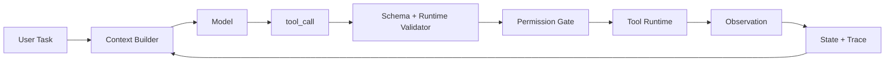

# Content Quality Upgrade Phase 1 Implementation Plan

> **For agentic workers:** REQUIRED SUB-SKILL: Use superpowers:subagent-driven-development (recommended) or superpowers:executing-plans to implement this plan task-by-task. Steps use checkbox (`- [ ]`) syntax for tracking.

**Goal:** 让网站具备承载严谨图文技术文章的基础能力，并用第一批样板内容证明知识点和面试题可以写得更像工程师技术文档。

**Architecture:** 保留 `content/topics` 与 `content/questions` 作为内容源，先增强 `MarkdownDocument` 的渲染能力，再新增确定性的内容质量校验。第一阶段只强制校验样板集合，避免一次性打爆 172 篇存量内容；样板通过后再逐批扩大覆盖面。

**Tech Stack:** React 18, TypeScript, Vite raw Markdown imports, Node/tsx validation scripts, Markdown subset parser, Mermaid source fallback rendering.

---

### Task 1: Markdown 渲染器支持技术文章结构

**Files:**
- Modify: `src/components/shared/MarkdownDocument.tsx`
- Modify: `scripts/validate-interview-ui-contract.mjs`

- [ ] **Step 1: 扩展 Markdown block 类型**

在 `MarkdownDocument.tsx` 中增加 `table` 与 `callout` block，并保留原有 heading、paragraph、list、quote、code、hr 能力：

```ts
type MarkdownBlock =
  | { content: string; type: "heading"; level: 1 | 2 | 3 | 4 }
  | { content: string; type: "paragraph" }
  | { items: string[]; type: "ul" | "ol" }
  | { content: string; language?: string; type: "code" }
  | { content: string; type: "quote" }
  | { headers: string[]; rows: string[][]; type: "table" }
  | { content: string; title: string; type: "callout" }
  | { type: "hr" };
```

- [ ] **Step 2: 解析 Markdown 表格**

在 parser 中识别 Markdown pipe table：

```markdown
| 方案 | 适用场景 | 风险 |
| --- | --- | --- |
| Workflow | 固定路径 | 灵活性低 |
```

要求输出 `{ type: "table", headers, rows }`，并在遇到空行、标题、列表、代码块时正确 flush。

- [ ] **Step 3: 解析 callout**

支持以下简单语法：

```markdown
:::note 面试提醒
不要把 function calling 直接说成完整 Agent。
:::
```

输出 `{ type: "callout", title: "面试提醒", content: "..." }`。如果语法未闭合，应把内容降级为普通段落，避免页面崩。

- [ ] **Step 4: 增强 inline 链接**

让 `InlineText` 支持 `[label](https://example.com)`，渲染为带下划线 hover 的外链：

```tsx
<a href={href} rel="noreferrer" target="_blank">
  {label}
</a>
```

必须继续支持 inline code 和 bold。

- [ ] **Step 5: 渲染 Mermaid 代码块为图表区**

当 fenced code language 为 `mermaid` 时，先渲染为带标题的浅色图表源代码区，不引入 runtime 依赖：

```tsx
<figure className="overflow-hidden rounded-md border border-slate-200 bg-slate-50">
  <figcaption>Mermaid 图</figcaption>
  <pre><code>{block.content}</code></pre>
</figure>
```

这样先保证图文结构和可读性，后续再接真正 Mermaid 渲染库。

- [ ] **Step 6: 更新 UI contract**

在 `scripts/validate-interview-ui-contract.mjs` 中增加检查：`MarkdownDocument.tsx` 必须包含 `type: "table"`、`type: "callout"`、`mermaid` 和外链渲染。

- [ ] **Step 7: 验证**

Run:

```bash
npm run validate:interview-ui
npm run build
```

Expected: 两个命令通过。

### Task 2: 内容质量校验脚本

**Files:**
- Create: `scripts/validate-content-quality.mjs`
- Modify: `package.json`

- [ ] **Step 1: 新增样板集合**

在脚本中定义第一阶段样板集合：

```js
const sampleTopicIds = [
  "agent-definition",
  "workflow-vs-agent",
  "function-calling",
  "rag-pipeline",
  "mcp-fundamentals",
  "openai-agents-sdk",
  "mq-reliable-delivery-idempotency",
  "es-inverted-index-mapping",
];
```

第一阶段只强制这些 topic 和它们的 core/deep question 通过新标准。

- [ ] **Step 2: 校验 topic 结构**

每个样板 topic 必须包含：

```text
## 一句话定义
## 为什么需要它
## 核心架构
## 运行机制
## 关键设计取舍
## 生产落地细节
## 常见误区与排障
## 面试追问
## 项目化表达
## 来源与延伸阅读
```

同时必须包含至少一个 ` ```mermaid ` 图和至少一个 Markdown 表格。

- [ ] **Step 3: 校验 question 结构**

样板 topic 对应的题目必须包含：

```text
## 30 秒回答
## 标准回答
## 可画图
## 面试官追问
## 项目化回答
## 常见错误
```

同时必须包含至少一个 Mermaid 图。

- [ ] **Step 4: 校验模板痕迹**

对样板 question 检查：

```js
if ((text.match(/；/g) ?? []).length > 20) {
  errors.push(`${id} has too many Chinese semicolon joins`);
}
```

对 topic 和 question 检查连续重复句，防止生成脚本拼接痕迹继续进入样板。

- [ ] **Step 5: 主题关键概念校验**

至少加入这些确定性检查：

```js
const requiredTermsByTopic = {
  "mcp-fundamentals": ["Host", "Client", "Server", "Resources", "Prompts", "Tools"],
  "mq-reliable-delivery-idempotency": ["outbox", "ack", "DLQ", "幂等", "补偿"],
  "rag-pipeline": ["ingest", "chunk", "retrieve", "rerank", "citation", "eval"],
  "function-calling": ["schema", "permission", "tool_call", "observation", "trace"],
};
```

- [ ] **Step 6: 接入 package scripts**

新增：

```json
"validate:content-quality": "tsx scripts/validate-content-quality.mjs"
```

并把它接入 `validate:all`，放在 `validate:markdown-content` 之后。

- [ ] **Step 7: 红灯验证**

Run:

```bash
npm run validate:content-quality
```

Expected: 当前存量内容失败，错误集中在样板 topic/question 缺少新结构、Mermaid、表格或来源说明。

### Task 3: 第一批最小样板内容

**Files:**
- Modify: `content/topics/function-calling.md`
- Modify: `content/questions/q-function-calling-core.md`
- Modify: `content/questions/q-function-calling-deep.md`

- [ ] **Step 1: 重写 Function Calling topic**

把 `content/topics/function-calling.md` 改成新结构，必须包含：

```markdown
## 一句话定义
## 为什么需要它
## 核心架构

## 关键设计取舍
| 设计点 | 推荐做法 | 风险 |
```

正文要明确：模型只提出调用意图，宿主负责校验、权限、执行、幂等、错误恢复和 trace。

- [ ] **Step 2: 重写 core question**

把 `q-function-calling-core.md` 改成新问题模板，保留题目但新增 `30 秒回答`、`标准回答`、`可画图`、`面试官追问`、`项目化回答`、`常见错误`。

- [ ] **Step 3: 重写 deep question**

把 `q-function-calling-deep.md` 改成“Function calling 和完整 Agent 系统差什么”的专门回答，重点区分协议层、执行层、状态层、循环层、评测层和安全层。

- [ ] **Step 4: 验证最小样板**

Run:

```bash
npm run validate:content-quality
```

Expected: 如果脚本强制 8 个样板全部通过，此时仍失败，但 Function Calling 相关错误消失。

### Task 4: 扩大到 8 个 topic 样板

**Files:**
- Modify: `content/topics/agent-definition.md`
- Modify: `content/topics/workflow-vs-agent.md`
- Modify: `content/topics/rag-pipeline.md`
- Modify: `content/topics/mcp-fundamentals.md`
- Modify: `content/topics/openai-agents-sdk.md`
- Modify: `content/topics/mq-reliable-delivery-idempotency.md`
- Modify: `content/topics/es-inverted-index-mapping.md`
- Modify: corresponding core/deep question markdown files under `content/questions/`

- [ ] **Step 1: 按新模板重写剩余 7 个 topic**

每个 topic 至少包含一个 Mermaid 图、一个取舍表、来源与延伸阅读。

- [ ] **Step 2: 按新模板重写对应题目**

每个 topic 至少同步改 core 和 deep question。

- [ ] **Step 3: 全量验证**

Run:

```bash
npm run validate:all
npm run build
```

Expected: 两个命令通过。

### Task 5: 浏览器检查

**Files:**
- No direct file edits unless visual issues are found.

- [ ] **Step 1: 启动 dev server**

Run:

```bash
npm run dev -- --port 5177
```

- [ ] **Step 2: 打开页面抽查**

检查：

- Function Calling topic
- Function Calling core/deep questions
- RAG topic
- MQ 可靠投递 topic

Expected: 表格不溢出，Mermaid 源代码块清晰，链接可点击，长文阅读不明显破版。

- [ ] **Step 3: 修复视觉问题**

如果表格、代码块、链接或 callout 破版，回到 Task 1 修改样式后重新 build。

---

## Self-Review

- Spec coverage: 覆盖设计草案中的渲染能力、质量校验、样板内容和浏览器检查。
- Placeholder scan: 计划中的每项都有具体文件、命令和期望结果。
- Scope: 第一阶段不宣称完成全部 172 篇内容，只建立能力并完成样板；全量内容升级仍由后续批次继续推进。
