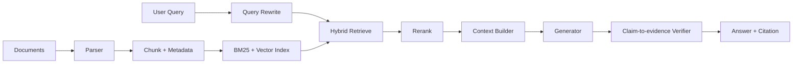

# Engineering Content Rigor Roadmap Implementation Plan

> **For agentic workers:** REQUIRED SUB-SKILL: Use superpowers:subagent-driven-development (recommended) or superpowers:executing-plans to implement this plan task-by-task. Steps use checkbox (`- [ ]`) syntax for tracking.

**Goal:** Build a sustainable content rigor pipeline and then expand the interview knowledge site from AI/ES/MQ into Redis, database, JVM, observability, distributed systems, and web engineering topics.

**Architecture:** Keep the existing static React/Vite site and raw Markdown content model. Add a stricter deterministic content-rigor audit, use a small set of hand-written sample articles to calibrate the standard, then expand topic/question/domain/path data in batches without pretending planned domains are complete.

**Tech Stack:** React 18, TypeScript, Vite raw Markdown imports, Node/tsx validation scripts, Mermaid Markdown diagrams, static data files under `src/data`, Markdown files under `content`.

---

## File Structure

- Create: `scripts/audit-content-rigor.mjs`  
  Deterministic audit for figure captions, source intent, data structures, incident playbooks, counterexamples, project-ready interview answers, and per-domain sample coverage.
- Modify: `package.json`  
  Add `audit:content-rigor`. Keep it outside `validate:all` until the selected sample set passes.
- Modify: `content/topics/rag-pipeline.md`  
  Upgrade one AI/RAG sample to the new L2+ standard with numbered diagrams, source intent, data structures, and incident playbook.
- Modify: `content/questions/q-rag-pipeline-core.md`  
  Upgrade the matching core interview answer to the new L3 interview standard.
- Modify: `content/topics/es-shards-write-path.md`  
  Upgrade one traditional backend sample using ES write-path internals.
- Modify: `content/questions/q-es-index-shard-write.md`  
  Upgrade the matching ES answer.
- Modify: `content/topics/mq-reliable-delivery-idempotency.md`  
  Upgrade one MQ reliability sample.
- Modify: `content/questions/q-mq-reliable-delivery.md`  
  Upgrade the matching MQ answer.
- Modify: `src/data/sources.ts`  
  Add Redis, MySQL/PostgreSQL, JDK, Prometheus, and HTTP/Web official sources before those domains are expanded.
- Modify: `src/data/categories.ts`  
  Add Redis, database, Java/JVM, observability, distributed-system, and web-engineering categories.
- Modify: `src/data/topics.ts` and supporting `src/data/deepSamples.ts`  
  Add topic seeds and deep patches for the first traditional backend batch.
- Modify: `src/data/questions.ts` and supporting `src/data/deepSamples.ts`  
  Add hand-written or generated-plus-patched questions for the first traditional backend batch.
- Modify: `src/data/learningPaths.ts`  
  Add Redis, database, JVM, observability, distributed-system, and web engineering paths as their topics become available.
- Modify: `src/data/graphEdges.ts`  
  Add prerequisite, same-path, contrast, and project-evidence edges for new topics.
- Create: `content/topics/*.md` and `content/questions/*.md` for each new topic/question batch.

## Task 1: Add Content Rigor Audit

**Files:**
- Create: `scripts/audit-content-rigor.mjs`
- Modify: `package.json`

- [x] **Step 1: Create the audit script with file loading helpers**

Create `scripts/audit-content-rigor.mjs`:

```js
// @author codex
import fs from "node:fs";
import path from "node:path";
import { questions, topics } from "../src/data/index.ts";

const root = process.cwd();
const topicDir = path.join(root, "content", "topics");
const questionDir = path.join(root, "content", "questions");

const sampleTopicIds = [
  "rag-pipeline",
  "function-calling",
  "mcp-fundamentals",
  "es-shards-write-path",
  "mq-reliable-delivery-idempotency",
];

const sampleQuestionIds = [
  "q-rag-pipeline-core",
  "q-function-calling-core",
  "q-mcp-fundamentals-core",
  "q-es-index-shard-write",
  "q-mq-reliable-delivery",
];

const readMarkdown = (dir, id) =>
  fs.readFileSync(path.join(dir, `${id}.md`), "utf8");

const compactLength = (text) => text.replace(/\s/g, "").length;
const countMatches = (text, pattern) => text.match(pattern)?.length ?? 0;
const hasAny = (text, terms) => terms.some((term) => text.includes(term));
```

- [x] **Step 2: Add rigor dimensions**

Append:

```js
const rigorDimensions = {
  numberedFigure: [/图\s*1/, /图\s*2/, /图\s*\d/],
  figureExplanation: ["这张图", "图中", "图里", "图 1", "图1"],
  sourceIntent: ["用于支持", "用于说明", "用于确认", "语义边界", "官方", "文档"],
  dataStructure: ["字段", "schema", "状态字段", "索引字段", "trace", "表结构", "协议"],
  incidentPlaybook: ["影响面", "止血", "根因", "回滚", "降级", "隔离", "回归"],
  counterExample: ["反例", "不适合", "不能", "边界条件", "误用"],
  projectAnswer: ["项目", "指标", "失败案例", "改进", "生产", "上线"],
};

const hasPatternOrTerm = (text, termsOrPatterns) =>
  termsOrPatterns.some((item) =>
    item instanceof RegExp ? item.test(text) : text.includes(item),
  );
```

- [x] **Step 3: Score topic and question documents**

Append:

```js
const scoreDocument = ({ id, kind, text }) => {
  const issues = [];
  const minChars = kind === "topic" ? 4200 : 2600;

  if (compactLength(text) < minChars) {
    issues.push(`too short for rigor: ${compactLength(text)} < ${minChars}`);
  }

  if (countMatches(text, /```mermaid/g) < 1) {
    issues.push("missing mermaid diagram");
  }

  for (const [dimension, terms] of Object.entries(rigorDimensions)) {
    if (!hasPatternOrTerm(text, terms)) {
      issues.push(`missing rigor dimension: ${dimension}`);
    }
  }

  if (kind === "topic" && countMatches(text, /^\|.*\|$/gm) < 6) {
    issues.push("topic needs a substantial comparison table");
  }

  if (!text.includes("## 来源与延伸阅读") && !text.includes("## 参考资料")) {
    issues.push("missing source/reference section");
  }

  if (kind === "question" && !text.includes("## 30 秒回答")) {
    issues.push("question missing 30-second answer");
  }

  return { id, kind, chars: compactLength(text), issues };
};
```

- [x] **Step 4: Emit sample-focused report**

Append:

```js
const topicIds = new Set(topics.map((topic) => topic.id));
const questionIds = new Set(questions.map((question) => question.id));

const reports = [
  ...sampleTopicIds
    .filter((id) => topicIds.has(id))
    .map((id) => scoreDocument({ id, kind: "topic", text: readMarkdown(topicDir, id) })),
  ...sampleQuestionIds
    .filter((id) => questionIds.has(id))
    .map((id) =>
      scoreDocument({ id, kind: "question", text: readMarkdown(questionDir, id) }),
    ),
];

const failing = reports.filter((report) => report.issues.length > 0);

console.log(
  JSON.stringify(
    {
      totals: {
        checked: reports.length,
        failing: failing.length,
        passing: reports.length - failing.length,
      },
      failing: failing.sort(
        (left, right) =>
          right.issues.length - left.issues.length ||
          left.chars - right.chars ||
          left.id.localeCompare(right.id),
      ),
    },
    null,
    2,
  ),
);

if (failing.length > 0) {
  process.exit(1);
}
```

- [x] **Step 5: Add npm script**

Modify `package.json` scripts:

```json
"audit:content-rigor": "tsx scripts/audit-content-rigor.mjs"
```

Do not add it to `validate:all` yet.

- [x] **Step 6: Run red-light baseline**

Run:

```bash
npm run audit:content-rigor
```

Expected: FAIL. The report should show the selected samples missing one or more rigor dimensions.

## Task 2: Upgrade RAG Sample Pair

**Files:**
- Modify: `content/topics/rag-pipeline.md`
- Modify: `content/questions/q-rag-pipeline-core.md`

- [x] **Step 1: Rewrite RAG topic around evidence lifecycle**

Update the topic so it includes:

````markdown
## 核心架构



图 1：RAG 的关键不是向量库，而是 evidence lifecycle。Parser 决定证据是否可定位，Retriever 决定候选是否覆盖，Rerank 决定上下文质量，Verifier 决定 claim 是否被证据支持。
````

- [x] **Step 2: Add data model section**

Add:

```markdown
## 关键数据结构与协议

| 字段 | 所属对象 | 作用 | 排障价值 |
| --- | --- | --- | --- |
| `doc_id` | Document | 文档唯一标识 | 定位文档版本 |
| `chunk_id` | Chunk | 证据最小单元 | 定位 citation |
| `section_path` | Chunk | 章节层级 | 避免上下文断裂 |
| `permission_scope` | Chunk | 权限过滤 | 防止越权召回 |
| `embedding_version` | Index | 向量版本 | 排查召回漂移 |
| `rerank_score` | Candidate | 精排分数 | 分析证据筛选 |
| `claim_support` | Verification | 支持/矛盾/不足 | 评估幻觉 |
```

- [x] **Step 3: Add incident playbook**

Add a failure scenario for "answer has citation but citation does not support claim" with impact, trace evidence, immediate mitigation, root cause, fix, and regression.

- [x] **Step 4: Upgrade core question**

In `q-rag-pipeline-core.md`, add a 30-second answer, a numbered Mermaid figure, three follow-ups, project answer, counterexamples, and source intent lines.

- [x] **Step 5: Run focused audits**

Run:

```bash
npm run audit:content-rigor
npm run audit:technical-depth
```

Expected: `rag-pipeline` and `q-rag-pipeline-core` no longer fail for missing rigor dimensions. Other selected sample files may still fail until their tasks are complete.

## Task 3: Upgrade ES Write Path Sample Pair

**Files:**
- Modify: `content/topics/es-shards-write-path.md`
- Modify: `content/questions/q-es-index-shard-write.md`

- [x] **Step 1: Add write visibility model**

In `es-shards-write-path.md`, add a section explaining that write success, durability, and search visibility are different states.

Include a table with:

```markdown
| 状态 | 由什么决定 | 用户现象 | 排障入口 |
| --- | --- | --- | --- |
| write accepted | primary shard processing | bulk item success | item status |
| replicated | in-sync replicas | 副本确认 | shard health |
| durable | translog/fsync policy | 崩溃可恢复 | translog stats |
| searchable | refresh/searcher reopen | 搜索可见 | refresh stats |
```

- [x] **Step 2: Add numbered sequence diagram**

Add a Mermaid sequence diagram with "图 1" explanation covering coordinating node, primary, replica, translog, refresh, and segment.

- [x] **Step 3: Add incident playbook**

Add a realistic scenario: "bulk HTTP 200 but some items fail and users cannot find new products." Include impact, evidence, stopgap, root cause, fix, and regression.

- [x] **Step 4: Upgrade matching question**

In `q-es-index-shard-write.md`, add the same state distinction and three deep follow-ups: refresh vs flush, bulk partial failure, old MQ event overwriting new ES document.

- [x] **Step 5: Run focused audits**

Run:

```bash
npm run audit:content-rigor
npm run validate:all
```

Expected: ES sample pair no longer fails content-rigor checks. Existing validation still passes.

## Task 4: Upgrade MQ Reliability Sample Pair

**Files:**
- Modify: `content/topics/mq-reliable-delivery-idempotency.md`
- Modify: `content/questions/q-mq-reliable-delivery.md`

- [x] **Step 1: Add end-to-end reliability contract**

Add a section that separates producer consistency, broker durability, consumer processing, idempotency, retry, DLQ, and compensation.

- [x] **Step 2: Add data structure table**

Add:

```markdown
| 字段 | 所属对象 | 作用 | 失败时如何使用 |
| --- | --- | --- | --- |
| `event_id` | Outbox Event | 全局事件 ID | 去重和追踪 |
| `aggregate_id` | Outbox Event | 业务聚合根 | 定位订单/库存 |
| `event_type` | Message | 消息语义 | 路由 handler |
| `version` | Message | 业务版本 | 防旧消息覆盖 |
| `idempotency_key` | Consumer | 幂等键 | 防重复副作用 |
| `attempt_count` | Retry | 重试次数 | 判断 DLQ |
| `trace_id` | Message | 链路追踪 | 串联生产与消费 |
```

- [x] **Step 3: Add incident playbook**

Add a scenario: "consumer handled payment callback successfully but ack timed out and message was redelivered." Include stopgap and durable fix.

- [x] **Step 4: Upgrade matching question**

In `q-mq-reliable-delivery.md`, add an answer path that explicitly says at-least-once is the default assumption and exactly-once does not remove business idempotency.

- [x] **Step 5: Run focused audits**

Run:

```bash
npm run audit:content-rigor
npm run validate:all
```

Expected: MQ sample pair no longer fails content-rigor checks. Existing validation still passes.

## Task 5: Add Source Catalog for Traditional Domains

**Files:**
- Modify: `src/data/sources.ts`

- [x] **Step 1: Add Redis official sources**

Append source objects:

```ts
{
  id: "redis-docs",
  title: "Redis Documentation",
  url: "https://redis.io/docs/latest/",
  kind: "official",
},
{
  id: "redis-distributed-locks",
  title: "Redis: Distributed Locks",
  url: "https://redis.io/docs/latest/develop/use/patterns/distributed-locks/",
  kind: "official",
},
```

- [x] **Step 2: Add database official sources**

Append MySQL and PostgreSQL source objects:

```ts
{
  id: "mysql-innodb-indexes",
  title: "MySQL InnoDB Indexes",
  url: "https://dev.mysql.com/doc/refman/8.4/en/innodb-index-types.html",
  kind: "official",
},
{
  id: "postgres-mvcc",
  title: "PostgreSQL MVCC",
  url: "https://www.postgresql.org/docs/current/mvcc.html",
  kind: "official",
},
```

- [x] **Step 3: Add JVM and observability sources**

Append:

```ts
{
  id: "oracle-java-concurrency",
  title: "Oracle Java Concurrency",
  url: "https://docs.oracle.com/javase/tutorial/essential/concurrency/",
  kind: "official",
},
{
  id: "prometheus-docs",
  title: "Prometheus Documentation",
  url: "https://prometheus.io/docs/introduction/overview/",
  kind: "official",
},
{
  id: "opentelemetry-docs",
  title: "OpenTelemetry Documentation",
  url: "https://opentelemetry.io/docs/",
  kind: "official",
},
```

- [x] **Step 4: Run data validation**

Run:

```bash
npm run validate:data
```

Expected: PASS.

## Task 6: Add First Redis Domain Batch

**Files:**
- Modify: `src/data/categories.ts`
- Modify: `src/data/topics.ts`
- Modify: `src/data/deepSamples.ts`
- Modify: `src/data/learningPaths.ts`
- Modify: `src/data/graphEdges.ts`
- Create: `content/topics/redis-cache-consistency.md`
- Create: `content/topics/redis-hotkey-breakdown-avalanche.md`
- Create: `content/questions/q-redis-cache-consistency.md`
- Create: `content/questions/q-redis-hotkey-breakdown-avalanche.md`

- [x] **Step 1: Add Redis categories**

Add categories under `domainId: "redis"`:

```ts
{
  id: "redis-cache",
  domainId: "redis",
  title: "Redis 缓存与一致性",
  description: "缓存模式、双写一致性、热点、击穿、穿透和雪崩。",
  icon: "Database",
  accent: "red",
},
{
  id: "redis-ops",
  domainId: "redis",
  title: "Redis 稳定性治理",
  description: "大 key、热 key、持久化、主从、哨兵、Cluster 和容量治理。",
  icon: "Activity",
  accent: "amber",
},
```

- [x] **Step 2: Add Redis topic seeds**

Add two topic seeds:

```ts
{
  id: "redis-cache-consistency",
  domainId: "redis",
  title: "缓存一致性",
  categoryId: "redis-cache",
  priority: "must",
  interviewFrequency: "high",
  roleTags: ["development"],
  prerequisites: [],
  summary: "缓存一致性讨论数据库和 Redis 缓存之间如何在高并发读写下保持可接受的新鲜度和可恢复性。",
  mustRemember: ["缓存不是事实源", "先更新数据库再删除缓存是常见基线", "一致性要结合业务容忍度和补偿"],
  details: ["Cache Aside 是最常见模式。", "强一致读取通常不应依赖异步缓存。"],
  engineeringNotes: ["写路径要有幂等和重试。", "缓存 key 要带版本、租户或业务域边界。"],
  commonPitfalls: ["先更新缓存再写数据库", "把延迟双删当成绝对一致"],
  projectEvidenceIds: ["pe-coding-agent"],
  sourceIds: ["redis-docs"],
  coreQuestion: "缓存和数据库如何保证一致性？",
  deepQuestion: "如果删除缓存失败或旧值回填，你会怎么排查和修复？",
  questionDifficulty: 3,
}
```

Create a similar `redis-hotkey-breakdown-avalanche` seed for cache penetration, breakdown, avalanche, hot key, and degraded protection.

- [x] **Step 3: Write Redis Markdown**

Create both topic Markdown files using the L2 topic skeleton from the spec. Each file must include one numbered Mermaid diagram, one comparison table, one data-structure table, one incident playbook, and source intent lines.

- [x] **Step 4: Write Redis question Markdown**

Create both question Markdown files using the L3 question skeleton. Each file must include 30-second answer, standard answer, numbered diagram, three follow-ups, project answer, counterexamples, common errors, and references.

- [x] **Step 5: Update path and graph**

Add a `redis-engineering-review` learning path and edges:

```ts
"redis-cache-consistency",
"redis-hotkey-breakdown-avalanche",
```

Edges should connect cache consistency to MQ/DB consistency and hot-key handling to observability.

- [x] **Step 6: Run verification**

Run:

```bash
npm run validate:all
npm run audit:technical-depth
npm run build
```

Expected: PASS. If `audit:content-rigor` is expanded to include Redis samples, it must also pass for the new Redis files.

## Task 7: Add Database and JVM First Batches

**Files:**
- Modify: `src/data/categories.ts`
- Modify: `src/data/topics.ts`
- Modify: `src/data/deepSamples.ts`
- Modify: `src/data/learningPaths.ts`
- Modify: `src/data/graphEdges.ts`
- Create: `content/topics/db-index-execution-plan.md`
- Create: `content/topics/db-mvcc-transaction-isolation.md`
- Create: `content/topics/java-thread-pool-governance.md`
- Create: `content/topics/jvm-gc-troubleshooting.md`
- Create matching question Markdown files under `content/questions/`

- [x] **Step 1: Add database categories and topics**

Add categories for `db-indexing` and `db-transaction`. Add topic seeds for:

- `db-index-execution-plan`
- `db-mvcc-transaction-isolation`

- [x] **Step 2: Add JVM categories and topics**

Add categories for `java-concurrency` and `jvm-ops`. Add topic seeds for:

- `java-thread-pool-governance`
- `jvm-gc-troubleshooting`

- [x] **Step 3: Write Markdown content**

Create all topic and question Markdown files with L2/L3 rigor. Database topics must cite MySQL/PostgreSQL official docs. JVM topics must cite JDK/Oracle docs or runtime tooling docs.

- [x] **Step 4: Update paths and graph**

Add:

- `database-engineering-review`
- `java-jvm-engineering-review`

Connect DB transaction topics to MQ transaction/outbox topics. Connect JVM troubleshooting to observability and incident governance.

- [x] **Step 5: Run verification**

Run:

```bash
npm run validate:all
npm run audit:technical-depth
npm run build
```

Expected: PASS.

## Task 8: Add Observability, Distributed Systems, and Web Engineering Batches

**Files:**
- Modify existing data files under `src/data/`
- Create new Markdown files under `content/topics/` and `content/questions/`

- [x] **Step 1: Add observability topics**

Add at least:

- `prometheus-metrics-promql`
- `observability-incident-tracing`

Each topic must connect traditional service metrics with Agent/RAG metrics such as `tool_error_rate`, `retrieval_recall@k`, `citation_precision`, and `eval_pass_rate`.

- [x] **Step 2: Add distributed systems topics**

Add at least:

- `distributed-idempotency-retry-timeout`
- `distributed-transaction-saga-outbox`

Connect these topics to MQ, DB, Redis, and system design interview questions.

- [x] **Step 3: Add web engineering topics**

Add at least:

- `web-http-cache-session-auth`
- `web-api-contract-idempotency-security`

Connect these topics to tool schema, API contract, permission, and backend interview questions.

- [x] **Step 4: Run verification**

Run:

```bash
npm run validate:all
npm run audit:technical-depth
npm run build
```

Expected: PASS.

## Task 9: Browser and Mobile QA

**Files:**
- No source edits unless QA finds rendering defects.

- [x] **Step 1: Start dev server**

Run:

```bash
npm run dev -- --port 5179
```

Expected: Vite server starts on `http://127.0.0.1:5179/`.

- [x] **Step 2: Inspect desktop pages**

Open:

- Home knowledge graph
- RAG topic
- ES write path topic
- MQ reliable delivery question
- Redis cache consistency topic
- DB MVCC question

Expected: page loads, Mermaid renders as SVG, no console errors, content is readable.

- [x] **Step 3: Inspect mobile viewport**

Use a `390x844` viewport. Verify:

- `document.documentElement.scrollWidth <= window.innerWidth`
- at least one `article figure svg` exists on sampled Mermaid pages
- long table and code blocks scroll horizontally inside their containers
- question list and answer panel do not overlap

- [x] **Step 4: Save screenshots**

Save representative screenshots under `output/playwright/`:

- `content-rigor-rag-mobile.png`
- `redis-cache-consistency-mobile.png`
- `db-mvcc-question-mobile.png`

## Task 10: Final Completion Audit

**Files:**
- Inspect all files touched by previous tasks.

- [x] **Step 1: Derive completion matrix**

Create a local checklist from the active goal:

- AI, ES, MQ still pass existing gates.
- Redis has topics, questions, path, graph edges, Markdown content.
- Database has topics, questions, path, graph edges, Markdown content.
- JVM has topics, questions, path, graph edges, Markdown content.
- Observability has topics, questions, path, graph edges, Markdown content.
- Distributed systems has topics, questions, path, graph edges, Markdown content.
- Web engineering has topics, questions, path, graph edges, Markdown content.
- Rigor audit covers representative high-frequency samples.
- Browser QA proves Mermaid and mobile readability.

- [x] **Step 2: Run final command suite**

Run:

```bash
npm run validate:all
npm run audit:technical-depth
npm run audit:content-rigor
npm run build
```

Expected: PASS.

- [x] **Step 3: Inspect coverage counts**

Run a tsx coverage summary over `domains`, `topics`, and `questions`. Expected: every non-planned domain included in the completion matrix has nonzero topics and questions.

- [x] **Step 4: Confirm no placeholders**

Run:

```bash
rg -n "TBD|TODO|待补|占位|lorem|placeholder" src content docs
```

Expected: Only intentional historical plan text may appear. No shipped content file under `content/` should contain placeholders.

- [x] **Step 5: Decide goal status**

Only mark the thread goal complete if the completion matrix is fully proven by current files, validation output, and browser QA evidence. If any traditional domain remains planned or lacks content, keep the goal active and continue with the next batch.
