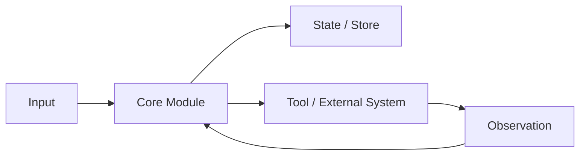
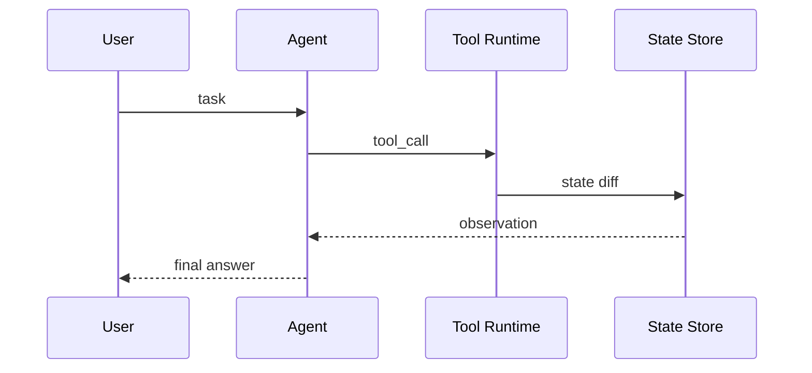

# 内容质量升级设计草案

日期：2026-06-29

## 1. 背景

当前网站已经完成第一轮内容覆盖：60 个知识点和 112 道面试题都有独立 Markdown 文件，`npm run validate:all` 能通过。这个阶段解决的是“有没有内容”和“是否有基本栏目”，但没有解决“内容是否像工程师写出的严谨技术文章”。

抽样阅读后可以确认，当前内容最大的问题不是字数少，而是写法和质量合同太弱：

- 多数文章没有 Mermaid、表格、图注或结构化对比图，架构、流程和部署关系只能靠长段文字想象。
- 面试题答案大量由结构化字段拼接而成，出现“；”连接、重复要点和泛化模板，读起来不像自然写作。
- 文章缺少 claim-to-source 的证据意识，虽然数据里有来源链接，但正文没有说明哪些结论来自官方文档、工程博客或项目经验。
- 题目与题目之间复用同一套“边界、数据流、指标、取舍”模板，导致具体问题不够锋利。
- 现有校验只检查字数、栏目和关键词，无法约束图表、来源、技术深度、回答针对性和读者理解成本。

目标是把网站从“内容覆盖型题库”升级为“图文并茂、证据明确、可以用于真实面试表达的工程知识库”。

## 2. 参考写法与来源

后续内容不应模仿营销稿，也不应只堆术语。建议参考这类官方工程内容的共同特点：

- Anthropic 的 [Building effective agents](https://www.anthropic.com/engineering/building-effective-agents) 先界定 workflow 与 agent，再用逐步复杂化的模式图解释何时该加复杂度。
- OpenAI 的 [A practical guide to building agents](https://cdn.openai.com/business-guides-and-resources/a-practical-guide-to-building-agents.pdf) 把模型选择、工具定义、编排、guardrails 和多 agent 拆成可执行工程决策，并配流程图说明。
- MCP 官方 [Architecture overview](https://modelcontextprotocol.io/docs/learn/architecture) 把 Host、Client、Server、Resources、Prompts、Tools、安全与授权边界分开定义，适合作为协议类知识点写法参考。
- Google [Agent Development Kit](https://adk.dev/) 文档把 framework 能力拆成构建、调试、评估、扩展、部署，适合作为框架选型类知识点写法参考。

迁移到本站时，每篇文章都应回答四个问题：

1. 这个概念解决什么问题，不解决什么问题？
2. 真实系统里有哪些对象、状态、接口、数据流和失败路径？
3. 面试官会从哪些角度继续追问，如何用项目证据支撑？
4. 哪些结论来自权威资料，哪些是工程经验或推导？

## 3. 内容质量标准

### 3.1 知识点文章标准

每个知识点应从“定义文章”升级成“技术设计小文档”。建议固定结构如下：

````markdown
# 标题

## 一句话定义

用 2-3 句话解释概念、边界和适用场景。第一段必须能直接作为面试开场。

## 为什么需要它

说明问题背景、没有它会出现什么工程问题，以及它和相邻概念的区别。

## 核心架构



图后必须有图注，解释每个节点的职责、边界和状态变化。

## 运行机制

按步骤解释数据流。每一步要说明输入、输出、失败模式和可观测信号。

## 关键设计取舍

| 方案 | 适用场景 | 优点 | 风险 | 面试表达 |
| --- | --- | --- | --- | --- |
| 简单方案 | ... | ... | ... | ... |

## 生产落地细节

覆盖 schema、状态、权限、幂等、重试、超时、缓存、隔离、审计、部署和回滚中与该主题相关的细节。

## 常见误区与排障

给出真实排查顺序：先看影响面，再沿数据流定位，再止血、根因、回归。

## 面试追问

列出 3-5 个追问，并说明每个追问考察什么。

## 项目化表达

把知识点挂到 Paper / Travel / Web / Coding Agent 或后端经验上，给出可说出口的项目叙事。

## 来源与延伸阅读

列出官方文档、工程博客、论文或项目源码，并说明每个来源支持了正文的哪类结论。
````

### 3.2 面试题答案标准

面试题不能再只是知识点文章的拼接。每道题应有独立答题策略：

- **开场 30 秒**：给出边界判断和结论，不绕圈。
- **主体 2-3 分钟**：按“定义 -> 架构/流程 -> 工程细节 -> 指标/失败模式 -> 取舍”展开。
- **追问防线**：预判面试官最可能追问的 3 个点，分别给出回答。
- **项目落点**：明确这题如何落到具体项目或过往后端经验。
- **扣分点**：指出哪些说法会显得不严谨，例如“function calling 等于 agent”“RAG 就是向量库”“MQ 可以保证绝对 exactly once”。

推荐模板：

````markdown
# 问题标题

## 30 秒回答

直接给出主结论和边界。

## 标准回答

### 1. 先划边界
### 2. 再画流程
### 3. 补工程细节
### 4. 讲指标与故障
### 5. 最后讲取舍

## 可画图



## 面试官追问

### 追问 1：...

回答要点、考察点、容易踩坑。

## 项目化回答

用一个真实系统片段或可实现项目说明。

## 常见错误

列出 3-5 个错误表达。
````

### 3.3 图表标准

图不是装饰，必须服务理解。每篇高频知识点至少包含一种图：

- 架构图：模块职责、边界、依赖关系。
- 流程图：请求、状态、工具、存储、验证器如何流转。
- 时序图：多轮调用、ack/retry、handoff、tool call 等交互。
- 状态图：任务状态、消息状态、订单状态、agent run 状态。
- 部署图：服务、队列、数据库、索引、对象存储、worker、监控的部署关系。
- 对比表：方案取舍、适用边界、故障模式。

默认使用 Mermaid 维护图表，因为它可以直接写在 Markdown 中，适合版本管理和批量校验。复杂视觉稿可以后续再引入图片生成或专门画图 skill。

### 3.4 来源与证据标准

每篇文章都要区分三类信息：

- 官方事实：来自 OpenAI、Anthropic、Google、MCP、Elastic、Kafka、RabbitMQ、RocketMQ 等官方文档或论文。
- 工程经验：来自常见生产实践，例如幂等、重试、DLQ、trace、eval、guardrails。
- 面试表达：面向中国技术面试的组织方式，是对事实和经验的再表达。

正文中不要求每句话都加链接，但每篇文章尾部必须有“来源与延伸阅读”，并且每个来源要标注用途，例如“用于 workflow/agent 边界”“用于 tools/handoff/guardrails 概念”“用于 broker ack 与 DLQ 细节”。

## 4. 前端与内容模型改造

内容写法升级后，当前 `MarkdownDocument` 能力不足，需要同步增强：

- 支持 fenced code 的 `mermaid` 渲染，至少先用漂亮的代码块和图表占位，后续再接 Mermaid runtime。
- 支持 Markdown 表格，用于方案对比和指标矩阵。
- 支持链接渲染，允许文章正文链接到官方资料。
- 支持图片、图注和 callout，用于复杂图或注意事项。
- 支持锚点目录，长文阅读时可快速跳转。

内容数据层建议保留 `content/topics` 和 `content/questions`，但停止把生成脚本作为主要内容来源。后续生成脚本只用于创建新文件草稿，不用于覆盖正式文章。

## 5. 校验升级

新增 `validate:content-quality`，从“是否有内容”升级为“是否符合工程文章标准”。建议第一阶段做静态校验：

- 高频 topic 必须包含至少 1 个 Mermaid 图。
- 高频 question 必须包含 `## 30 秒回答`、`## 标准回答`、`## 可画图`、`## 面试官追问`。
- 每篇文章必须包含 `## 来源与延伸阅读` 或 `## 参考资料`。
- 禁止出现大量模板拼接痕迹，例如单篇问题正文中中文分号超过阈值、同一句重复超过阈值。
- 表格、图、代码块必须有解释段落，不能孤立出现。
- 对特定主题检查关键概念：例如 MCP 必须出现 Host/Client/Server/Resources/Prompts/Tools；MQ 可靠投递必须出现 outbox/事务消息、broker 持久化、consumer ack、DLQ、幂等；RAG 必须出现 ingest/chunk/retrieve/rerank/citation/eval。

第二阶段可以增加人工审阅清单或 LLM-assisted review，但第一阶段先用确定性脚本挡住明显低质内容。

## 6. 实施方案比较

### 方案 A：全量一次性重写

一次性重写 60 个知识点和 112 道题，直接追求最终质量。

优点：最终一致性强，体验提升明显。

缺点：工作量非常大，容易出现批量生成痕迹；没有先验证模板和渲染能力，返工风险高。

### 方案 B：先做内容标准 + 渲染能力 + 高频样板，再批量推广

先定义质量标准和校验脚本，增强 Markdown 渲染器，然后挑 8-12 个高频主题做样板：Agent 定义、Workflow vs Agent、Function Calling、RAG、MCP、OpenAI Agents SDK、MQ 可靠投递、ES 倒排索引/写入链路。样板通过后，再按路径分批改全量内容。

优点：能先验证“好文章长什么样”，避免全量返工；也能让校验脚本跟着真实样板演进。

缺点：第一轮只覆盖部分内容，全量升级需要持续推进。

### 方案 C：只改生成脚本重新生成全部内容

增强 `generate-markdown-content.mjs`，让它输出更长、更结构化的文章。

优点：速度快，全量覆盖容易。

缺点：会延续当前问题的根源：模板拼接、重复、泛化、缺少针对性。只能作为草稿生成器，不适合成为正式内容生产方式。

推荐采用方案 B。

## 7. 第一批样板主题

第一批应覆盖 AI Agent、RAG、协议、框架、传统后端四类面试高频点：

1. `agent-definition`：定义类，建立 workflow vs agent 边界。
2. `workflow-vs-agent`：对比类，训练取舍表达。
3. `function-calling`：工具调用类，适合画 tool runtime。
4. `rag-pipeline`：系统链路类，适合画 ingest/retrieve/rerank/generate/eval。
5. `mcp-fundamentals`：协议类，适合画 Host/Client/Server。
6. `openai-agents-sdk`：框架类，适合讲 Agent/Runner/tools/handoff/guardrails/tracing。
7. `mq-reliable-delivery-idempotency`：后端可靠性类，适合画 outbox、ack、retry、DLQ。
8. `es-inverted-index-mapping`：搜索底层类，适合画倒排索引、mapping、doc values。

每个样板至少同步改 1 道 core question 和 1 道 deep question，保证知识点文章和面试题答案风格一致。

## 8. 验收标准

第一阶段完成后，应满足：

- `npm run validate:all` 继续通过。
- 新增 `npm run validate:content-quality` 通过。
- 第一批 8 个样板 topic 都包含 Mermaid 图、对比表、来源与延伸阅读。
- 第一批对应面试题都包含 30 秒回答、标准回答、可画图、追问和项目化回答。
- 浏览器中样板文章可读，没有图表破版、表格溢出或代码块影响移动端阅读。
- 随机抽样阅读时，不再出现明显模板拼接、连续分号堆砌或同一句重复。

## 9. 不做的事

第一阶段不做：

- 不全量一次性重写 172 篇内容。
- 不引入后端 CMS。
- 不把全部图做成图片资产。
- 不依赖 LLM 在线生成用户打开页面时的内容。
- 不把来源链接当作正文严谨性的替代品；来源必须服务具体结论。

## 10. 推荐下一步

先按方案 B 写实施计划：

1. 增强 Markdown 渲染器，支持 Mermaid、表格、链接、图注和 callout。
2. 新增 `validate:content-quality`，把图表、来源、栏目、模板痕迹纳入校验。
3. 重写第一批 8 个样板 topic 和对应 16 道题。
4. 浏览器检查样板页阅读体验。
5. 根据样板沉淀批量改造清单，再进入第二批内容。
