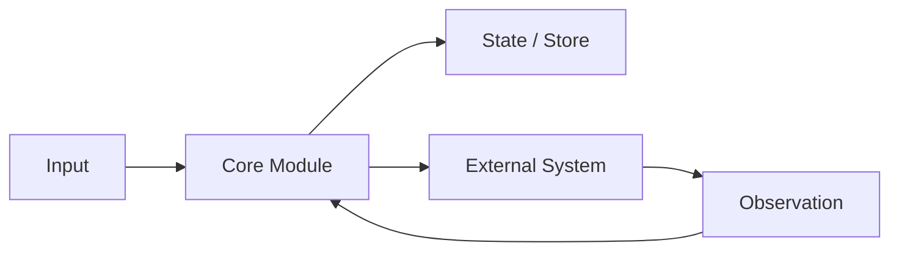
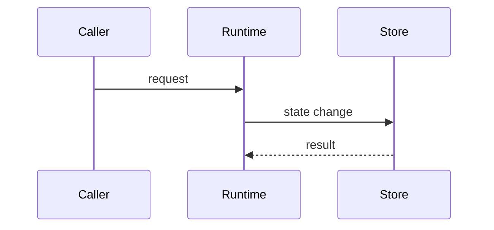

# 研发面试内容严谨度升级设计

日期：2026-06-30

## 1. 背景

当前站点已经从 AI Agent 单专题扩展为“研发面试知识体系”的雏形：`AI Agent 与 RAG`、`Elasticsearch`、`MQ` 有样板内容，`Redis`、`数据库`、`Prometheus 与监控体系`、`Java 并发与 JVM`、`分布式与系统设计`、`工程质量与故障治理` 仍处于 planned 状态。

上一轮内容升级解决的是“有文章、有题、有 Mermaid、有基础门禁”。现在暴露出的核心问题更高一层：许多知识点和面试题虽然结构完整，但不像严肃技术文章。它们缺少图注、来源映射、内部机制展开、数据结构、故障现场、部署关系、约束条件和反例，读者很难像读 OpenAI、Anthropic、Google、Elastic、Kafka、RabbitMQ 这类工程文章一样理解一个知识点为什么成立、系统如何运转、线上如何排障。

因此本阶段目标不是继续堆数量，而是建立一套能支撑后续全专题扩展的内容严谨度标准。后续补 Redis、DB、JVM、Web、分布式、监控专题时，不能再按“模板拼接 + 关键词 + 图”扩散，而要按“技术论证 + 工程案例 + 面试表达”的标准产出。

## 2. 总目标

把站点内容从“结构完整的学习题库”升级为“可用于真实面试准备的工程技术知识库”。

完成后，每个专题都应满足：

- 知识点能像技术博客或设计文档一样解释机制，而不是只给定义。
- 面试题能把知识转成可说出口的回答，并能接住 3-5 个深问。
- 图表服务理解：架构、数据流、状态、时序、部署、故障路径至少覆盖其一。
- 来源服务事实：官方文档、论文、工程博客和项目经验要被区分，并说明各自支持什么结论。
- 传统后端经验和 AI 工程经验要互相连接：ES/MQ/Redis/DB/监控/JVM 不是孤立复习，而是可以迁移到 Agent、RAG、工具执行、评测平台和智能应用后端。

## 3. 内容质量分层

### 3.1 L0：规划入口

适用于 planned domain。页面可以展示专题名称、范围、学习路径和空状态，但不能伪装成已有完整内容。

验收标准：

- `domains.ts` 中 status 为 `planned`。
- 有清晰描述和后续模块规划。
- 不生成虚假的题目数量和完成状态。

### 3.2 L1：结构完整

适用于新增专题的第一批落地。每个 topic 和 question 至少有完整 Markdown 文件、基础章节、Mermaid 图、来源和题目绑定。

验收标准：

- `validate:data`、`validate:markdown-content` 通过。
- 知识点包含定义、机制、取舍、排障、项目表达、来源。
- 面试题包含 30 秒回答、标准回答、可画图、追问、项目化回答、常见错误。

### 3.3 L2：工程严谨

适用于高频知识点和面试题。它是后续主要合格线。

验收标准：

- 图表有编号和图注，正文解释图中节点、边界和状态变化。
- 至少有一个核心数据结构、协议字段、表结构、配置项或运行时状态模型。
- 至少有一个真实故障或排障 playbook：影响面、定位、止血、根因、回归。
- 关键取舍要有适用场景、收益、代价和误用风险。
- 来源与延伸阅读必须说明“该来源支持了哪类结论”。

### 3.4 L3：面试可战

适用于面试高频题和主干路径。它要求内容能直接转成口述和白板表达。

验收标准：

- 每道题有 30 秒、2-3 分钟、深问三档回答。
- 至少 3 个追问带回答要点、考察点和常见误区。
- 至少一个项目化回答能关联真实系统、指标、失败案例和改进动作。
- 至少一个反例能说明“什么场景不该这么做”。
- 读者能根据文章画出白板图，而不是只能背文本。

## 4. 知识点文章标准

每个 L2+ 知识点采用下面的正文骨架。不同专题可以微调，但不能删除论证职责。

````markdown
# 标题

## 一句话定义

用 2-3 句话说明概念、边界、适用场景和不解决的问题。

## 为什么需要它

说明没有它会出现什么工程问题，和相邻概念有什么区别。

## 核心架构



图 1：说明每个节点职责、边界、状态变化和失败传播路径。

## 运行机制

按数据流或控制流逐步解释输入、处理、状态、输出、失败分支和可观测信号。

## 关键数据结构与协议

列出字段、配置、状态机、schema、索引、消息格式或 trace event。

## 关键设计取舍

| 方案 | 适用场景 | 收益 | 代价 | 面试表达 |
| --- | --- | --- | --- | --- |

## 生产落地细节

覆盖权限、幂等、重试、超时、降级、容量、部署、回滚、审计和安全中与该主题相关的部分。

## 故障现场与排障

给出一条真实风格的排查链路：影响面 -> 证据 -> 止血 -> 根因 -> 修复 -> 回归。

## 面试追问

列出 3-5 个追问，说明考察点和回答方向。

## 项目化表达

把知识点连接到 Paper Agent、Web Agent、Coding Agent、RAG 平台、传统后端服务或真实业务系统。

## 来源与延伸阅读

- [官方文档](https://example.com)：用于支持协议语义、API 行为或底层机制。
- [工程文章](https://example.com)：用于支持设计取舍、生产实践或故障治理。
````

## 5. 面试题答案标准

面试题不能是知识点文章的缩写。它要服务“现场回答”。

每道 L2+ 题目采用下面结构：

````markdown
# 问题标题

## 面试定位

说明这题考什么，面试官想区分什么能力层次。

## 30 秒回答

直接给主结论、边界和关键词，不绕圈。

## 标准回答

按“边界 -> 架构/流程 -> 工程细节 -> 指标/故障 -> 取舍”展开。

## 可画图



图 1：说明面试时如何讲图。

## 面试官追问

### 追问 1：...

回答要点、考察点、容易踩坑。

## 项目化回答

给出可用于项目经历的表达，包含业务场景、系统设计、指标、失败案例和改进。

## 边界条件与反例

说明什么时候不适合、什么说法会被追问打穿。

## 常见错误

列出扣分表达。

## 来源与延伸阅读
````

## 6. 图表规范

图不是装饰。每张图都必须回答一个技术问题。

优先使用 Mermaid，因为当前站点已支持 Mermaid SVG 渲染，适合 Markdown 维护和自动门禁。

推荐图型：

- 架构图：模块职责、依赖关系、边界。
- 时序图：请求、ack、retry、tool call、handoff。
- 状态图：任务状态、消息状态、事务状态、Agent run 状态。
- 部署图：服务、队列、数据库、索引、worker、监控。
- 故障路径图：从症状到根因的传播链路。
- 对比表：方案取舍、适用边界、指标和误用风险。

每张图必须满足：

- 图前或图后有“图 N”说明。
- 正文解释图中至少 3 个关键节点或边。
- 图中出现的核心对象在正文中有定义。
- 不能只放图不解释，也不能用图替代机制描述。

## 7. 来源与证据规范

文章要区分三类信息：

1. 官方事实：来自 OpenAI、Anthropic、Google、MCP、Elastic、Kafka、RabbitMQ、RocketMQ、Redis、PostgreSQL、MySQL、Prometheus、JDK 等官方文档或论文。
2. 工程实践：来自生产系统常见经验，例如幂等、重试、DLQ、缓存穿透、索引失效、GC 排障、SLO、灰度和回滚。
3. 面试表达：面向中国研发岗位面试的组织方式，是对事实和经验的再表达。

来源条目不只贴链接，还要写用途：

```markdown
- [RabbitMQ Consumer Acknowledgements](https://www.rabbitmq.com/docs/confirms)：用于确认 producer confirm 和 consumer ack 的语义边界。
- [Kafka Documentation](https://kafka.apache.org/documentation/)：用于支持 consumer group、offset、partition 和 rebalancing 的机制说明。
```

高风险或容易过时的技术事实优先查官方文档。当前已有来源库可以继续扩展，但正文必须说明来源用途。

## 8. 传统工程专题扩展蓝图

### 8.1 Redis

模块建议：

- Redis 场景与边界：缓存、会话、计数器、排行榜、分布式锁。
- 数据结构与编码：String、Hash、List、Set、ZSet、Bitmap、HyperLogLog、Stream。
- 缓存一致性：Cache Aside、双写、延迟双删、订阅 binlog、版本号。
- 缓存问题：穿透、击穿、雪崩、热点 key、大 key。
- 分布式锁与限流：SET NX PX、Redlock 争议、令牌桶、滑动窗口。
- 持久化与高可用：RDB、AOF、主从、哨兵、Cluster。

样板题：

- Redis 为什么快？
- 缓存和数据库如何保证一致性？
- 缓存击穿、穿透、雪崩怎么处理？
- 分布式锁怎么设计，Redlock 有什么争议？
- Redis Cluster 如何做分片和故障转移？

### 8.2 数据库

模块建议：

- 索引与执行计划：B+Tree、覆盖索引、回表、最左前缀、EXPLAIN。
- 事务与隔离级别：ACID、MVCC、锁、幻读、快照读、当前读。
- 锁与并发控制：行锁、间隙锁、死锁、乐观锁、悲观锁。
- SQL 优化：慢查询、分页、JOIN、聚合、统计信息。
- 高可用与扩展：主从、读写分离、分库分表、迁移、归档。
- 数据一致性：Outbox、CDC、最终一致性、补偿。

样板题：

- MySQL 索引为什么用 B+Tree？
- MVCC 如何实现可重复读？
- 事务隔离级别和幻读怎么解释？
- 慢 SQL 如何排查？
- 分库分表后全局 ID、事务和查询怎么处理？

### 8.3 Java 并发与 JVM

模块建议：

- Java 内存模型：happens-before、volatile、synchronized、final。
- 线程池：核心参数、队列、拒绝策略、隔离和监控。
- 锁与并发容器：AQS、ReentrantLock、CAS、ConcurrentHashMap。
- GC 与内存：对象生命周期、G1/ZGC、停顿、内存泄漏。
- JVM 排障：jstack、jmap、jfr、arthas、CPU 飙高、Full GC。
- Spring/服务端工程：连接池、事务边界、异步执行、限流熔断。

样板题：

- volatile 能解决什么，不能解决什么？
- 线程池参数如何设置？
- ConcurrentHashMap 如何保证并发安全？
- Full GC 频繁如何排查？
- 线上 CPU 100% 怎么定位？

### 8.4 Prometheus 与可观测性

模块建议：

- 指标模型：counter、gauge、histogram、summary、label。
- PromQL：rate、increase、histogram_quantile、聚合和向量匹配。
- 告警设计：SLO、错误预算、抑制、分组、静默。
- 日志与链路追踪：trace id、span、结构化日志、采样。
- 容量和故障治理：黄金指标、RED/USE、看板、演练和复盘。
- AI 系统观测：token、tool error、retrieval recall、citation precision、eval pass rate。

样板题：

- Counter 和 Gauge 的区别？
- p95 延迟如何用 Prometheus 计算？
- 告警如何避免风暴？
- 日志、指标、链路追踪如何配合排障？
- Agent/RAG 系统应该监控哪些指标？

### 8.5 分布式与系统设计

模块建议：

- CAP、BASE、一致性与可用性。
- 幂等、去重、重试、超时、补偿。
- 限流、熔断、降级、隔离、背压。
- 分布式事务：TCC、Saga、Outbox、事务消息。
- 高并发架构：缓存、队列、异步、读写分离、热点治理。
- 系统设计题：订单、秒杀、搜索、消息通知、任务调度、AI eval 平台。

样板题：

- 如何设计幂等接口？
- 高并发秒杀系统怎么设计？
- 分布式事务有哪些方案？
- 服务雪崩怎么治理？
- 如何估算容量和设计扩容方案？

### 8.6 Web 与工程质量

模块建议：

- HTTP/HTTPS、浏览器缓存、Cookie/Session/JWT。
- REST、RPC、GraphQL、OpenAPI、错误码和幂等。
- 安全：鉴权、授权、CSRF、XSS、SSRF、越权。
- 发布质量：灰度、回滚、feature flag、压测、契约测试。
- 研发效能：CI、测试金字塔、代码评审、事故复盘。

样板题：

- HTTP 缓存机制是什么？
- JWT 和 Session 如何选择？
- 接口幂等如何设计？
- 灰度发布和回滚怎么做？
- 如何设计一次线上事故复盘？

## 9. 分批实施策略

### Phase 1：严谨度门禁与样板

目标：建立可持续标准，而不是直接全量重写。

范围：

- 新增 `audit:content-rigor`。
- 先覆盖 `rag-pipeline`、`function-calling`、`mcp-fundamentals`、`es-shards-write-path`、`mq-reliable-delivery-idempotency`。
- 每个样板同步改 1-2 道对应题。

验收：

- 新审计脚本能报告图注、来源用途、数据结构、排障闭环、反例边界缺失。
- 样板内容不再只是形式完整，而能经得起深问。

### Phase 2：传统后端第一批

目标：补 Redis、数据库、Java/JVM 的第一批核心内容。

范围：

- Redis 6 个 topic + 10-12 道题。
- 数据库 6 个 topic + 10-12 道题。
- Java/JVM 6 个 topic + 10-12 道题。

验收：

- 新增 domain/category/topic/question/path/edge 数据。
- Markdown 内容达到 L1，核心 topic 达到 L2。
- 页面和题库不出现重复归类、空白详情或移动端溢出。

### Phase 3：监控、分布式、Web 工程

目标：补足传统软件研发工程师的系统化面试能力。

范围：

- Prometheus 与可观测性。
- 分布式与系统设计。
- Web 与工程质量。

验收：

- 每个 domain 至少有一条学习路径。
- 面试题能按 domain 进入训练页。
- 系统设计题能连接多个 topic，而不是孤立问答。

### Phase 4：全量严谨度升级

目标：把所有 topic/question 从 L1/L2 推到高频 L3。

范围：

- 全量补图注、来源用途、事故排查、数据结构、反例。
- 扩展 `audit:content-rigor` 到全部高频内容。
- 浏览器抽样检查 Mermaid、表格、长标题和移动端阅读。

验收：

- `validate:all` 通过。
- `audit:technical-depth` 通过。
- `audit:content-rigor` 对高频内容通过。
- 重点路径抽样阅读不再出现明显模板拼接和浅层解释。

## 10. 不做的事

- 不一次性伪造所有 planned 专题为 complete。
- 不用纯生成脚本覆盖手写样板。
- 不引入后端 CMS、登录系统或在线 LLM 生成。
- 不把来源链接当作严谨性的替代品。
- 不为了页面装饰生成无解释的图片。

## 11. 自检

- 没有使用 TBD/TODO 占位。
- 设计范围覆盖当前目标：传统专题规划、知识内容标准、面试题训练标准、分批实施和验收。
- 当前阶段仍未宣称目标完成；这是后续执行的质量合同。
